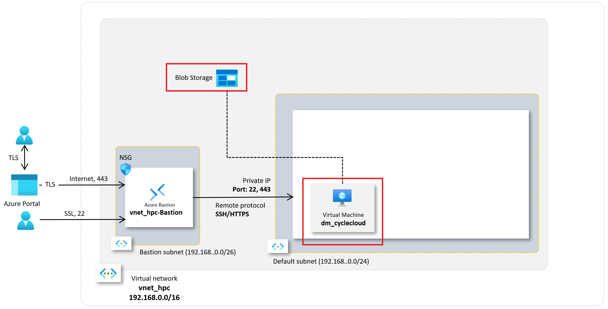
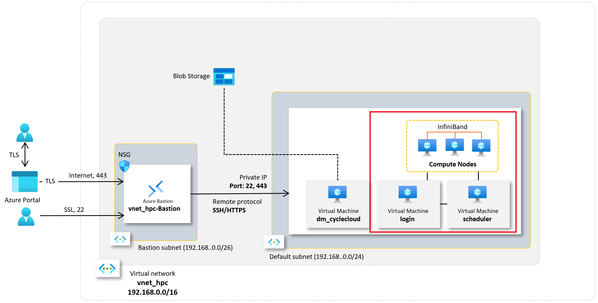
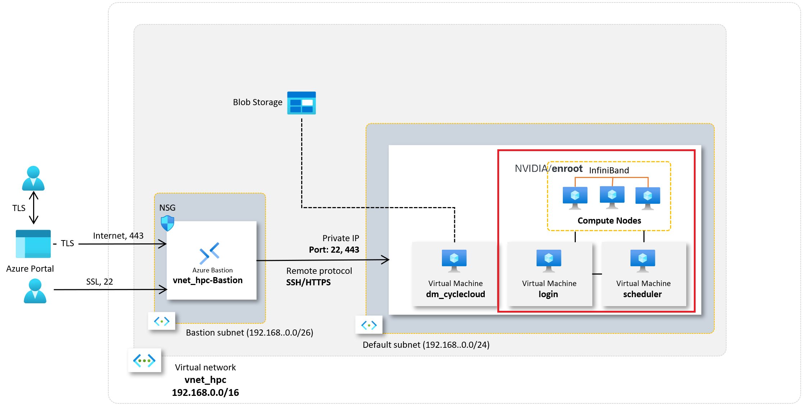
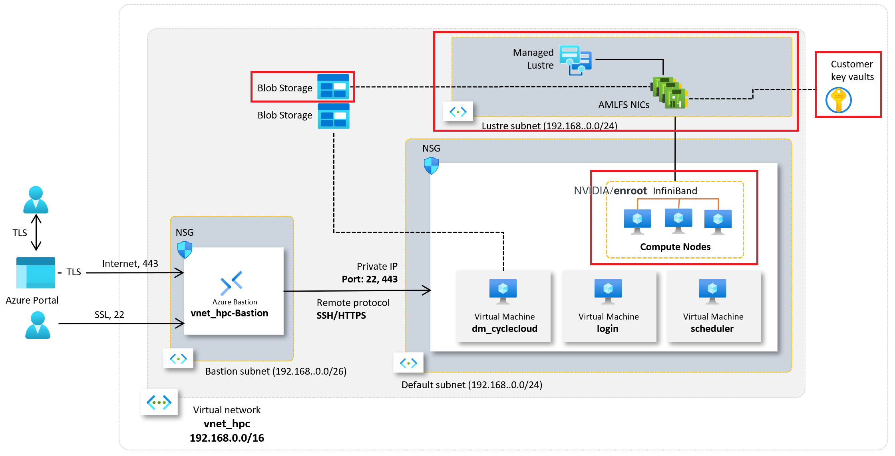

= 개요: Microsoft Azure에서 CycleCloud를 사용하는 Slurm/Enroot/Lustre 기반 HPC 구성

이 문서 시리즈는 Microsoft Azure에서 NVidia GPU를 사용한 분산 머신 러닝을 위한 Slurm/CycleCloud 기반 환경을 구성하는 것을 목표로 제작되었습니다. 모든 문서의 연습을 마무리하면, 아래와 같은 구조의 Azure Cloud 기반 HPC 환경이 구성됩니다.이 문서는 5단계로 구성되며, 6단계 **InfiniBand 구성**은  일반적으로 Azure 가상 컴퓨터가 InfiniBand를 지원한다면 자동으로 구성되므로, 확인이 필요하지 않다면 수행하지 않아도 됩니다.

이 문서 시리즈는 아래와 같은 단계로 구성됩니다.

== 1. link:./01_vnet_subnet_bastion.adoc[네트워크 환경 구성]

**네트워크 환경 구성** 가이드 문서에서는 HPC 환경이 구성되기 위한 네트워크 환경을 구성합니다. 이 문서의 연습이 완료된 후 구성되는 환경은 아래와 같습니다.

image:./images/00/01/image01.png[]

이 문서의 연습으로 배포되는 구성요소는 다음과 같습니다:

* HPC 클러스터와 관련된 모든 리소스를 논리적으로 묶어 관리하는 컨테이너인 **리소스 그룹(Resource Group)**
* HPC 환경이 존재하게 될 **가상 네트워크(Virtual Network)**
* 가상 네트워크에 구성되는 **서브넷(Subnet)**
** CycleCloud와 HPC 클러스터의 운영 노드(Login, Scheduler)가 존재할 **Default 서브넷**
** Bastion이 존재할 **Bastion 서브넷**
* CycleCloud와 HPC 클러스터 노드에 대한 단일 액세스 지점을 제공하는 **배스천(Bastion)**

== 2. link:./02_cyclecloud_storage.adoc[Azure CycleCloud 배포]

Azure CycleCloud 배포 가이드 문서에서는 이전 가이드에서 배포한 네트워크 환경에 Azure CycleCloud 가상 컴퓨터와, 동작을 위한 Blob Storage를 배포하고 배포합니다. 이 문서의 연습이 완료된 후 구성되는 환경은 아래와 같습니다.

이 문서의 연습으로 배포되는 구성요소는 다음과 같습니다:

* CycleCloud에서 프로젝트 정보를 저장하고 운영하는데 필요한 정보를 저장하는 **Azure 저장소 계정(Azure Storage Account)**
* **CycleCloud 가상 머신(Virtual Machine)**
* CycleCloud 가상 머신에서 Azure 저장소 계정과의 액세스에 사용되는 **관리 ID(Managed ID)**

== 3. link:./03_slurm_cluster.adoc[Slurm 클러스터 생성 및 배포]

**Slurm 클러스터 생성 및 배포** 문서에서는 이전 가이드에서 배포한 CycleCloud를 사용하여 Slurm 클러스터를 배포합니다. 이 문서의 연습이 완료된 후 구성되는 환경은 다음과 같습니다.

이 문서에서 Azure에 배포되는 구성요소는 다음과 같습니다.

* Slurm 클러스터의 **Login 노드(가상 컴퓨터)**
* Slurm 클러스터의 **Scheduler 노드(가상 컴퓨터)**
* Slurm 클러스터의 설정에 따라 개수가 지정되는 **컴퓨팅 노드(가상 컴퓨터)**

|===
|**참고** 이 가이드의 연습에서 생성되는 클러스터는 스케줄러로 Slurm을 사용하는 일반적인 클러스터이며, Enroot와 Lustre를 사용하지 않습니다. 이 가이드는 단순 연습용으로 사용되며, 구독에서 사용할 수 있는 리소스의 한계(예: 가상 머신의 종류)에 따라 클러스터를 구성하지 못할 수도 있으나, 이는 오류가 아니라 리소스의 제한에 따른 것입니다.
|===

이 연습에서 CycleCloud를 사용하여 생성되는 Slurm 클러스터는 연습이 종료된 후 즉시 삭제해야 합니다.

== 4. link:./04_template.adoc[CycleCloud 프로젝트를 사용한 사용자 정의 클러스터 템플릿 설정]

이 가이드 문서에서는 CycleCloud에서 기본으로 제공되는 클러스터 생성 템플릿을 사용하지 않고, 제공되는 사용자 정의 템플릿을 사용하여 사용자 정의 템플릿이 사용되는 프로젝트로 HPC 클러스터를 생성합니다. 이 연습에서는 연습용으로 가장 단순하며 많이 사용되는 OpenPBS 클러스터를 생성합니다. 이 가이드 문서는 아래와 같은 경우에만 사용해야 합니다.

1. CycleCloud에서 사용자 정의 템플릿을 사용하는 방법을 연습하고자 하는 경우
2. OpenPBS 클러스터를 사용자 정의하여 배포하고자 하는 경우

이 문서의 연습으로 배포되는 구성요소는 다음과 같습니다:

* **OpenPBS 클러스터 운영 노드와 컴퓨팅 노드**
* CycleCloud에 의해 생성되고 Azure 저장소 계정(locker라고 불림)에 저정되는 사용자 정의 클러스터 생성 템플릿

== 5. link:./05_enroot.adoc[Enroot 설정]

이 가이드에서는 Slurm 클러스터의 각 노드에서 Enroot를 사용하도록 컴퓨팅 노드를 구성하도록 작성된 사용자 정의 템플릿이 포함된 CycleCloud 프로젝트를 사용하여 Slurm 클러스터를 생성합니다. 이 연습에서는 클러스터를 특별한 저장소를 사용하도록 구성하지 않습니다.

이 문서의 연습이 완료되면 생성되는 환경은 아래와 같습니다.

이 문서의 연습으로 배포되는 구성요소는 다음과 같습니다:

* **Enroot**를 사용하도록 정의된 **Slurm 클러스터 운영 노드와 컴퓨팅 노드**

== 6. link:./06_lustre.adoc[Azure Managed Lustre 구성]

이 가이드에서는 Microsoft Azure에서 제공하는 관리되는 분산 저장소인 Azure Managed Lustre를 구성하고 구성된 Azure Managed Luster File System을 사용하여 클러스터를 생성합니다. 이 문서의 연습이 완료된 후 구성되는 환경은 아래와 같습니다.

이 문서의 연습으로 배포되는 구성요소는 다음과 같습니다:

* Azure Managed Lustre 파일 시스템을 위한 **서브넷(Subnet)**
* Slurm 클러스터에서 사용될 **Azure Managed Lustre 파일 시스템**
* Azure Managed Luster 파일 시스템과의 데이터 이동에 사용되는 **Azure 저장소 계정**

== 7. link:./07_infiniBand.adoc[InfiniBand 구성]

이 가이드에서는 컴퓨팅 노드간의 빠른 네트워크 통신을 위한 InfiniBand를 CycleCloud에서 구성하는 방법에 대해 안내합니다. 

CycleCLoud에서는 기본적으로 생성될 컴퓨팅 노드가 InfiniBand를 구성할 수 있는 크기(SKU)를 가지고 있다면 InfiniBand가 자동으로 구성되므로, 사용해 수동으로 구성할 필요가 없으나, 이 문서에서는  Cloud-init을 사용하여 InfiniBand를 구성할 수 있는 방법을 설명합니다. 따라서, 이 문서의 내용은 참고용으로만 사용하되 수행하지 않아도 무방하며, 이 연습으로 특별히 생성되는 구성요소는 없습니다.

---

link:./00-1_prerequisite.adoc[다음: 사전 준비 사항]