= 네트워크 환경 구성 (Virtual Network, Subnet, Bastion)
:sectnums:
:toc:

이 문서 시리즈는 Microsoft Azure에서 NVidia GPU를 사용한 분산 머신 러닝을 위한 Slurm/CycleCloud 기반 환경을 구성하는 것을 목표로 제작되었습니다. 모든 문서의 연습을 마무리하면, 아래와 같은 구조의 Azure Cloud 기반 HPC 환경이 구성됩니다.

image:./images/01/00/image01.png[width=800, frame="on"]

이 가이드에서는 첫 번째 단계로 리소스 그룹을 만들고, Virtual Network와 Subnet을 구성한 후 Bastion을 사용한 보안된 접근을 구성합니다. 이 연습에서는 아래와 같은 과정을 수행합니다.

* 리소스 그룹 생성
* Virtual Network와 Subnet 생성
* Bastion 구성
* Virtual Machine 생성
* 클라이언트에서 Azure Portal과 SSH를 사용한 연결 테스트

Bastion을 배포한 후 SSH 또는 RDP를 사용하여 VM의 개인 IP 주소를 사용하여 Bastion을 통해 가상 네트워크의 VM(가상 머신)에 연결할 수 있습니다. 연결하는 VM에는 공용 IP 주소, 클라이언트 소프트웨어, 에이전트 또는 특수 구성이 필요하지 않습니다.

이 가이드의 절차를 완료하면 아래와 같은 환경이 구성됩니다. 

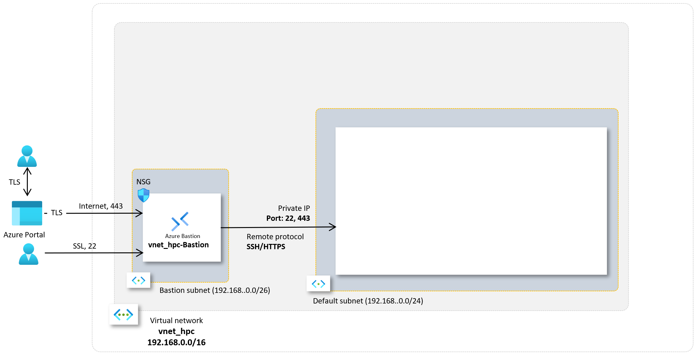

이 연습을 위해서는 비용에 대한 권한이 있는 Azure 구독이 필요합니다.

== Azure Portal에 로그인

여기서는 Azure Portal에 로그인합니다. 아래 절차에 따릅니다. 로그인 계정과 구독에 대해서는 문서 link:../02_tech_desc/01_azure/01_subscription.adoc[Azure 구독(Subscription)]을 참조하세요.

1. Azure Portal에 접속합니다.
+
https://portal.azure.com
+
2. 유효한 계정으로 Azure Portal에 로그인합니다.
3. 위쪽의 검색 텍스트 상자에서 **구독**을 입력하고 검색 결과 창에서 **구독**을 클릭합니다.
+
image:./images/01/01/image01.png[width=500]
+
4. 로그인한 계정의 디렉토리에 있는 계정과 내 역할 및 비용에 대한 권한을 확인합니다.
+
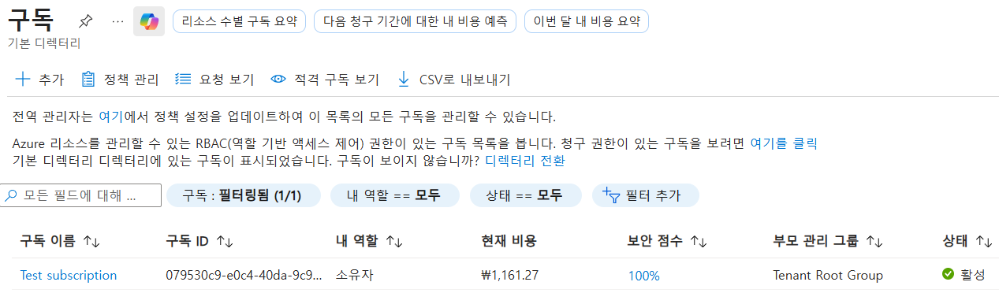

== 리소스 그룹(Resource Group) 생성

Azure에서 리소스 그룹(Resource Group)은 관련된 Azure 리소스들(가상 머신, 스토리지 등)을 하나의 프로젝트나 애플리케이션 단위로 묶어서 관리하는 논리적 컨테이너(폴더)입니다. 리소스 그룹에 대한 자세한 내용은 문서 link:../02_tech_desc/01_azure/02_resource_group.adoc[리소스 그룹]을 참조하세요.

이 연습에서는 HPC 클러스터와 관련된 모든 리소스가 위치할 리소스 그룹을 생성합니다. 아래 절차에 따릅니다.

1. 위쪽의 검색 텍스트 상자에서 **리소스 그룹**을 입력하고 검색 결과 창에서 **리소스 그룹**을 클릭합니다.
+
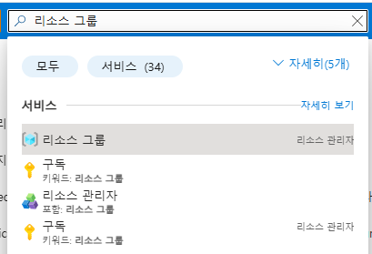
+
2. **리소스 관리자 | 리소스 그룹** 페이지에서 **+ 만들기**를 클릭합니다.
+
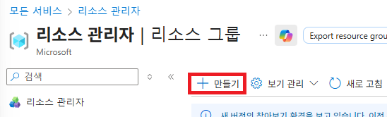
+
3. 리소스 그룹 만들기 페이지에서, 아래와 같이 설정합니다.
+
[cols="1,3a", options="header"]
|===
|항목|값
|구독|해당 구독
|리소스 그룹 이름|_rg-hpc_
|지역|_(Asia Pacific) Korea South_
|===
+
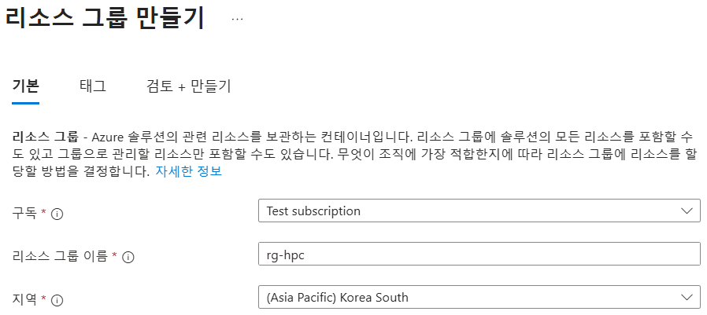
+
4. 아래쪽의 **검토+만들기** 버튼을 클릭합니다.
5. **리소스 그룹 만들기** 페이지에서, 유효성 검사가 완료되면 아래쪽에서 **만들기** 버튼을 클릭합니다.
6. 생성된 리소스 그룹을 확인합니다. 생성한 리소스 그룹이 보이지 않으면 **리소스 그룹** 페이지를 새로 고침 합니다.
+
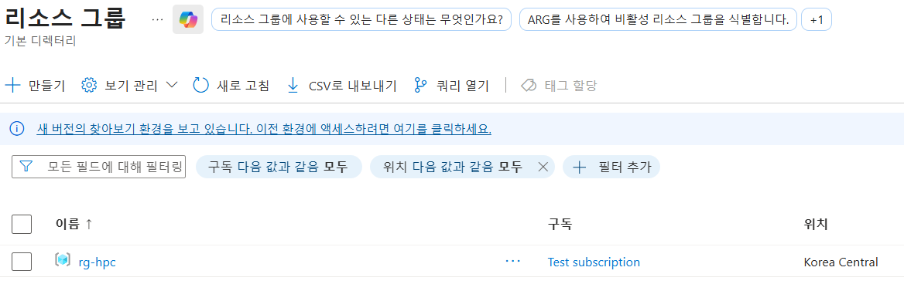

== Virtual Network와 Bastion 생성

Azure 가상 네트워크(Virtual Network, VNet)는 Azure 클라우드 안에 있는 사용자만의 격리된 프라이빗 네트워크로, 가상 머신 등과 같은 리소스를 안전하게 배치하는 공간으로 SDN(Software Defined Network)로 구성됩니다. 보다 자세한 내용은 문서 link:../02_tech_desc/01_azure/03_vnet.adoc[Azure 가상 네트워크]를 참조하세요.

배스천(Bastion)은 가상 머신이 공용 IP를 노출할 필요 없이, 웹 브라우저만으로 안전하게 원격 접속할 수 있게 해주는 관리형 보안 게이트웨이 서비스입니다. Azure 배스천에 대한 보다 자세한 내용은 문서 link:../02_tech_desc/01_azure/04_azure_bastion.adoc[Azure Bastion]를 참조하세요.

Azure에서는 배스천을 관리되는 서비스(PaaS) 형태로 제공하며, 가상 네트워크를 생성하면서 Bastion을 생성할 수 있습니다. 여기에서는 Bastion을 통해서만 접근하도록 구성되는 가상 네트워크를 생성합니다. 아래 절차에 따릅니다.

1. 상단의 Microsoft Azure 로고를 클릭하여 Azure Portal의 Home 페이지로 이동합니다.
+
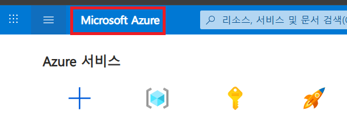
+
2. Azure 서비스 구역에서 **리소스 만들기**를 클릭합니다.
+
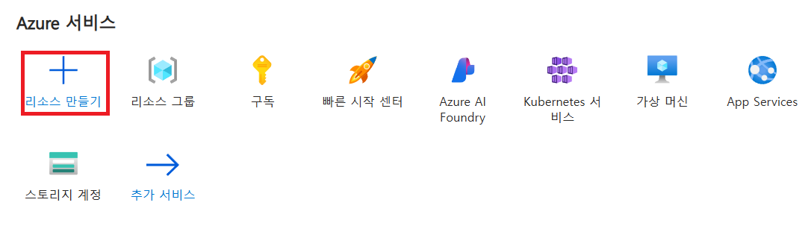
+
3. **범주** 구역에서 **네트워킹**을 클릭하고 **Virtual network**아래의 **만들기**를 클릭합니다.
+
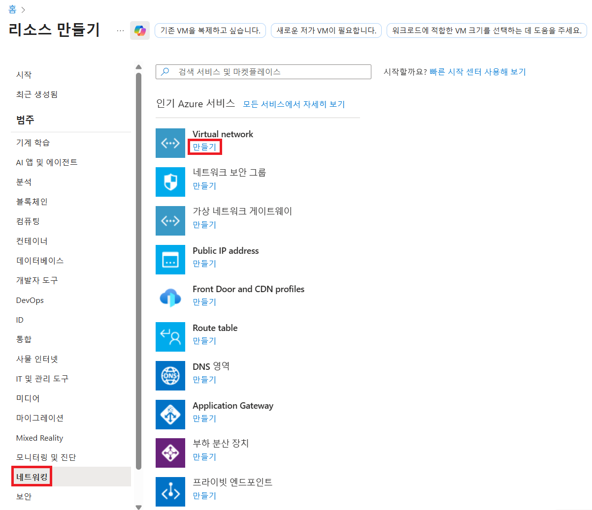
+
4. **가상 네트워크 만들기** 페이지의 **기본** 탭 에서, 아래와 같이 설정합니다.
+
|===
|항목|값
|구독|해당 구독
|리소스 그룹 이름|_rg-hpc_
|가상 네트워크 이름|_vnet_hpc_
|지역|_(Asia Pacific) Korea South_
|===
+
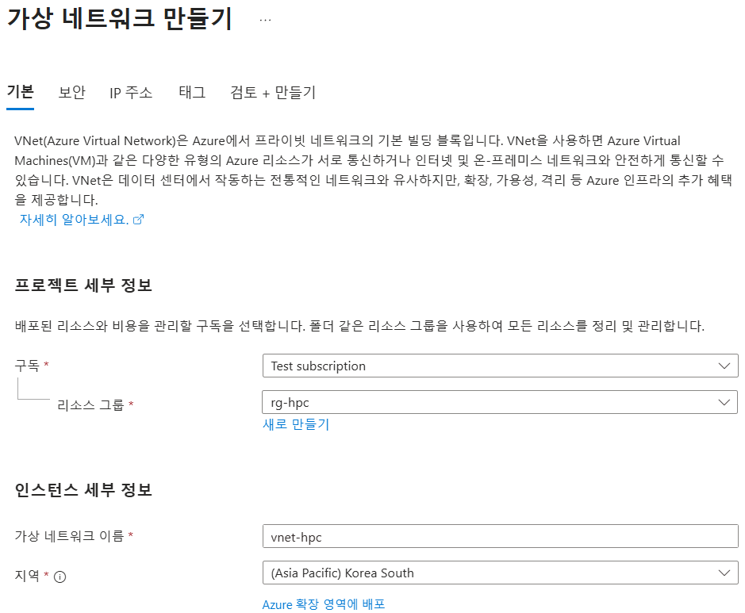
+
5. 아래쪽의 **다음** 버튼을 클릭합니다.
6. **가상 네트워크 만들기** 페이지의 **보안** 탭 에서 **Azure Bastion 사용** 체크박스를 선택합니다. Azure Bastion의 이름을 지정하거나 기억합니다. 여기에서는 _vnet_hpc-Bastion_ 입니다.
+
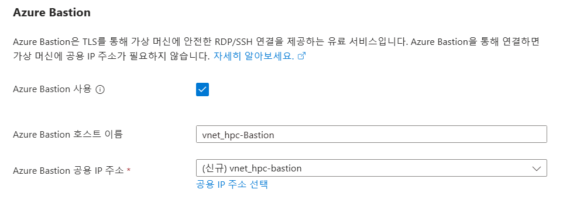
+
7. **Azure Bastion 공용 IP 주소** 드롭다운 리스트 아래의 **공용 IP 주소 선택**을 클릭하고 SKU를 확인합니다.
+
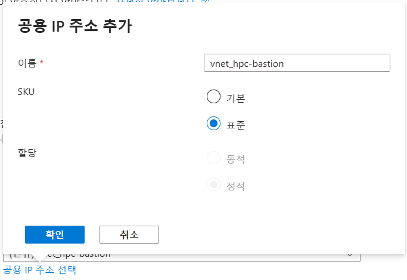
+
8. 아래쪽의 **다음** 버튼을 클릭합니다.
9. **가상 네트워크 만들기**의 **IP 주소** 탭 에서 주소 공간을 _192.168.0.0_ 으로 변경합니다. 미리 만들어진 두 서브넷을 확인합니다.
+
[cols="1,2,2,2"]
|===
|서브넷|IP 주소 범위|크기|NAT 게이트웨이
|default|192.168.0.0 - 192.168.0.255|/24(256개 주소)|-
|AzureBastionSubnet|192.168.1.0 - 192.168.1.63|/26(64개 주소)|-
|===
+
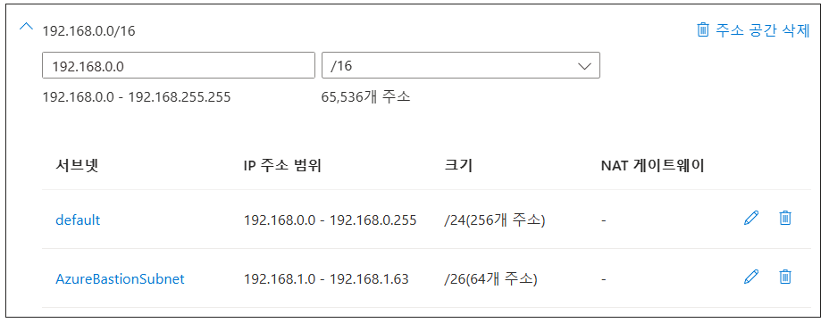
+
10. 아래쪽의 **검토 + 만들기** 버튼을 클릭합니다.
11. **가상 네트워크 만들기**의 **검토 + 만들기** 페이지에서 유효성 검사가 완료되면 **만들기** 버튼을 클릭합니다.
+
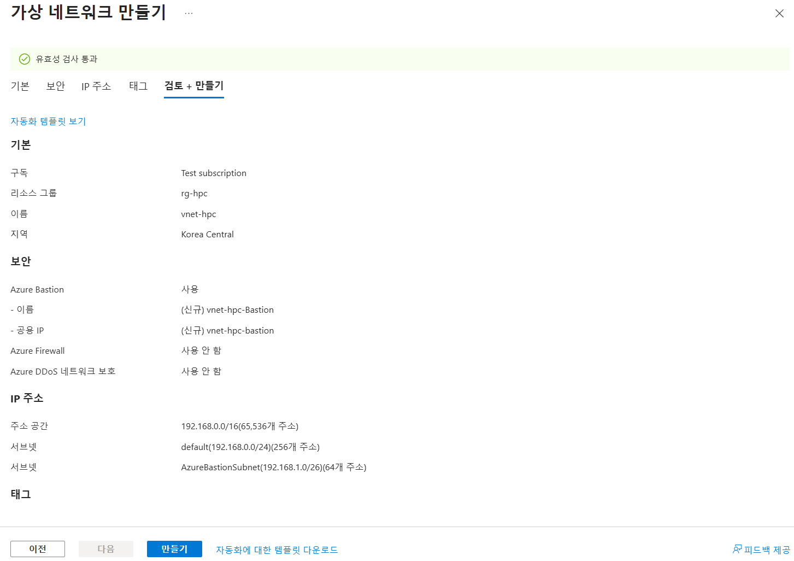
+
12. Virtual Network 배포가 진행됩니다.
+
13. 배포가 완료되면, 정보를 확인하고 **리소스로 이동** 버튼을 클릭하여 리소스로 이동합니다.
+
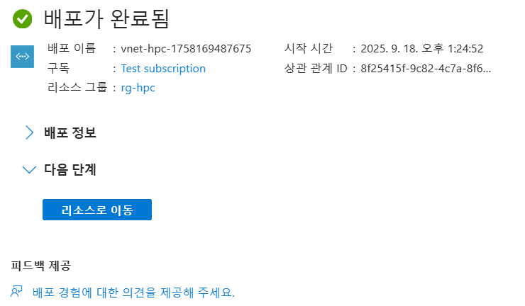
+
14. 왼쪽 패널에서 **설정**을 클릭하여 생성된 vnet_hpc 주소공간과 서브넷을 확인합니다.
+
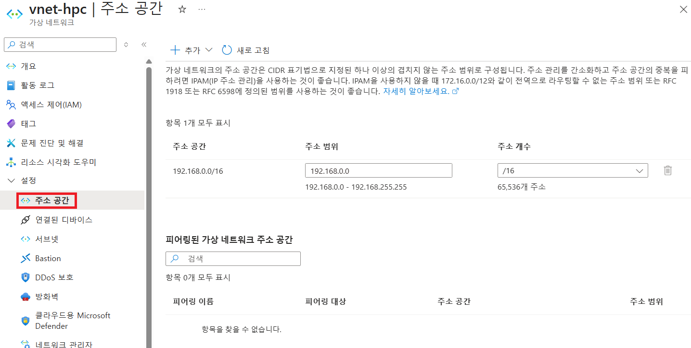
+
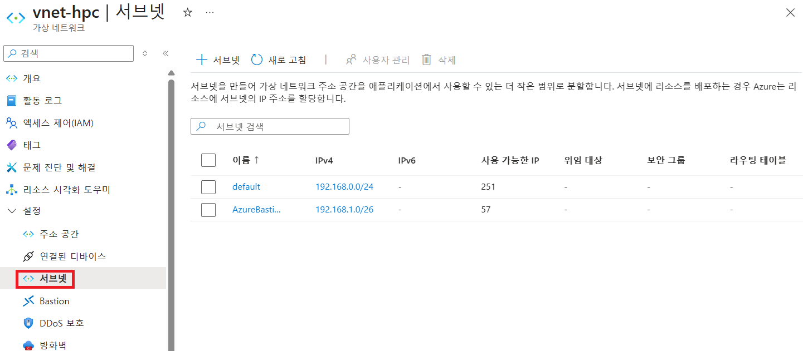
+
15. 왼쪽 패널에서 Bastion을 클릭하여 생성된 Azure Bastion 정보를 확인합니다.
+
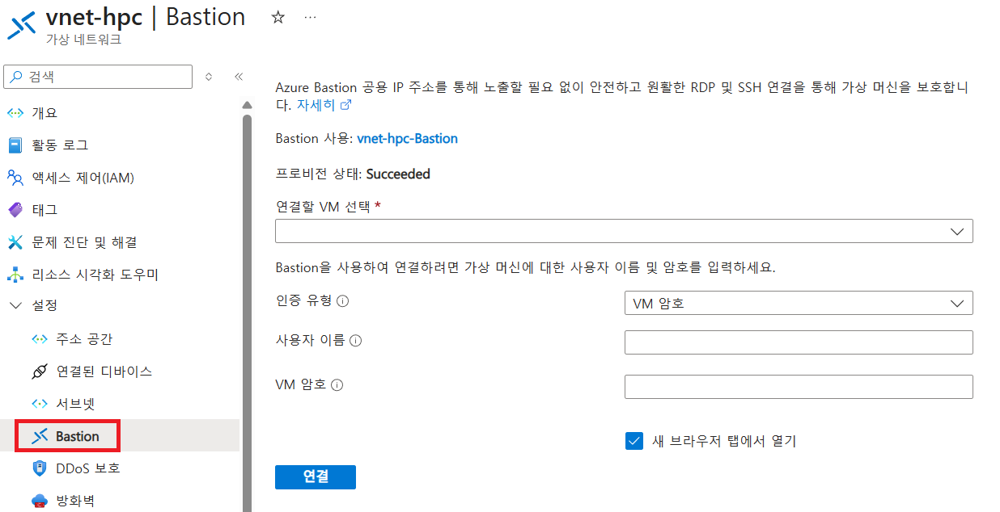

== SSH 키 생성

여기에서는 VM에서 사용할 SSH 키를 생성합니다. 아래 절차에 따릅니다.

1. 위쪽의 검색 텍스트 상자에서 **SSH 키**를 입력하고 검색 결과 창에서 **SSH 키**를 클릭합니다.
+
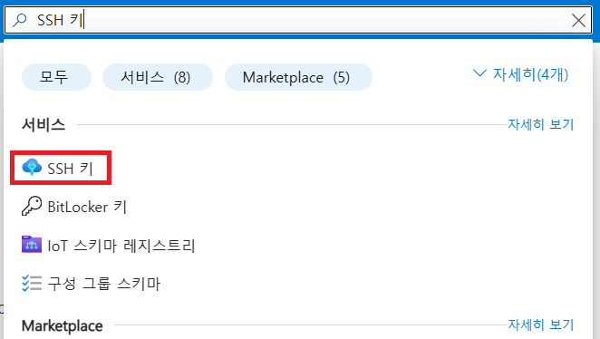
+
2. **SSH 키** 페이지에서 왼쪽 위의 **만들기** 를 클릭합니다.
+
image:./images/01/04/image02.png[width=600]
+
3. SSH 키 만들기 페이지에서 아래와 같이 기본 사항을 지정합니다. 다른 설정은 기본값으로 유지합니다.
+
[cols="1,3a", options="header"]
|===
|항목|값
|리소스 그룹|_rg-hpc_
|키 쌍 이름|_vnet-hpc-sshkey_
|SSH 공개 키 원본|_새 키 쌍 생성_
|SSH 키 유형|_RSA SSH 형식_
|===
+
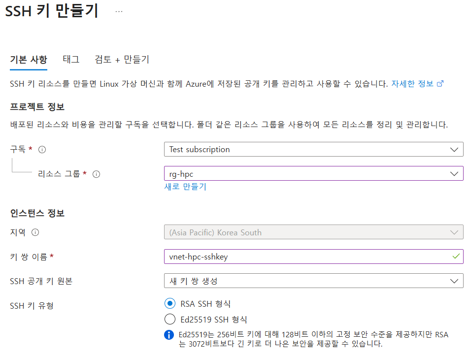
+
4. 아래쪽의 **검토 + 만들기** 버튼을 클릭합니다.
5. 유효성 검사를 통과하면 아래쪽의 **만들기** 버튼을 클릭합니다.
6. **새 키 쌍 생성** 대화상자에서 **프라이빗 키 다운로드 및 리소스 만들기**를 클릭합니다.
+
image:./images/01/04/image04.png[width=400]
+
7. 다른 이름으로 저장 대화상자에서 SSH 키를 저장할 폴더를 지정하고 **저장** 버튼을 클릭하여 저장합니다.
8. SSH 키 페이지에서 생성된 SSH 키를 확인합니다. (보이지 않으면 **새로 고침**을 클릭합니다)
+
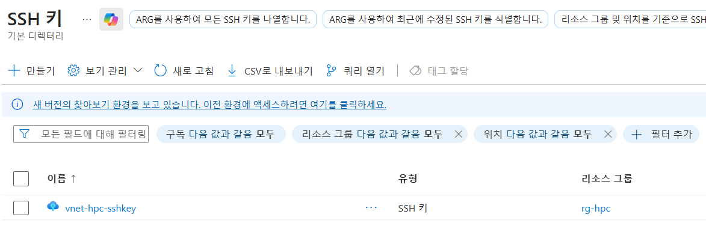

== Azure Bastion SKU 변경

Azure Bastion 터널링을 사용하기 위해서는 표준 또는 프리미엄 SKU가 필요합니다. 아래 절차에 따라 SKU를 변경합니다.

1. 상단의 Microsoft Azure 로고를 클릭하여 Azure Portal의 Home 페이지로 이동합니다.
2. 리소스 그룹을 클릭하고 **rg-hpc** 그룹을 클릭합니다.
3. **vnet-hpc-Bastion** 을 클릭합니다.
+
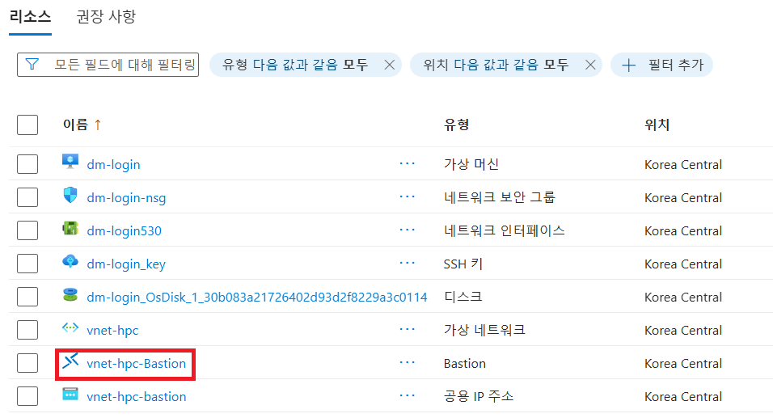
+
4. 왼쪽 패널의 **설정** 구역에서 **구성**을 클릭합니다.
+
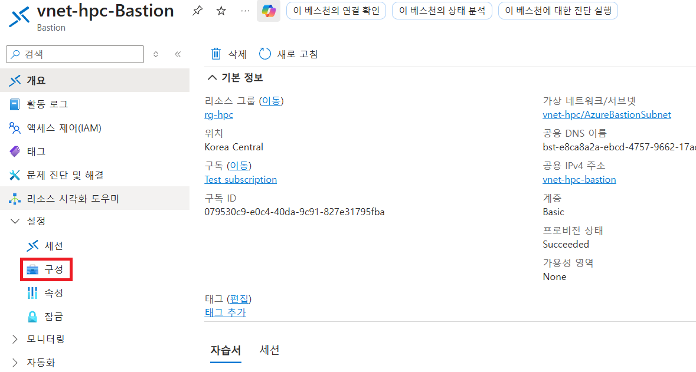
+
5. 설정을 아래와 같이 변경합니다.
+
[cols="1,3a", options="header"]
|===
|계층|_표준_
|복사 및 붙여넣기|_선택_
|기본 클라이언트 지원|_선택_
|===
+
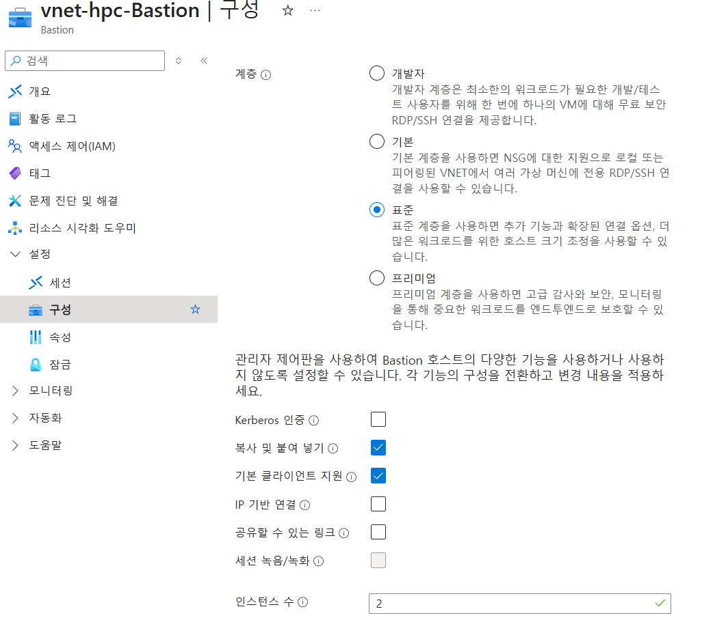
+
6. 아래쪽에서 **적용** 버튼을 클릭합니다.
7. 변경 내용이 적용되는 것을 확인합니다.

---

link:./00-1_prerequisite.adoc[이전: 사전 준비 사항] | link:./02_cyclecloud_storage.adoc[다음: Azure CycleCloud 배포]