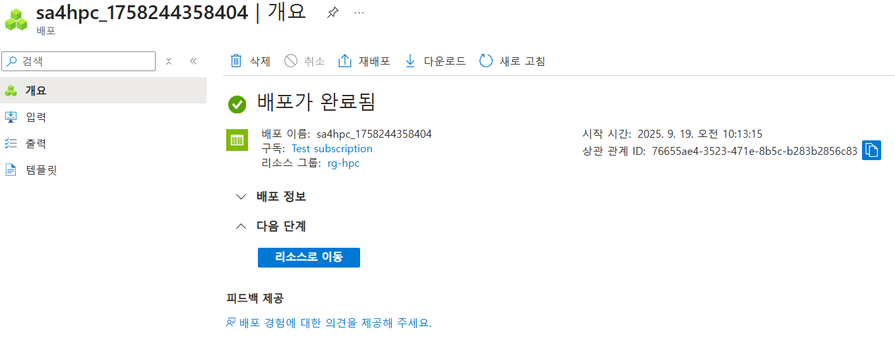
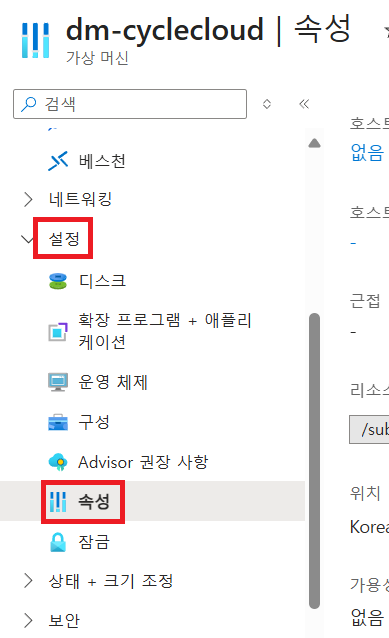
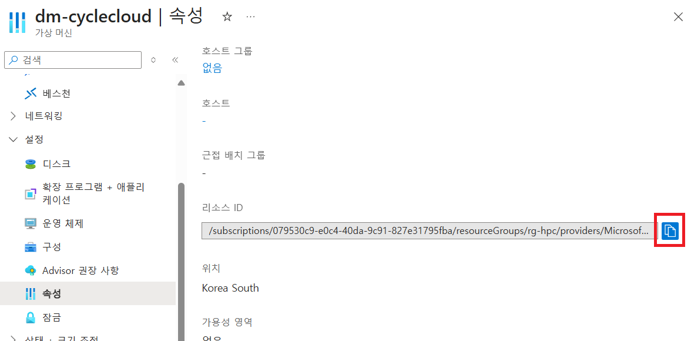
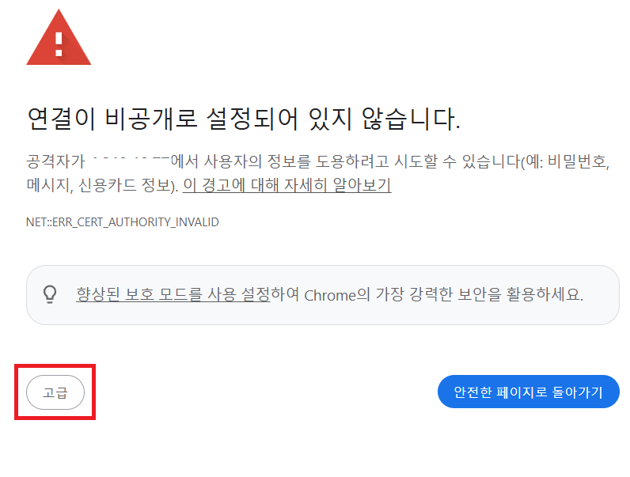
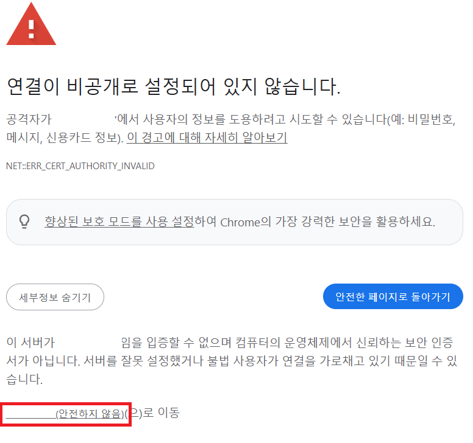
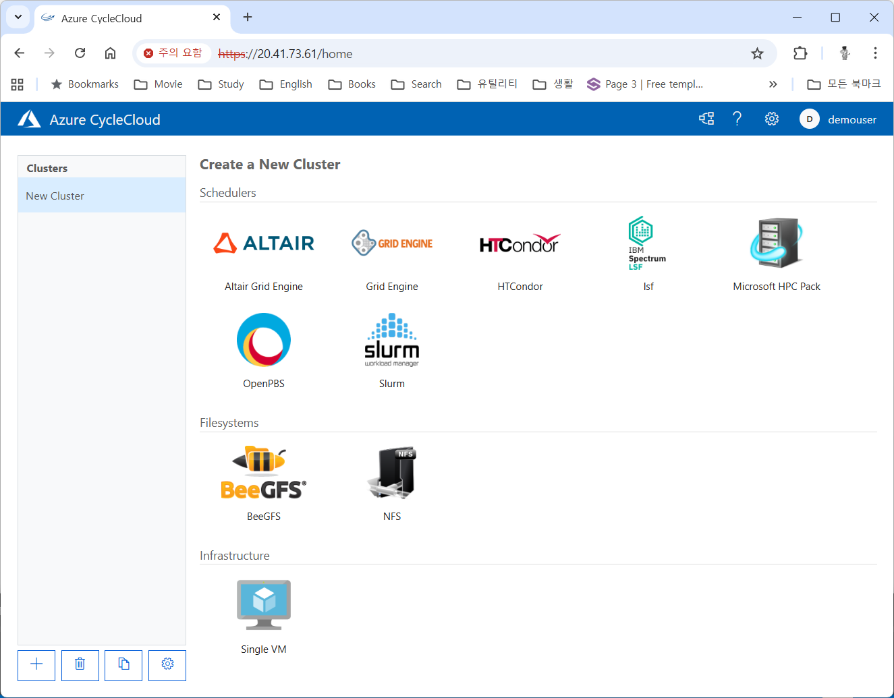

= Azure CycleCloud 배포
:sectnums:
:toc:

이 가이드에서는 이전의 문서에서 생성한 가상 네트워크에서 CycleCloud를 생성합니다. Azure CycleCloud는 HPC 스케줄러를 구현하는 간단하고 안전하며 스케일이 가능한 방법을 제공합니다.

이 가이드에서는 첫 번째 단계로 프로젝트를 저장할 스토리지 계정을 만들고, CycleCloud 가상 머신을 생성합니다. 이 연습에서는 아래와 같은 과정을 수행합니다.

* CycleCloud 스토리지 생성
* CycleCloud 가상 머신 생성
* Locker Identity를 위한 관리 ID 생성
* Web UI에서 CycleCloud 설정

이 가이드의 절차를 완료하면 아래와 같은 환경이 구성됩니다. 

이 연습을 위해서는 이전 가이드에서 수행한 환경이 구성되어 있어야 합니다.

////
https://learn.microsoft.com/ko-kr/training/modules/azure-cyclecloud-high-performance-computing/4-exercise-install-configure
////

== 스토리지 계정 생성

여기에서는 CycleCloud Storage를 생성합니다.

1. Azure Portal에 접속합니다.
+
https://portal.azure.com
+
2. 유효한 계정으로 Azure Portal에 로그인합니다.
3. Azure 서비스 구역에서 **리소스 만들기**를 클릭합니다.
4. 왼쪽 패널에서 **스토리지**를 클릭하고 오른쪽에서 **스토리지 계정** 아래의 **만들기**를 클릭합니다.
+
image:./images/02/01/image01.png[width=500]
+
5. 아래와 같이 기본 사항을 지정합니다. 다른 설정은 기본값으로 유지합니다.
+
[cols="1,3a", options="header"]
|===
|항목|값
|리소스 그룹|_rg-hpc_
|스토리지 계정 이름|_sa4hpc_
|위치|_(Asia Pacific) Korea South_
|기본 스토리지 유형|_기본 스토리지 유형_
|성능|_프리미엄_
|프리미엄 계정 유형|_블록 blob_
|중복도|_LRS(로컬 중복 스토리지)_
|===
+

+
6. 아래쪽에서 **다음** 버튼을 클릭합니다.
7. **고급** 탭에서 설정을 확인합니다. 모든 값을 기본 값으로 유지합니다.
+
 
+
8. 아래쪽에서 **다음** 버튼을 클릭합니다.
9. **네트워킹** 탭에서 아래와 같이 네트워크 설정을 지정합니다. 다른 설정은 기본값으로 유지합니다.
+
[cols="1,3a", options="header"]
|===
|항목|값
|공용 네트워크 액세스|_사용_
|공용 네트워크 액세스 범위|_선택한 가상 네트워크 및 IP 주소에서 사용_
|가상 네트워크|_vnet-vpc_
|서브넷|_default(192.168.0.0/24)('Micrsoft.Storage'엔드포인트가 추가됨)_
|===
+

+
10. 아래쪽에서 **검토 + 만들기** 버튼을 클릭합니다.
11. 유효성 검사가 완료되면 **만들기** 버튼을 클릭합니다.
12. 배포가 진행됩니다.
13. 배포가 완료되면 **리소스로 이동** 버튼을 클릭합니다.
+

+
14. 생성된 스토리지 계정의 정보를 확인합니다.
+
image:./images/02/01/image06.png[width=800]

== CycleCloud 가상 머신 생성

이 연습에서는 CycleCloud 가상 머신을 생성합니다. 아래 절차에 따릅니다.

1. 상단의 Microsoft Azure 로고를 클릭하여 Azure Portal의 Home 페이지로 이동합니다.
2. Azure 서비스 구역에서 **리소스 만들기**를 클릭합니다.
3. 왼쪽 패널에서 **컴퓨팅**을 선택하고 **가상 머신** 아래의 **만들기**를 클릭합니다.
+
image:./images/02/02/image01.png[width=600] 
+
4. 아래와 같이 가상 머신 기본 사항을 지정합니다. 다른 설정은 기본값으로 유지합니다.
+
[cols="1,3a", options="header"]
|===
|항목|값
|리소스 그룹|_rg_rpc_
|가상 머신 이름|_dm-cyclecloud_ (다른 이름을 지정할 수 있습니다)
|지역|_(Asia Pacific) Korea South_
|가용성 옵션|_인프라 중복이 필요하지 않습니다_
|보안 유형|_표준_
|이미지|이미지를 선택하기 위해 아래 절차에 따릅니다. 

1. 아래쪽의 **모든 이미지 보기**를 클릭합니다. +
2. Market Place 페이지에서, 검색창에 _Azure CycleCloud_를 입력하고 엔터키를 눌러 검색합니다.
+
image:./images/02/02/image02.png[width=500]
+
3. 검색 결과에서, **Azure CycleCloud** 아래의 **선택**을 클릭하고 **Azure CycleCloud 8.7 - X64 2세대**를 클릭합니다.
+
image:./images/02/02/image03.png[width=400]    
+
4. **가상 머신 만들기** 페이지에서, **이미지**에 해당 이미지가 표시됩니다.
|크기|_Standard_D4ds_v4 - 4 vcpus, 16 GiB memory_
|인증 형식|_SSH 공개 키_
|사용자 이름|_azureuser_ (다른 이름을 지정할 수 있습니다)
|SSH 공개 키 원본|_Azure에 저장된 기본 키 사용_
|저장된 키|_vnet-hpc-sshkey_ (SSH 키 생성에서 생성한 키)
|===
+

+
5. 아래에서 **다음: 디스크** 버튼을 클릭합니다.
6. 디스크 탭에서, **VM으로 삭제** 항목이 선택되어 있는 것을 확인합니다.
+
image:./images/02/02/image05.png[width=800]
+
7. 나머지 항목은 기본 값들을 유지하고 아래에서 **다음: 네트워킹** 버튼을 클릭합니다.
8. 네트워킹 탭에서, 아래와 같이 가상 머신의 네트워크 정보를 설정합니다. 다른 설정은 기본값으로 유지합니다.
+
[cols="1,3a", options="header"]
|===
|항목|값
|가상 네트워크|_vnet-hpc(rg-hpc)_
|서브넷|_default_
|공용 IP|없음
|VM 삭제시 공용 IP 및 NIC 삭제|_선택_
|가속화된 네트워킹 사용|_선택_
|===
+

+
9. 아래에서 **다음: 관리** 버튼을 클릭합니다.
10. 관리 탭에서, 아래와 같이 정보를 지정합니다. 다른 설정은 기본값으로 유지합니다.
+
[cols="1,3a", options="header"]
|===
|항목|값
|시스템이 할당한 관리 ID 사용|_선택_
|===
+

+
11. 아래에서 **검토 + 만들기** 버튼을 클릭합니다.
12. 유효성 검사가 완료되면, 아래에서 **만들기** 버튼을 클릭합니다.
13. 배포가 시작됩니다.
14. 배포가 완료되면, **리소스로 이동** 버튼을 클릭합니다.

== Bastion을 통해 연결

여기에서는 공용 IP와 공용 인바운드 포트가 없이 만들어진 VM에 Bastion을 통해 연결합니다. 아래 절차에 따릅니다.

=== Azure Portal에서 SSH 연결

1. 상단의 Microsoft Azure 로고를 클릭하여 Azure Portal의 Home 페이지로 이동합니다.
2. **Azure 서비스** 구역에서 **리소스 그룹**을 클릭합니다.
3. 생성한 **rg_hpc** 리소스 그룹을 클릭합니다.
4. 리소스 그룹에서, 위에서 생성한 **dm_cyclecloud** 가상 머신을 클릭합니다.
+

+
5. 왼쪽 패널에서 **네트워킹** → **네트워크 설정**을 클릭하고 공용 IP 주소가 없음을 확인합니다.
+

+
6. 왼쪽 패널에서 **연결** → **배스천**을 클릭합니다.
7. 아래와 같이 항목들을 설정합니다.
+
[cols="1,2a", options="header"]
|===
|항목|값
|인증 유형|_로컬 파일의 SSH 프라이빗 키_
|사용자 이름|_azueruser_
|로컬 파일|이전 연습에서 생성하여 로컬에 저장한 vnet-hpc-sshkey.pem 파일
|===
+

+
8. **연결** 버튼을 클릭합니다.
9. 새 브라우저 탭에서 SSH 연결을 확인합니다. 
+

+
10. exit를 입력하고 enter 키를 눌러 접속을 종료합니다.
11. Disconnected에서 Close 버튼을 클릭합니다.
+

=== 로컬 클라이언트를 통한 SSH 접속

Azure에서 제공하는 Bastion 터널링을 사용하면 Azure Portal이 아닌 로컬 SSH를 통해 가상 머신에 접속할 수 있습니다. 명령의 형식은 아래와 같습니다.

이 동작을 위해서는 Azure Bastion의 SKU가 표준 이상으로 지정되어 있어야 합니다.

----
az network bastion ssh --auth-type
                       [--auth-type]            // SSH 연결에 사용할 인증 형식입니다.
                       [--ids]                  // 선택적 매개변수로, 리소스 ID를 나타냅니다.
                       [--name]                 // Bastion Host의 이름입니다.
                       [--resource-group]       // Bastion Host의 리소스 그룹 이름입니다.
                       [--resource-port]        // 선택적 매개변수로, Bastion이 연결할 대상 VM의 리소스 포트입니다.
                       [--ssh-key]              // 선택적 매개변수로, SSH 연결에 대한 SSH 키 파일 위치입니다.
                       [--subscription]         // 선택적 매개변수로, 구독의 이름 또는 ID입니다.
                       [--target-ip-address]    // 선택적 매개변수로, 대상 Virtual Machine의 IP 주소입니다.
                       [--target-resource-id]   // 선택적 매개변수로, 대상 Virtual Machine의 ResourceId입니다.
                       [--username]             // 선택적 매개변수로, SSH 연결의 사용자 이름입니다.
                       []
----

로컬 SSH를 통해 가상 머신에 액세스하려면 클라이언트에 Azure CLI가 설치되어야 합니다. 설치 방법은 아래 링크의 설명을 따르십시오.

* https://github.com/gikpreet/class-environment_settings/blob/main/10_microsoft_azure/azure_cli/01_azure_cli_windows.adoc[Windows 11에서 Azure CLI 설치]
* https://github.com/gikpreet/class-environment_settings/blob/main/10_microsoft_azure/azure_cli/02_azure_cli_macos.adoc[macOS에서 Azure CLI 설치]
* https://github.com/gikpreet/class-environment_settings/blob/main/10_microsoft_azure/azure_cli/03_azure_cli_linux.adoc[Linux에서 Azure CLI 설치]

==== 가상 머신 resource id 확인

Bastion을 통해 SSH를 사용하여 가상 머신에 접속하기 위해서는 가상 머신의 resource id가 필요합니다. 아래 절차를 통해 가상 머신의 resource id를 확인할 수 있습니다.

1. 상단의 Microsoft Azure 로고를 클릭하여 Azure Portal의 Home 페이지로 이동합니다.
2. **Azure 서비스 구역**에서 **리소스 그룹**을 클릭합니다.
3. **rg_hpc** 리소스 그룹을 클릭합니다.
4. 리소스 그룹에서, 위에서 생성한 **dm_cyclecloud** 가상 머신을 클릭합니다.
5. 왼쪽 패널에서 **개요**를 클릭합니다.
6. 기본 정보의 오른쪽 위에서, **JSON 보기**를 클릭합니다.
+

+
7. 오른쪽에서 열리는 **리소스 JSON** 패널에서 **id** 필드의 값을 복사합니다.
+

==== SSH를 통해 접속

1. 터미널을 실행합니다.
2. 아래 명령을 실행하여 dm-cyclecloud 가상 머신에 접속합니다. 명령은 각 리소스의 이름으로 수정되어야 합니다.
+
----
az network bastion ssh --name vnet_hpc-Bastion --resource-group rg-hpc --target-resource-id /subscriptions/079530c9-e0c4-40da-9c91-827e31795fba/resourceGroups/rg-hpc/providers/Microsoft.Compute/virtualMachines/dm-cyclecloud --auth-type ssh-key --username azureuser --ssh-key C:/keys/vnet-hpc-sshkey.pem
----
+
[cols="1a"]
|====
|**참고** 명령의 형식은 아래와 같습니다.
----
az network bastion ssh
    --name <Bastion 호스트 이름>
    --resource-group <리소스 그룹 이름>
    --target-resource-id <VM의 resouce ID>
    --auth-type <인증 방식>
    --username <사용자 이름>
    --ssh-key <개인 키 위치>
----
|====
+
3. 접속에 성공합니다.
+
----
C:\Users\gik_k\.azure\cliextensions\bastion\azext_bastion\custom.py:107: UserWarning: pkg_resources is deprecated as an API. See https://setuptools.pypa.io/en/latest/pkg_resources.html. The pkg_resources package is slated for removal as early as 2025-11-30. Refrain from using this package or pin to Setuptools<81.
  from pkg_resources import parse_version
Last login: Sat Sep 20 14:48:01 2025 from 192.168.1.5
[azureuser@dm-cyclecloud ~]$
----
+
4. SSH 연결에서 아래 명령을 실행하여 CycleCloud 버전을 확인합니다.
+
----
cyclecloud --version
----
+

+
5. 아래 명령을 실행하여 SSH 연결을 닫습니다.
+
----
exit
----

=== Bastion을 통해 CycleCloud Portal에 연결

////
https://learn.microsoft.com/ko-kr/azure/cyclecloud/how-to/ccws/connect-to-portal-with-bastion?view=cyclecloud-8
////

로컬 환경에서 HTTPS 경로를 사용할 수 없는 경우 Azure Bastion을 사용하여 Azure CycleCloud 가상 머신에 SSH 터널을 설정할 수 있습니다. 아래 절차에 따릅니다.

1. dm-cyclecloud 가상 컴퓨터의 resource id를 복사합니다.
2. 아래 명령을 수행하여 Bastion Tunneling을 구성합니다. 아래 명령은 배스천 터널링을 사용하여 dm-cyclecloud 가상 컴퓨터의 443번 포트를 로컬 호스트의 8443번 포트로 포워딩합니다.
+
----
az network bastion tunnel --name vnet_hpc-Bastion --resource-group rg-hpc --target-resource-id /subscriptions/079530c9-e0c4-40da-9c91-827e31795fba/resourceGroups/rg-hpc/providers/Microsoft.Compute/virtualMachines/dm-cyclecloud --resource-port 443 --port 8443
----
+
[cols="1a"]
|====
|**참고** 명령의 형식은 아래와 같습니다.
----
az network bastion tunnel
    --name <Bastion 호스트 이름>
    --resource-group <리소스 그룹 이름>
    --target-resource-id <VM의 resouce ID>
    --resource-port <가상 컴퓨터의 포트>
    --port <포워딩 될 로컬호스트의 포트>
----
|====
+
3. 터널링이 실행되고 포트가 포워딩 됩니다.
+
----
Opening tunnel on port: 8443
Tunnel is ready, connect on port 8443
Ctrl + C to close
----
4. 새 웹 브라우저를 실행하고, 주소창에 아래 주소를 입력하여 dm-cyclecloud 가상 머신의 CycleCloud 포털에 접속합니다.
+
https://localhost:8443
+
5. 만약 웹 브라우저(chrome 또는 egde 등)에서 TLS 보안 경고 화면을 표시하면, 경고 메시지에서 **고급** 버튼을 클릭합니다.
+

+
6. 아래쪽의 x.x.x.x(안전하지 않음)로 이동 링크를 클릭합니다.
+

+
7. CycleCloud 포털에 연결됩니다.
+

+
8. 웹 브라우저를 닫습니다.

== CycleCloud Locker Identity를 위한 관리 ID 생성

CycleCloud Locker는 Azure CycleCloud에서 프로젝트의 이진 파일(예: 오픈 소스 소프트웨어)을 저장하고 관리하기 위한 스토리지 영역입니다. 이 Locker에 업로드된 이진 파일들은 /project/Blob 경로에 표시되며, 이를 통해 프로젝트 작성자는 자신이 배포하고자 하는 소프트웨어의 바이너리를 관리하고 클러스터에 배포할 수 있습니다.

CycleCloud의 Locker Identity는 Azure CycleCloud가 Azure 스토리지 계정에서 데이터를 읽고 쓰기 위해 사용하는 관리 ID입니다. 사용자가 직접 암호를 관리할 필요 없이, CycleCloud가 권한을 안전하게 관리할 수 있도록 도와주며, 스토리지 계정 접근을 위한 보안 메커니즘으로 작동합니다. 

=== 관리 ID 생성

여기에서는 CycleClod Locker Identity를 위한 관리 ID를 생성합니다. 아래 절차에 따릅니다.

1. Portal의 위쪽 검색창에 **관리 ID**를 검색하고 선택합니다.
+

+
2. 관리 ID 페이지에서 왼쪽 위의 **만들기**를 클릭합니다.
+
image:./images/02/04/image02.png[width=500]
+
3. **사용자가 할당한 관리 ID 만들기** 페이지에서 아래와 같이 설정합니다.
+
[cols="1,3a", options="header"]
|===
|항목|값
|구독|해당 구독
|리소스 그룹|_rg-hpc_
|이름|_locker-mi_
|지역|_Korea South_
|격리 범위|_없음_
|===
+

+
4. 아래쪽의 **검토 + 만들기** 버튼을 클릭합니다.
5. 유효성 검사가 완료되면 **만들기** 버튼을 클릭합니다.
6. 배포가 시작됩니다.
7. 배포가 완료되면 **리소스로 이동** 버튼을 클릭합니다.
8. Portal의 위쪽 검색창에 **관리 ID**를 검색하고 선택합니다.
9. 생성된 관리 ID를 확인합니다. 보이지 않으면 **새로 고침**을 클릭합니다.
+

=== 스토리지 계정에 대한 권한 부여

여기에서는 생성한 관리 ID가 Locker로 사용될 스토리지 계정에 접근할 수 있도록 역할을 할당합니다. 아래 절차에 따릅니다.

1. 상단의 Microsoft Azure 로고를 클릭하여 Azure Portal의 Home 페이지로 이동합니다.
2. **리소스 그룹**을 클릭합니다.
3. 리소스 그룹에서 **rg-hpc**를 클릭합니다.
4. rg-hpc 페이지의 리소스 목록에서 **sa4hpc** 스토리지 계정을 클릭합니다.
5. 왼쪽 패널에서 **액세스 제어(IAM)**을 클릭합니다.
+
image:./images/02/04/image05.png[width=600]
+
6. **추가** 버튼을 클릭하고 **역할 할당 추가**를 클릭합니다.
+
image:./images/02/04/image06.png[width=600]
+
7. **역할 할당 추가** 페이지에서, **역할** 탭, **작업 기능 역할** 탭의 검색 텍스트 상자에 _storage blob 데이터 Reader_ 를 입력하여 검색하고 선택합니다.
+

+
8. 아래쪽에서 **다음** 버튼을 클릭합니다.
9. **역할 할당 추가** 페이지의 **구성원** 탭에서 **다음에 대한 액세스 할당**에서 **관리 ID**를 선택하고 **+ 구성원 선택** 링크를 클릭합니다.
+

+
10. 오른쪽의 관리 ID 선택 패널에서 관리 ID 드롭다운 목록을 클릭하고 **사용자가 할당한 관리 ID**를 선택합니다.
+

+
11. 위에서 생성한 **locker-mi**를 클릭하고 **선택** 버튼을 클릭합니다.
+

+
12. 역할 할당 추가 페이지에서 **검토 + 할당** 버튼을 클릭합니다.
13. 유효성 검사가 완료되면 **검토 + 할당** 버튼을 클릭합니다.
14. **sa4hpc | 액세스 제어(IAM)** 페이지에서 **역할 할당** 탭을 선택하고 **Storage Blob 데이터 Reader 구역에 추가된 관리 ID**를 확인합니다.
+

== CycleCloud 가상 머신에 Azure 구독 추가

Microsoft Entra 관리 ID를 사용하여 구독에서 클러스터를 관리할 수 있는 Azure CycleCloud 권한을 부여합니다. 이 방법은 서비스 주체를 사용하는 대신 사용됩니다. 관리 ID를 CycleCloud VM에 할당하여 Storage, Key Vault 또는 Azure Container Registries와 같은 Azure 리소스에 대한 액세스를 제공합니다.

1. 상단의 Microsoft Azure 로고를 클릭하여 Azure Portal의 Home 페이지로 이동합니다.
2. **리소스 그룹**을 클릭합니다.
3. 리소스 그룹에서 **dm-cyclecloud** 가상 머신을 클릭합니다.
4. dm-cyclecloud 가상 머신 페이지의 왼쪽 패널에서 **보안** -> **ID**를 클릭합니다.
+
image:./images/02/05/image01.png[width=800]
+
5. **시스템 할당 항목** 페이지에서 **상태**를 **켜기**로 변경합니다.
+
image:./images/02/05/image02.png[width=800]
+
6. 위쪽에서 저장 버튼을 클릭합니다.
+
image:./images/02/05/image03.png[width=800]
+
7. **시스템에 할당한 관리 ID 사용**에서 **예**를 클릭합니다.
+
image:./images/02/05/image04.png[width=500]
+
8. 관리 ID 사용이 적용됨을 확인합니다.
+

+
|===
|**참고** 이 단계는 가상 머신을 생성할 때 **관리** 단계에서 **시스템이 할당한 관리 ID 사용** 옵션을 체크 했으면 미리 설정되어 있습니다. **시스템 할당 항목** 상태가 **켜짐**으로 설정되어 있다면 1 ~ 8 단계를 수행하지 않아도 됩니다.
|===
+
9. 포털 위쪽의 검색 상자에서 _구독_ 을 입력하여 검색하고 결과에서 **구독**을 클릭합니다.
+

+
10. 구독 페이지에서 해당 구독을 클릭합니다.
+

+
11. 해당 구독 페이지의 왼쪽 패널에서, **액세스 제어(IAM)**을 클릭합니다.
+

+
12. 액세스 제어 페이지에서 위쪽의 **+추가**를 클릭하고 **역할 할당 추가**를 클릭합니다.
+

+
13. 역할 할당 추가 페이지에서 **권한 있는 관리자 역할**을 클릭하고 **기여자**를 선택합니다.
+

+
14. 아래쪽의 **다음** 버튼을 클릭합니다.
15. 역할 할당 추가 페이지의 **구성원** 탭에서, **다음에 대한 액세스 할당**에서 **관리 ID**를 선택하고 **구성원 선택**을 클릭합니다.
+

+
16. 오른쪽의 관리 ID 선택 패널에서, **관리 ID** 드롭다운 리스트를 클릭하고 **가상 머신**을 클릭합니다.
+

+
17. dm-cyclecloud 가상 컴퓨터를 선택하고 아래쪽에서 **선택** 버튼을 클릭합니다.
+

+
18. 역할 할당 추가 페이지에서 **검토 + 할당** 버튼을 클릭합니다.
19. 유효성 검사가 완료되면 **검토 + 할당** 버튼을 클릭합니다.
20. 액세스 제어 페이지에서 위쪽의 **+추가**를 클릭하고 **역할 할당 추가**를 클릭합니다.
21. **작업 기능 역할** 텝에서 **storage blob 데이터 Contributor**을 검색하고 선택합니다.
+

+
22. 선택 후 아래쪽의 **다음** 버튼을 클릭합니다.
23. 역할 할당 추가 페이지의 **구성원** 탭에서, **다음에 대한 액세스 할당**에서 **관리 ID**를 선택하고 **구성원 선택**을 클릭합니다.
24. 오른쪽의 관리 ID 선택 패널에서, **관리 ID** 드롭다운 리스트를 클릭하고 **가상 머신**을 클릭합니다.
25. **dm-cyclecloud** 가상 컴퓨터를 선택하고 아래쪽에서 **선택** 버튼을 클릭합니다.
26. 역할 할당 추가 페이지에서 **검토 + 할당** 버튼을 클릭합니다.
27. 유효성 검사가 완료되면 **검토 + 할당** 버튼을 클릭합니다.
28. 액세스 제어 페이지에서 **역할 할당**을 클릭하고 **기여자**와 **Storage Blob 데이터 Contributor**가 추가되어 있는 것을 확인합니다.
+

== CycleCloud Web UI에 액세스

여기서는 생성한 CycleCloud의 Web UI에 액세스합니다. 아래 절차에 따릅니다.

1. 새 웹 브라우저를 실행하고, 주소창에 아래 주소를 입력하여 dm-cyclecloud 가상 머신의 CycleCloud 포털에 접속합니다.
+
https://localhost:8443
+
|====
|이 접속을 위해서는 Bastion tunneling이 아래와 같이 동작하고 있어야 합니다.

|====
2. Welcome 페이지에서, Site 이름을 _cyclecloud demo_ 로 지정하고 **Next** 버튼을 클릭합니다.
+

+
3. Azure Portal을 표시하는 웹 브라우저로 이동해서 합니다.
4. **rg-hpc** 리소스 그룹으로 이동하고, **vnet-hpc-sshkey**를 선택합니다.
+

+
5. 퍼블릭 키를 복사합니다.
+

+
6. CycleCloud 포털을 표시하는 웹 사이트로 이동합니다.
7. SSH Public Key에 복사한 퍼블릭 키를 붙어넣습니다.
8. **User ID**와 **Password**를 입력하고 **Done** 버튼을 클릭합니다.
* 사용자 ID는 가상 컴퓨터의 ID와 별개의 ID입니다. 동일한 이름을 지정할 수도 있습니다. 여기서는 _demouser_ 로 지정합니다.
* 패스워드는 8자에서 123자 사이여야 하며, 아래 규칙을 따라야 합니다.
** 대문자를 포함해야 합니다.
** 소문자를 포함해야 합니다.
** 숫자를 포함해야 합니다.
** 다음 특수를 문자 포함해야 합니다: @ # $ % ^ & * - _ ! + = [ ] { } | \ : ' , . ? ` ~ " ( ) ;
9. 두 번째 페이지는 아래와 같습니다. 아래쪽의 **Done** 버튼을 클릭합니다.
+

+
10. Add Subscription 페이지에서, **Validate Credentials**버튼을 클릭합니다.
11. **Test Successed** 메시지가 녹색 텍스트로 표시되는 것을 확인하고, 아래와 같이 정보를 지정합니다.
+
[cols="1,3a", options="header"]
|===
|항목|값
|Subscription Name|_cyclecloud demo_ +
적당한 이름을 지정할 수 있습니다.
|Set Default|_선택_
|Authentication|_Managed Identity_
|Subscription ID|기본 값
|Default Location|_Korea Central_
|Resource Group|_rg_hpc_
|Locker Identity|_rg-hpc/cyclecloud-locker-identity_
|Storage Account|_sa4hpc_
|Storage Container|_cyclecloud_
|===
+
image:./images/02/06/image06.png[width=700] 
+
12. 아래쪽의 **Save** 버튼을 클릭합니다.
13. Subscriptions 페이지의 위쪽 테이블에서 생성 요청한 구독을 클릭하고 아래쪽 테이블에서 Task 탭을 클릭하여 생성 단계를 확인합니다.
+

+
14. Subscriptions 페이지에서 위쪽의 **Back to Clusters** 링크를 클릭합니다.
+
image:./images/02/06/image08.png[width=700]
+
15. 클러스터 페이지를 확인합니다.
+

---