= Slurm 클러스터 생성 및 배포
:sectnums:
:toc:

Slurm은 고성능 컴퓨팅 클러스터에서 사용하는 오픈소스 작업 스케줄러(Job Scheduler)입니다. Slurm은 수 많은 계산 작업을 대기열에 등록하고, 가용한 컴퓨팅 자원(노드)에 순서대로 작업을 할당하여 전체 시스템의 효율을 극대화하는 역할을 합니다. 

Azure CycleCloud는 Microsoft Azure 클라우드에서 고성능 컴퓨팅(HPC) 클러스터를 손쉽게 만들고 관리하며 최적화하는 오케스트레이션 도구로, Slurm을 사용하는 HPC 클러스터를 쉽게 배포하고 관리할 수 있도록 합니다. 

Slurm과 CycleCloud 기술 개요에 대해서는 아래 문서들을 참조하십시오.

* link:../02_tech_desc/02_hpc/02_slurm.adoc[Slurm 기술 개요]
* link:../02_tech_desc/01_azure/06_azure_cyclecloud.adoc[Azure CycleCLoud]

이 가이드에서는 이전의 문서에서 생성한 가상 네트워크상에 구성된 CycleCloud를 사용하여 새 Slurm 클러스터를 만듭니다. CycleCloud는 해당 스케줄러에 대한 클러스터 프로비저닝을 간소화하는 미리 정의된 다양한 스케줄러 관련 템플릿을 제공합니다.

이 가이드에서는 첫 번째 단계로 Azure 구독이 클러스터의 리소스 요구사항을 수용하는지 확인하고, Azure CycleCloud를 사용하여 HPC 클러스터를 만들며, 구성하고 시작합니다. 연습에서는 다음과 같은 과정을 수행합니다.

* Azure CycleCloud를 사용하여 HPC 클러스터 생성
* Azure CycleCloud를 사용하여 HPC 클러스터 구성
* 비용 알림 설정
* 클러스터 시작
* 환경 정리(삭제)

이 가이드의 절차를 완료하면 아래와 같은 환경이 구성됩니다.

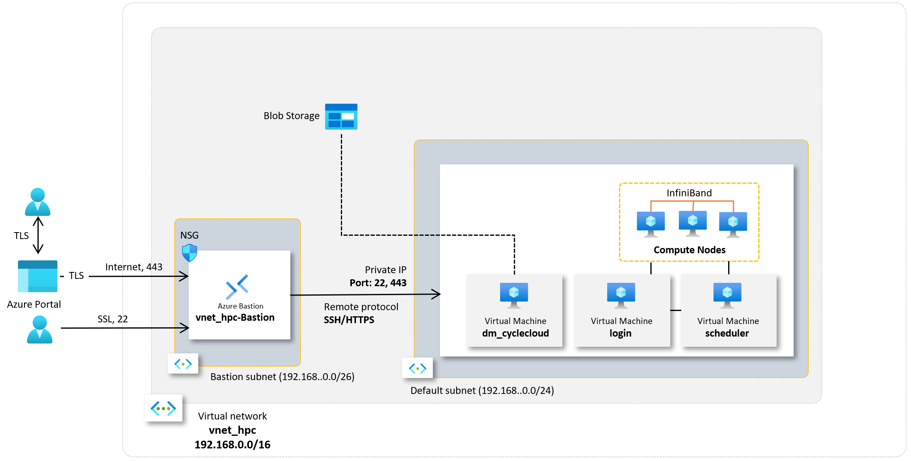

== HPC 클러스터 접근 준비

1. 웹 브라우저 (Chrome, Edge 등)를 실행합니다.
2. 생성된 CycleCloud의 Web UI에 접근합니다.
3. *Create a New Cluster* 페이지의 **Scheduler** 섹션에서 **Slurm**을 클릭합니다.
+
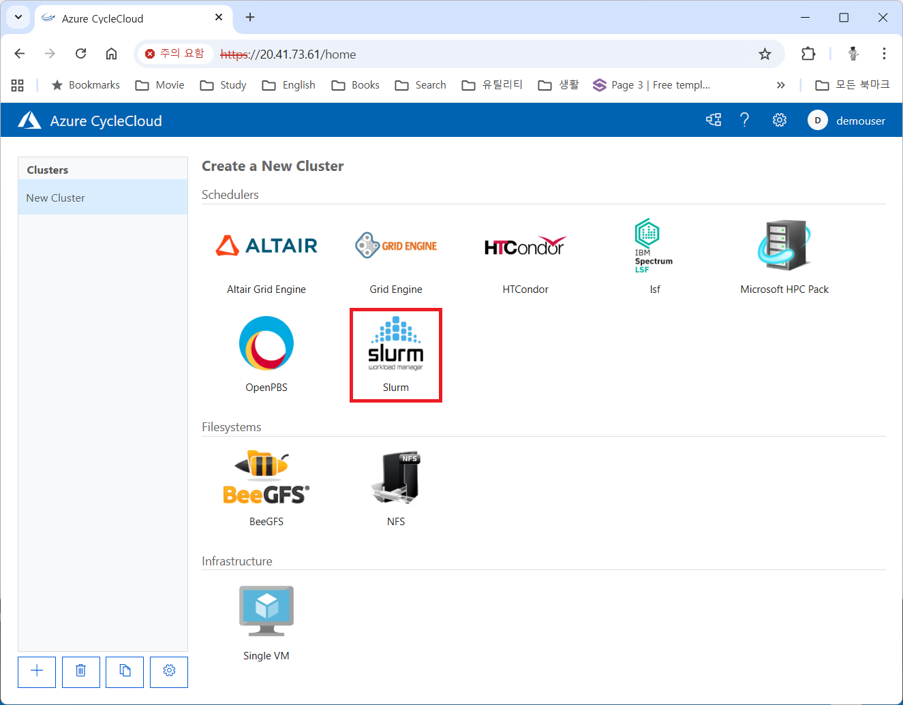
+
4. **New Slrum Cluster** 페이지에서, 위쪽의 **Cluster Name** 텍스트 상자에 클러스터의 이름을 입력합니다. 여기서는 _slurm-lab_ 입니다.
+
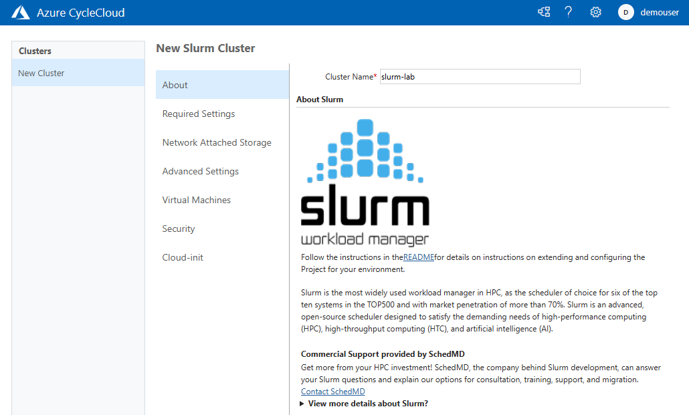
+
5. 아래쪽에서 **Next** 버튼을 클릭합니다.
6. **Required Settings** 단계에서 생성될 VM의 타입과 확장 한계를 지정하고, **Networking** 구역의 **Subnet ID**를 _rg-hpc:vnet-hpc-default_ 로 지정합니다.
+
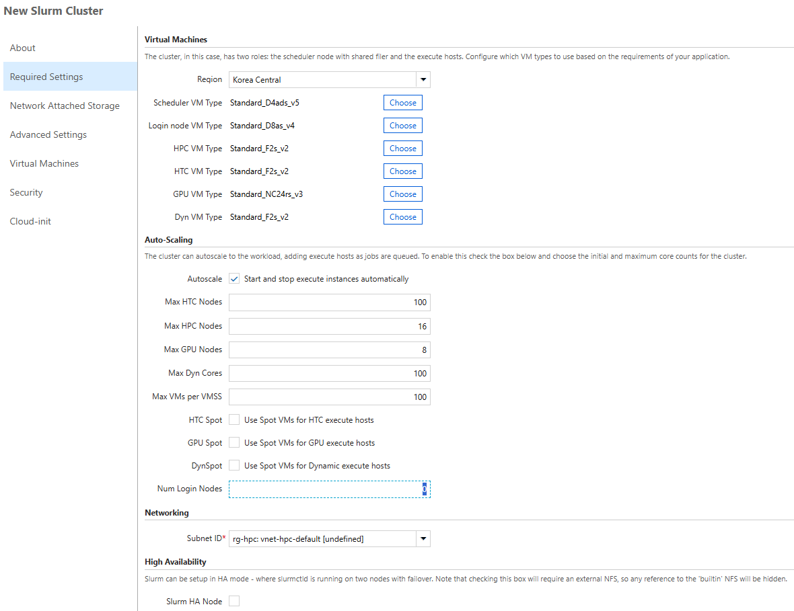
+
참고: 생성되는 VM의 역할은 아래와 같습니다.
+
[cols="1,3", options="header"]
|===
|VM 종류|역할
|Scheduler VM|클러스터의 두뇌 역할을 하는 핵심 VM으로, 사용자가 접속하여 작업을 제출하는 지점이며, 클러스터의 모든 노드를 관리하고 계산 작업을 각 컴퓨팅 노드에 분배하는 스케줄링 소프트웨어가 실행됩니다. 일반적으로 클러스터당 하나 또는 고가용성을 위해 두 개의 헤드 노드가 생성됩니다.
|Login node VM|사용자가 클러스터에 안전하게 접속하여 작업을 제출하고 관리할 수 있도록 제공되는 진입점 역할을 하는 VM입니다. 직접적인 계산은 수행하지 않으며, 헤드 노드의 부하를 줄여주는 역할을 합니다.
|HPC VM|고성능 연산과 대규모 병렬 처리에 최적화된 Azure VM으로, 주로 슈퍼컴퓨터에서 하는 일을 클라우드 환경에서 가능하게 만들어 주는 역할을 수행합니다.
|HTC VM|짧은 시간에 큰 계산을 병렬로 수행하는 것이 아닌, 많은 수의 독립적인 작업을 동시에, 꾸준히, 안정적으로 처리하는 역할을 수행합니다.
|GPU VM|GPU(Graphics Processing Unit)가 탑재된 가상 머신 입니다.
|Dyn VM|클러스터의 수요에 따라 자동으로 생성·삭제되는 유동적인 가상 머신으로, 필요할 때만 만들어지고 필요 없으면 자동으로 내려가는 탄력적 계산 자원입니다.
|===
+
> **참고** 기본 값으로 표시되는 VM 크기는 배포 시점에서 Azure에서 지원하지 않는 이름일 수 있습니다. VM 크기의 이름은 아래에서 확인할 수 있습니다.
+
* https://learn.microsoft.com/ko-kr/azure/virtual-machines/sizes/general-purpose/b-family[B 패밀리]
* https://learn.microsoft.com/ko-kr/azure/virtual-machines/sizes/general-purpose/d-family?tabs=dasv7%2Cdalsv7%2Cdpsv6%2Cdpdsv6%2Cdasv6%2Cdalsv6%2Cdv5%2Cddv5%2Cdasv5%2Cdpsv5%2Cdplsv5%2Cdlsv5%2Cdv4%2Cdav4%2Cddv4%2Cdv3%2Cdv2[D 패밀리]
* https://learn.microsoft.com/ko-kr/azure/virtual-machines/sizes/overview?tabs=breakdownseries%2Cgeneralsizelist%2Ccomputesizelist%2Cmemorysizelist%2Cstoragesizelist%2Cgpusizelist%2Cfpgasizelist%2Chpcsizelist#compute-optimized[컴퓨팅 최적화(F 패밀리)]
* https://learn.microsoft.com/ko-kr/azure/virtual-machines/sizes/overview?tabs=breakdownseries%2Cgeneralsizelist%2Ccomputesizelist%2Cmemorysizelist%2Cstoragesizelist%2Cgpusizelist%2Cfpgasizelist%2Chpcsizelist#memory-optimized[메모리 최적화(E 패밀리)]
* https://learn.microsoft.com/ko-kr/azure/virtual-machines/sizes/overview?tabs=breakdownseries%2Cgeneralsizelist%2Ccomputesizelist%2Cmemorysizelist%2Cstoragesizelist%2Cgpusizelist%2Cfpgasizelist%2Chpcsizelist#storage-optimized[스토리지 가속(L 패밀리)]
* https://learn.microsoft.com/ko-kr/azure/virtual-machines/sizes/overview?tabs=breakdownseries%2Cgeneralsizelist%2Ccomputesizelist%2Cmemorysizelist%2Cstoragesizelist%2Cgpusizelist%2Cfpgasizelist%2Chpcsizelist#gpu-accelerated[GPU 가속(N 패밀리)]
* https://learn.microsoft.com/ko-kr/azure/virtual-machines/sizes/overview?tabs=breakdownseries%2Cgeneralsizelist%2Ccomputesizelist%2Cmemorysizelist%2Cstoragesizelist%2Cgpusizelist%2Cfpgasizelist%2Chpcsizelist#fpga-accelerated[가속화된 컴퓨팅(N 패밀리)]
* https://learn.microsoft.com/ko-kr/azure/virtual-machines/sizes/overview?tabs=breakdownseries%2Cgeneralsizelist%2Ccomputesizelist%2Cmemorysizelist%2Cstoragesizelist%2Cgpusizelist%2Cfpgasizelist%2Chpcsizelist#high-performance-compute[고성능 컴퓨팅(H 패밀리)]

7. **Next** 버튼을 클릭합니다.
8. **Network Attached Storage** 단계에서, 기본 값을 유지하고 **Next** 버튼을 클릭합니다.
+
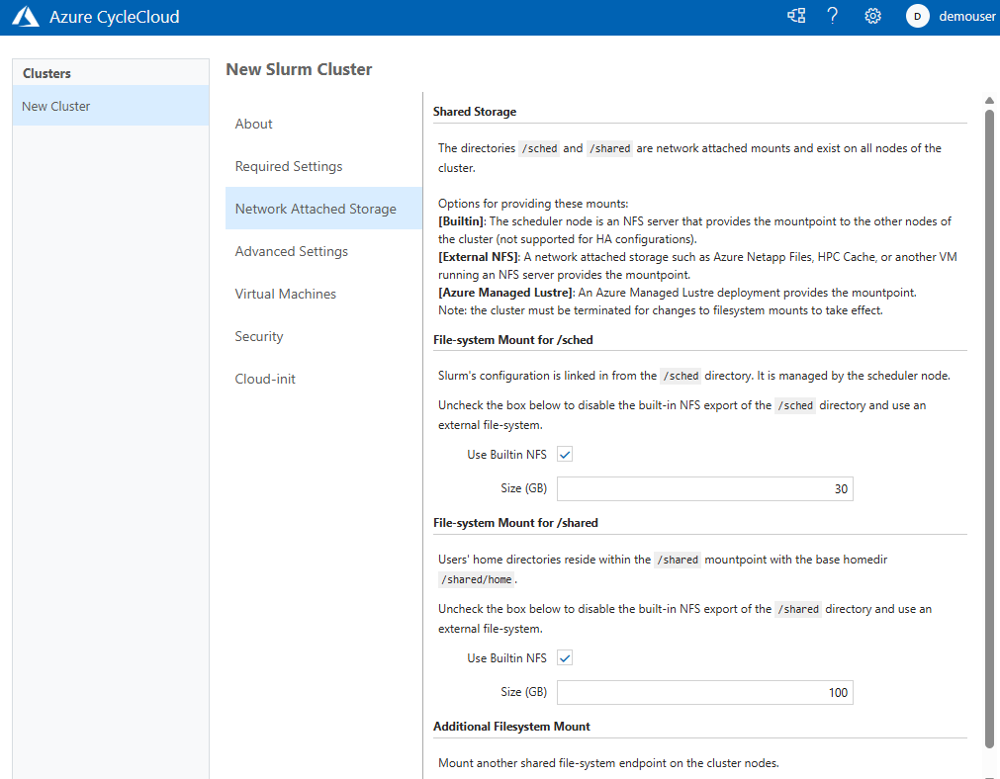
+
9. **Next** 버튼을 클릭합니다.
10. **Advanced Settings** 단계에서 기본 값을 유지하고 **Next** 버튼을 클릭합니다.
+
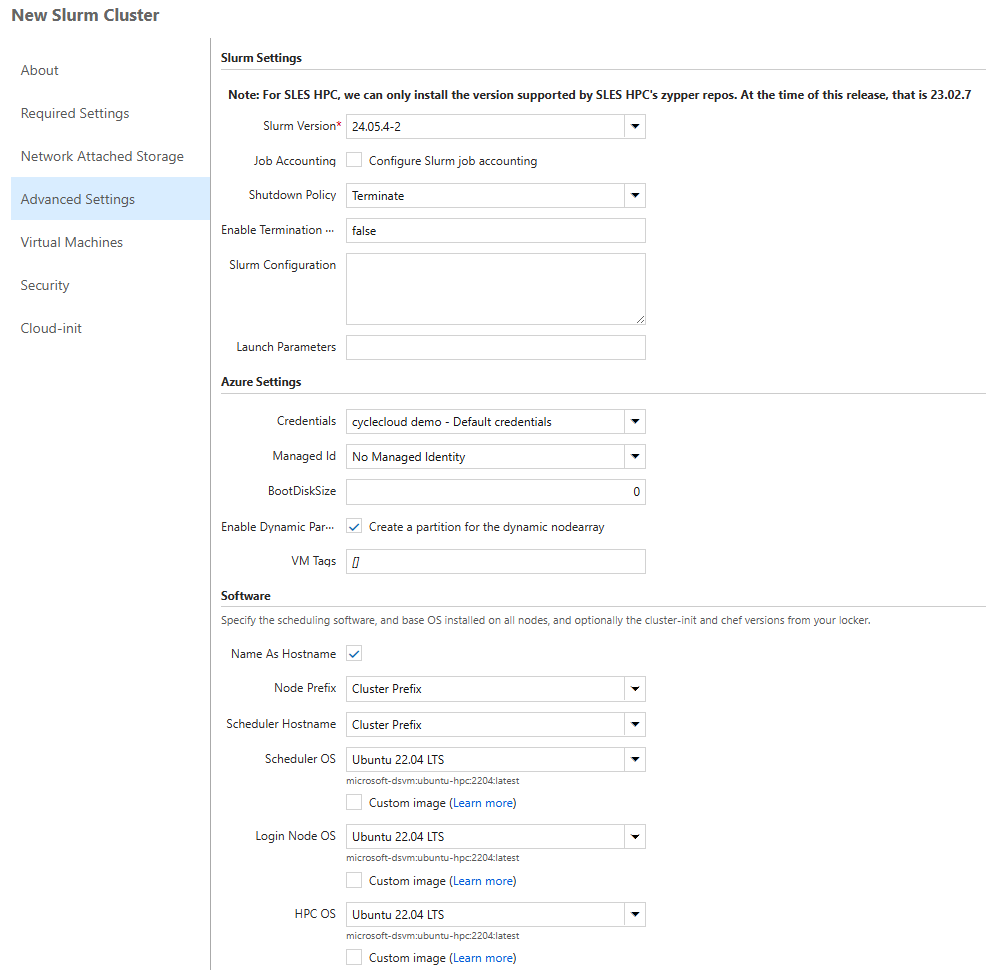
+
11. **Virtual Machines** 단계에서 기본 값을 유지하고 **Next** 버튼을 클릭합니다.
+
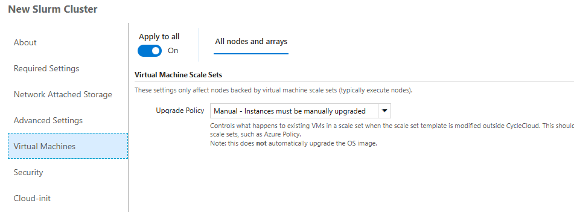
+
12. **Security** 단계에서 기본 값을 유지하고 **Next** 버튼을 클릭합니다.
+
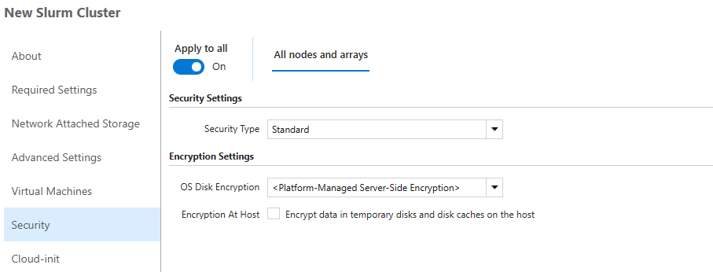
+
13. **Cloud-init** 단계에서 기본 값을 유지하고 **Save** 버튼을 클릭합니다.
+
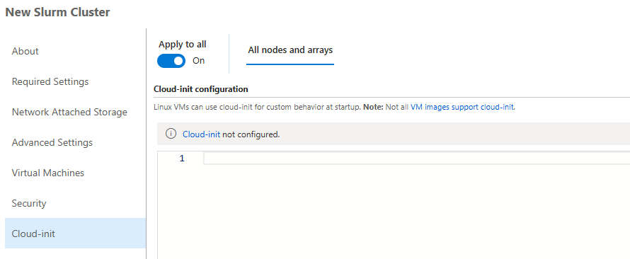
+
14. 클러스터가 생성됩니다.
+
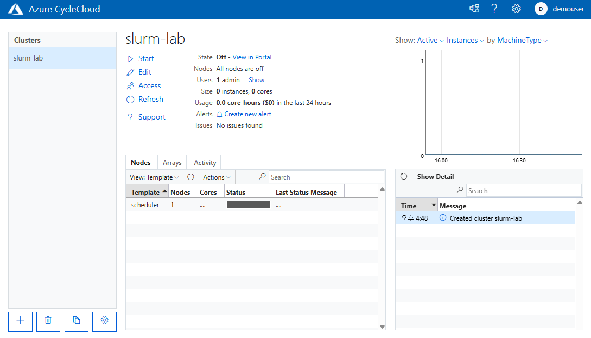

== 비용 경고 생성

HPC 클러스터는 비용이 많이 발생하는 작업입니다. Azure 리소스 피용으로 할당된 예산에 도달할 때 알림을 표시하도록 경고를 설정할 수 있습니다. 아래 절차에 따릅니다.

1. 클러스터 페이지에서 **Support** 구역의 **Create new alert** 링크를 클릭합니다.
+
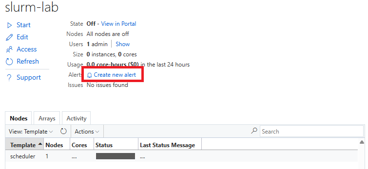
+
2. Cluster usage alert for slurm-lab 상자에서 아래와 같이 입력합니다.
+
|===
|항목|값
|Budget|_50_ (프로덕션 환경에서는 지정된 예산을 입력할 수 있습니다)
|Per|_Month_
|Enabled| _선택_
|Recipients|알림을 받을 email (+ 를 클릭하여 여러 이메일을 지정할 수 있습니다)
|===
+
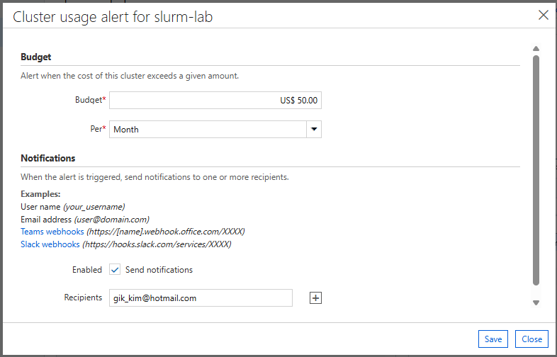
+
3. **Save** 버튼을 클릭합니다.

== 클러스터 시작 및 제거

여기에서는 클러스터를 시작하고 동작을 확인합니다. 아래 절차에 따릅니다.

1. 클러스터 페이지에서 Start 링크를 클릭합니다.
+
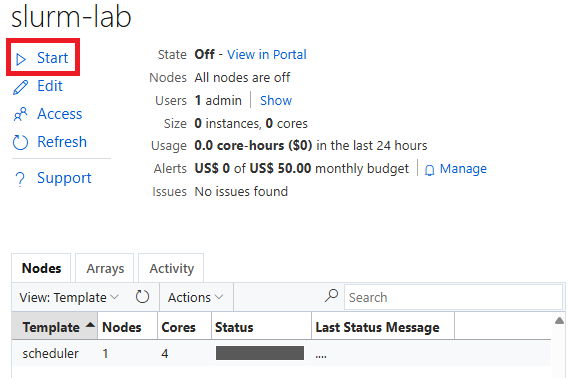
+
> **참고** 이 동작에는 클러스터의 헤드 노드 역할을 수행하는 Azure VM의 프로비전과 Slurm 스케줄러의 설치 및 구성이 포함됩니다. 시간이 소요될 수 있습니다.

2. **Are you sure you want to start the selected cluster(s)?** 상자에서 **OK** 버튼을 클릭합니다.
+
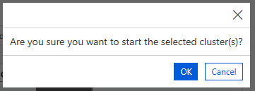
+
3. 클러스터가 시작됩니다.
+
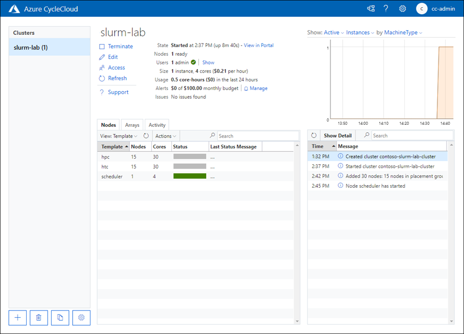
+
4. 클러스터 페이지에서 **Terminate** 를 클릭하여 클러스터를 제거합니다.
+
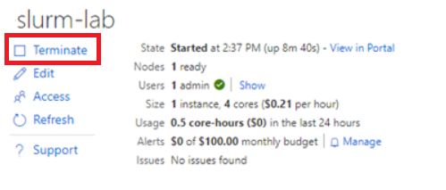

== Azure CycleCloud CLI 설정

여기에서는 Azure CycleCloud CLI를 설정합니다. 아래 절차에 따릅니다.

1. **Azure CycleCloud 배포** 가이드의 **3.2. 로컬 클라이언트를 통한 SSH 접속** 단계의 설명대로 CycleCloud 터미널에 접속합니다.
2. 아래 명령을 실행하여 cyclecloud의 버전을 확인합니다.
+
----
[azureuser@dm-cyclecloud ~]$ cyclecloud --version
CycleCloud 8.7.3-3438
----
+
3. 아래 명령을 실행하여 초기화를 시작합니다. 다음과 같이 설정합니다.
+
[cols="1,1,2", options="header"]
|===
|CycleServer URL|http://localhost|DNS를 설정하여 지정할 수도 있습니다.
|CycleServer username|demouser|**Azure CycleCloud 배포** 가이드의 **6. CycleCloud Web UI에 액세스** 단계의 8번 항목에서 지정한 CycldCloud Subscription의 관리자 사용자 이름입니다.
|CycleServer password||지정한 패스워드입니다.
|===
+
----
[azureuser@dm-cyclecloud ~]$ cyclecloud initialize
CycleServer URL: [http://localhost]
Detected untrusted certificate.  Allow?: [yes] yes
Using https://localhost
CycleServer username: [azureuser] demouser
CycleServer password:

Generating CycleServer key...
Initial account already exists, skipping initial account creation.
CycleCloud configuration stored in /home/azureuser/.cycle/config.ini
----
+
4. 다음 명령을 실행하여 설정된 locker를 확인합니다.
+
----
[azureuser@dm-cyclecloud ~]$ cyclecloud locker list
cyclecloud-demo-storage (az://sa4hpc/cyclecloud)
----

---

link:./02_cyclecloud_storage.adoc[이전: Azure CycleCloud 배포] | link:./04_template.adoc[다음: CycleCloud 프로젝트를 사용한 사용자 정의 템플릿을 사용한 클러스터 배포]