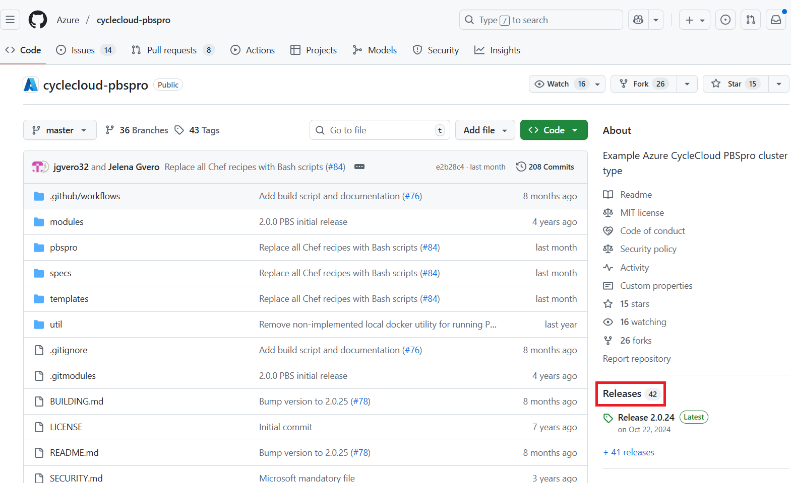
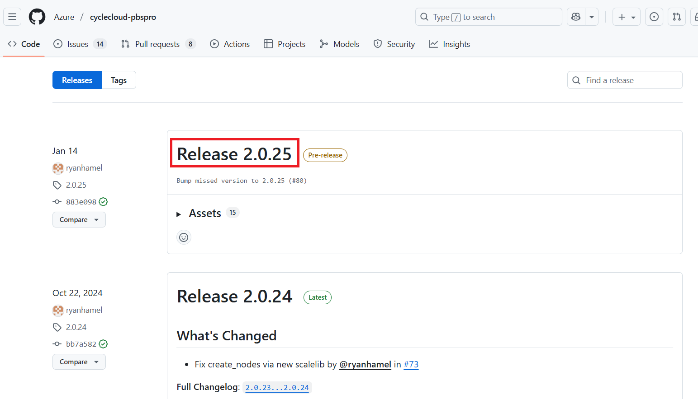
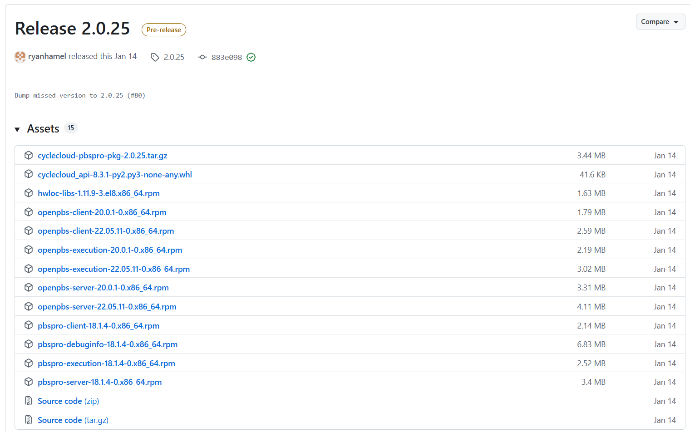
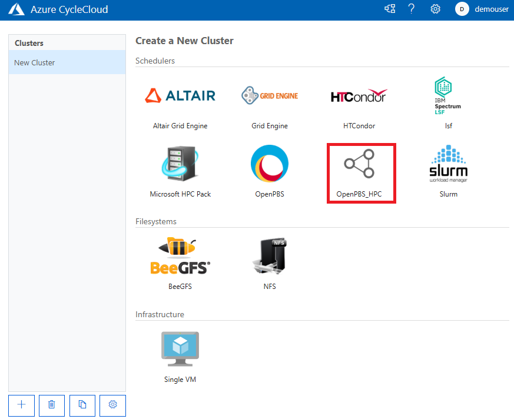
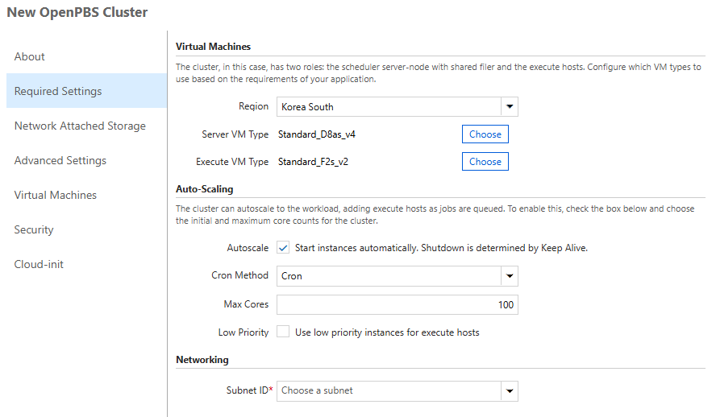
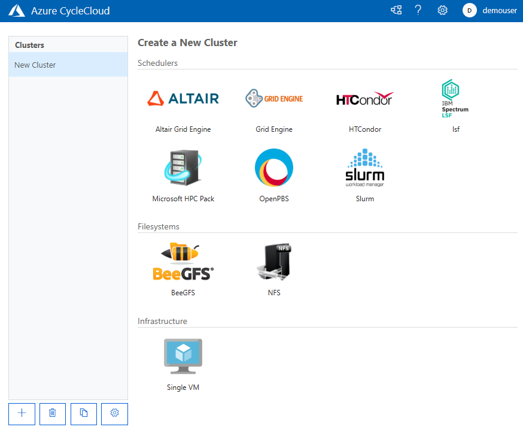

= 프로젝트를 사용한 사용자 정의 클러스터 템플릿 설정
:sectnums:
:toc:

사용자 정의 템플릿을 사용하여 사용자 지정 설정의 클러스터를 만들수 있습니다.  

이를 위해 CycleCloud 프로젝트를 사용하는데, CycleCloud 프로젝트는 클러스터 생성에 필요한 모든 구성요소(템플릿, 스크립트, 설치 파일 등)를 하나의 재사용 가능한 패키지로 묶어 관리하는 기능입니다.

클러스터 설정을 코드처럼 버전 관리하고, 여러 환경에 일관되게 배포할 수 있도록 돕는 일종의 "클러스터 설계도 묶음"이라고 생각할 수 있습니다.

작동방식 및 장점::
* 생성 및 업로드 +
사용자는 로컬 컴퓨터에서 CycleCloud CLI를 사용하여 프로젝트를 만들고, 필요한 파일들을 추가한 뒤 CycleCloud 서버에 업로드합니다.
* 재사용성 +
업로드된 프로젝트는 GUI를 통해 가져와 언제든지 동일한 구성의 클러스터를 생성하는 데 사용할 수 있습니다.
* 버전 관리 +
project.ini 파일에 버전을 명시하여, 클러스터 구성 변경 사항을 체계적으로 추적하고 관리할 수 있습니다.
* 자동화 +
cluster-init 스크립트가 blobs 디렉터리의 파일을 직접 참조할 수 있어, 노드 초기화 과정을 완벽하게 자동화할 수 있습니다.

CycleCloud 프로젝트의 주요 구성요소는 다음과 같습니다. 프로젝트는 일반적으로 다음과 같은 디렉토리 구조를 가집니다.

* `project.ini` : 프로젝트의 이름, 버전, 메타데이터를 정의하는 설정 파일입니다.
* `templates/` : Slurm, PBS 등 클러스터의 전체 구조를 정의하는 템플릿 파일(.txt)을 저장하는 곳입니다.
* `specs/` : 가상 머신(VM)의 종류, 이미지 등 개별 노드의 상세 사양(spec)을 정의하는 파일을 저장합니다.
* `blobs/` : cluster-init에서 사용할 설치 스크립트, 소프트웨어 패키지(RPM, tar.gz), 라이선스 파일 등 모든 종류의 바이너리 파일을 저장하는 공간입니다.

이 가이드에서는 프로젝트를 사용하여 사용자 정의 CycleCloud 템플릿을 정의하고, 배포합니다. Slurm 클러스터가 아닌 OpenPBS 클러스터를 배포하여, 다양한 환경의 클러스터를 프로젝트 템플릿을 사용하여 배포하는 것을 학습합니다.

== 클러스터 설정

여기에서는 프로젝트로 클러스터를 설정합니다.

=== CycleCloud 초기화

여기서는 CycleCloud 가상 머신에 SSH를 사용하여 액세스 합니다.

1. **Azure CycleCloud 배포** 가이드의 **3.1. Azure Portal에서 SSH 연결** 단계 또는 **3.2. 로컬 클라이언트를 통한 SSH 접속** 단계의 방법으로 CycleCloud에 접속합니다.
2. 아래 명령을 실행하여 CycleCloud CLI 버전을 확인합니다.
+
----
$ cyclecloud --version
CycleCloud 8.7.3-3438
----
+
3. 아래 명령을 실행하여 초기화합니다. 설정 항목은 다음과 같습니다.
+
----
$ cyclecloud initialize
CycleCloud 8.7.3-3438
[azureuser@dm-cyclecloud ~]$ cyclecloud initialize
CycleServer URL: [http://localhost]
Detected untrusted certificate.  Allow?: [yes] yes
Using https://localhost
CycleServer username: [azureuser] demouser
CycleServer password:

Generating CycleServer key...
Initial account already exists, skipping initial account creation.
CycleCloud configuration stored in /home/azureuser/.cycle/config.ini
----
+
[cols="1,1,2", options="header"]
|===
|항목|값|설명
|CycleServer URL|localhost|CycleServer의 URL 입니다. 엔터키를 쳐서 다음 단계로 진행합니다.
|CycleServer username|demouser|**Azure CycleCloud 배포** 가이드의 **6. CycleCloud Web UI에 액세스** 단계의 8번 단계에서 설정한 User ID입니다.
|CycleServer password|demouser|**Azure CycleCloud 배포** 가이드의 **6. CycleCloud Web UI에 액세스** 단계의 8번 단계에서 설정한 Password입니다.
|===
+
**Detected untrusted certificate.  Allow?: **에서는 _yes_ 를 입력합니다.

=== 템플릿 다운로드

여기에서는 기본 템플릿을 다운로드하여 Slurm이 아닌 PBSPro를 사용하는 클러스터 템플릿을 생성합니다. PBSPro 템플릿은 아래의 Github에서 확인할 수 있습니다.

https://github.com/Azure/cyclecloud-pbspro[Azure CycleCloud OpenPBS project]

아래 절차에 따릅니다.

1. 아래 명령을 실행하여 CycleCloud 서버에 **git**을 설치합니다.
+
----
$ sudo dnf install -y git
----
+
2. 아래 명령dmf 실행하여 cyclecloud_projects 디렉토리를 생성합니다.
+
----
$ mkdir cyclecloud_projects
----
+
3. 아래 명령을 실행하여 생성한 cyclecloud_projects 디렉토리로 이동합니다.
+
----
$ cd cyclecloud_projects
----
+
4. 아래와 같이 git clone 명령을 사용하여 cyclecloud-pbspro 프로젝트의 리포지토리를 복제합니다.
+
----
$ git clone https://github.com/Azure/cyclecloud-pbspro.git
Cloning into 'cyclecloud-pbspro'...
remote: Enumerating objects: 1836, done.
remote: Counting objects: 100% (497/497), done.
remote: Compressing objects: 100% (184/184), done.
remote: Total 1836 (delta 383), reused 331 (delta 302), pack-reused 1339 (from 1)
Receiving objects: 100% (1836/1836), 371.65 KiB | 21.86 MiB/s, done.
Resolving deltas: 100% (878/878), done.
----

=== 템플릿 사용자 정의

여기에서는 위의 cyclecloud-pbspro 프로젝트 템플릿을 사용자 정의합니다. 아래 절차에 따릅니다.

1. 아래 명령을 실행하여 cyclecloud-pbspro/templates 디렉토리로 이동합니다.
+
----
$ cd ./cyclecloud-pbspro/templates/
----
+
2. 아래 명령을 사용하여 openpbs.txt 파일을 openpbs_hpc.txt 파일로 복사합니다.
+
----
$ cp openpbs.txt openpbs_hpc.txt
----
+
3. 아래 명령을 실행하여 복사된 파일을 확인합니다.
+
----
$ ls
----
+
----
$ ls
openpbs_hpc.txt  openpbs.txt
----
+
4. 편집기를 사용해서 openpbs.txt 파일을 열고 템플릿의 이름을 _OpenPBS_HPC_ 로 변경합니다. 이 이름은 CycleCloud 관리 포털에서 템플릿 목록을 보거나 CLI에서 템플릿을 지정할때의 이름입니다.
+
----
################################
## Cluster Configuration File ##
################################

[cluster OpenPBS_HPC]
----

=== 계산 노드 추가

여기에서는 계산 노드로 사용할 수 있는 VM 크기를 추가합니다. 여기에서는 HB120rs 크기를 계산 노드로 추가합니다. 아래 절차에 따릅니다.

1. 열려 있는 openpbs.txt 파일에서, **[cluster OpenPBS_HPC]** 섹션에서 **[[nodearray execute]] 섹션**의 **[[[network-interface eth0]]]** 섹션 아래에 다음을 추가합니다.
+
----
[[nodearray HB120rs_v2]]
MachineType = Standard_HB120rs_v2
MaxCoreCount = $MaxExecuteCoreCount
ImageName = $ImageName_HBv2

Interruptible = $UseLowPrio_HBv2
AdditionalClusterInitSpecs = $ExecuteClusterInitSpecs

    [[[configuration]]]
    #autoscale.enabled = $Autoscale

    [[[cluster-init cyclecloud/pbspro:execute]]]

    [[[network-interface eth0]]]
    AssociatePublicIpAddress = $ExecuteNodesPublic
----
+
2. **[parameters Required Settings]**의 **[[parameters Auto-Scaling]]** 섹션에서 **[[[parameter UseLowPrio]]]** 섹션 아래에 다음을 추가합니다.
+
---
[[[parameter UseLowPrio_HBv2]]]
Label = Low Priority
DefaultValue = false
Widget.Plugin = pico.form.BooleanCheckBox
Widget.Label = Use low priority instances for HBv2
---
3. **[parameters Advanced Settings]**의 **[[parameters Software]]** 섹션에서 **[[[parameter ImageName]]]** 섹션 아래에 다음을 추가합니다.
+
----
[[[parameter ImageName_HBv2]]]
Label = HBv2 OS
ParameterType = Cloud.Image
Config.OS = linux
DefaultValue = almalinux8
Config.Filter := Package in {"cycle.image.centos7", "almalinux8"}
----
+
4. 파일을 저장하고 편집기를 닫습니다.

=== 패키지 가져오기

복제된 리포지토리에는 필요한 패키지가 포함되어 있지 않으므로 패키지를 가져와야 합니다. 여기에서는 사용하고 있는 프로젝트에 버전에 대응하는 패키지를 취득합니다. 아래 절차에 따릅니다.

1. 터미널에서 아래 명령을 실행하여 cyclecloud-pbspro 디렉토리로 이동합니다.
+
----
$ cd ..
----
+
2. 아래 명령을 실행하여 프로젝트의 버전을 확인합니다.
+
----
$ cat project.ini | grep version
----
+
----
$ cat project.ini | grep version
version = 2.0.25
----
+
3. 웹 브라우저에서 PBSPro 템플릿 github으로 이동하고, 오른쪽에서 Release를 클릭합니다.
+
https://github.com/Azure/cyclecloud-pbspro[Azure CycleCloud OpenPBS project]
+

+
4. 해당 버전의 Release를 클릭하여 엽니다. 여기서는 2.0.25 입니다.
+
 
+
5. 파일을 확인합니다.
+

+
6. CycleCloud 터미널에서, 아래 명령을 실행하여 blob 디렉토리를 만듭니다.
+
----
$ mkdir blobs
----
+
7. 생성한 blobs 디렉토리로 이동하고, blobs 디렉토리의 위치를 확인합니다.
+
----
$ cd blobs
$ pwd
/home/azureuser/cyclecloud_projects/cyclecloud-pbspro/blob
----
+
8. blob 디렉토리에서 wget 명령을 사용하여 해당 Release의 모든 파일을 다운로드 합니다.
+
----
wget https://github.com/Azure/cyclecloud-pbspro/releases/tag/2.0.25/cyclecloud-pbspro-pkg-2.0.25.tar.gz
wget https://github.com/Azure/cyclecloud-pbspro/releases/tag/2.0.25/cyclecloud_api-8.3.1-py2.py3-none-any.whl
wget https://github.com/Azure/cyclecloud-pbspro/releases/tag/2.0.25/hwloc-libs-1.11.9-3.el8.x86_64.rpm
wget https://github.com/Azure/cyclecloud-pbspro/releases/tag/2.0.25/openpbs-client-20.0.1-0.x86_64.rpm
wget https://github.com/Azure/cyclecloud-pbspro/releases/tag/2.0.25/openpbs-client-22.05.11-0.x86_64.rpm
wget https://github.com/Azure/cyclecloud-pbspro/releases/tag/2.0.25/openpbs-execution-20.0.1-0.x86_64.rpm
wget https://github.com/Azure/cyclecloud-pbspro/releases/tag/2.0.25/openpbs-execution-22.05.11-0.x86_64.rpm
wget https://github.com/Azure/cyclecloud-pbspro/releases/tag/2.0.25/openpbs-server-20.0.1-0.x86_64.rpm
wget https://github.com/Azure/cyclecloud-pbspro/releases/tag/2.0.25/openpbs-server-22.05.11-0.x86_64.rpm
wget https://github.com/Azure/cyclecloud-pbspro/releases/tag/2.0.25/pbspro-client-18.1.4-0.x86_64.rpm
wget https://github.com/Azure/cyclecloud-pbspro/releases/tag/2.0.25/pbspro-debuginfo-18.1.4-0.x86_64.rpm
wget https://github.com/Azure/cyclecloud-pbspro/releases/tag/2.0.25/pbspro-execution-18.1.4-0.x86_64.rpm
wget https://github.com/Azure/cyclecloud-pbspro/releases/tag/2.0.25/pbspro-server-18.1.4-0.x86_64.rpm
----
+
9. 아래 명령을 실행하여 다운로드한 파일을 확인합니다.
+
----
$ ls
cyclecloud_api-8.3.1-py2.py3-none-any.whl  openpbs-execution-20.0.1-0.x86_64.rpm    pbspro-debuginfo-18.1.4-0.x86_64.rpm
cyclecloud-pbspro-pkg-2.0.25.tar.gz        openpbs-execution-22.05.11-0.x86_64.rpm  pbspro-execution-18.1.4-0.x86_64.rpm
hwloc-libs-1.11.9-3.el8.x86_64.rpm         openpbs-server-20.0.1-0.x86_64.rpm       pbspro-server-18.1.4-0.x86_64.rpm
openpbs-client-20.0.1-0.x86_64.rpm         openpbs-server-22.05.11-0.x86_64.rpm
openpbs-client-22.05.11-0.x86_64.rpm       pbspro-client-18.1.4-0.x86_64.rpm
----

== 프로젝트 업로드

여기서는 프로젝트를 업로드 합니다. 아래 절차에 따릅니다.

1. 아래 명령을 실행하여 locker를 확인합니다.
+
----
$ cyclecloud locker list
----
+
----
[azureuser@dm-cyclecloud blob]$ cyclecloud locker list
cyclecloud-demo-storage (az://sa4hpc/cyclecloud)
----
+
2. 아래 명령을 실행하여 프로젝트를 업로드 합니다.
+
----
$ cyclecloud project upload cyclecloud-demo-storage
----
+
3. 업로드가 완료되는 것을 확인합니다.
----
...
Job 47088061-235b-9f42-772f-efed7bb79f99 summary
Elapsed Time (Minutes): 0.0334
Number of File Transfers: 1
Number of Folder Property Transfers: 0
Number of Symlink Transfers: 0
Total Number of Transfers: 1
Number of File Transfers Completed: 1
Number of Folder Transfers Completed: 0
Number of File Transfers Failed: 0
Number of Folder Transfers Failed: 0
Number of File Transfers Skipped: 0
Number of Folder Transfers Skipped: 0
Total Number of Bytes Transferred: 195320
Final Job Status: Completed

Upload complete!
----

== 템플릿 가져오기 및 확인

여기에서는 사용자 정의한 템플릿을 CycleCloud 서버로 가져옵니다.

1. 아래 명령을 실행하여 작성한 openpbs_hpc.txt 파일이 있는 templates 디렉토리로 이동합니다.
+
----
$ cd templates
----
+
2. 아래 명령을 실행하여 템플릿을 CycleCloud 서버로 가져옵니다.
+
----
$ cyclecloud import_template -f openpbs.txt
----
+
----
[azureuser@dm-cyclecloud templates]$ cyclecloud import_template -f openpbs.txt
Importing default template in openpbs_hpc.txt....
--------------------
OpenPBS : *template*
--------------------
Resource group:
Cluster nodes:
    server: Off -- --
Total nodes: 1
----
+
3. CycleCloud 포털에서, 생성한 OpenPBS 템플릿을 확인하고 클릭합니다.
+
 
+
4. 새 클러스터 생성 페이지에서 Required Settings 단계를 클릭하고 생성한 템플릿의 설정 단계를 확인합니다.
+

== 템플릿 삭제

여기에서는 생성한 템플릿을 삭제합니다. 아래 절차에 따릅니다.

1. CycleCloud 터미널에서, 아래 명령을 실행하여 템플릿 목록을 확인합니다.
+
----
$ cyclecloud show_cluster -t | grep *template*
----
+
----
[azureuser@dm-cyclecloud templates]$ cyclecloud show_cluster -t | grep *template*
altair-grid-engine_template_2.0.20 : *template*
beegfs_template_1.5.1 : *template*
gridengine_template_2.0.20 : *template*
hpcpack_template_2.1.2 : *template*
htcondor_template_1.1.1 : *template*
lsf_template_3.3.1 : *template*
nfs_template_1.1.1 : *template*
OpenPBS_HPC : *template*
pbspro_template_2.0.25 : *template*
single-vm_template_1.0.0 : *template*
slurm_template_3.0.12 : *template*
----
+
2. 아래 명령을 실행하여 템플릿을 삭제합니다.
+
----
$cyclecloud delete_template OpenPBS_HPC
----
+
3. CycleCloud 포털에서, 생성한 OpenPBS 템플릿이 제거된 것을 확인합니다.
+

