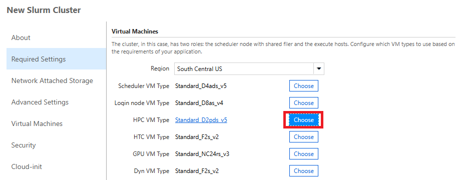
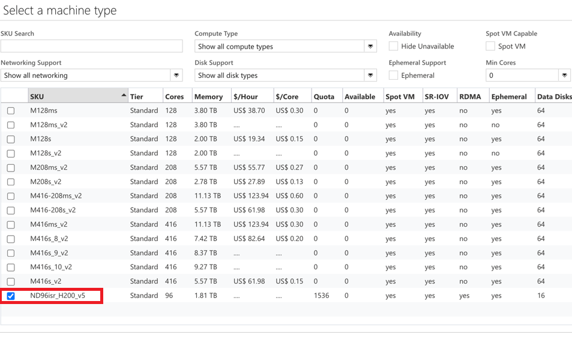
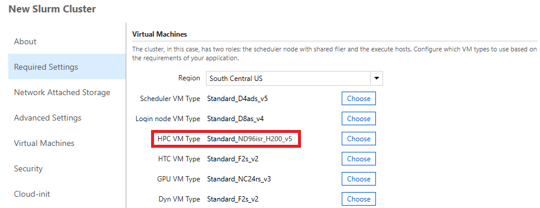
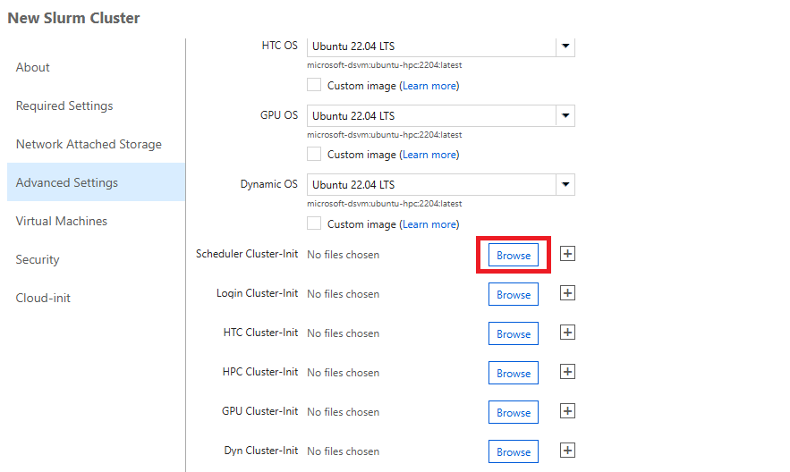
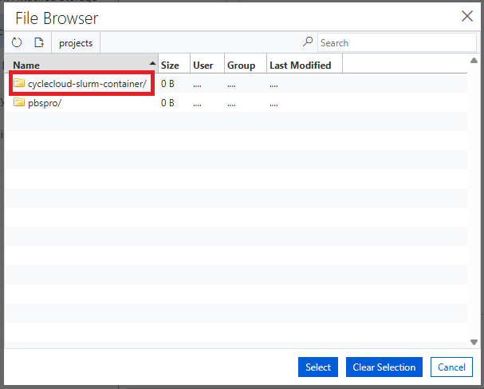
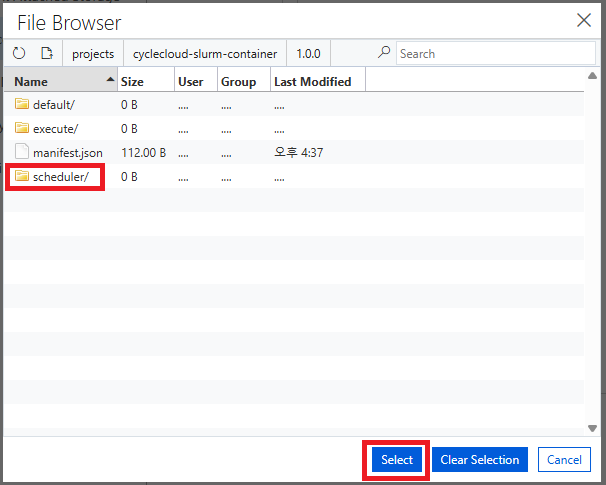
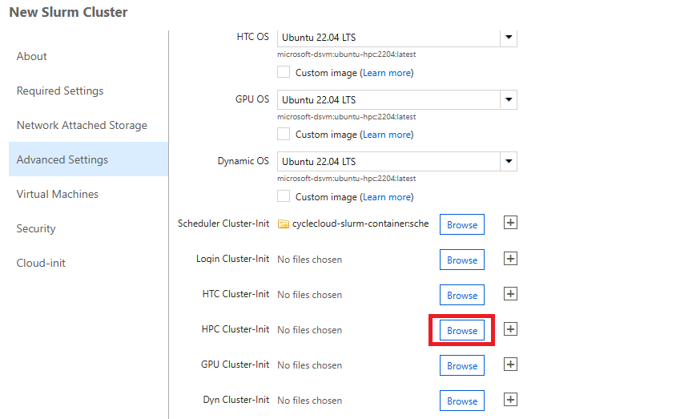
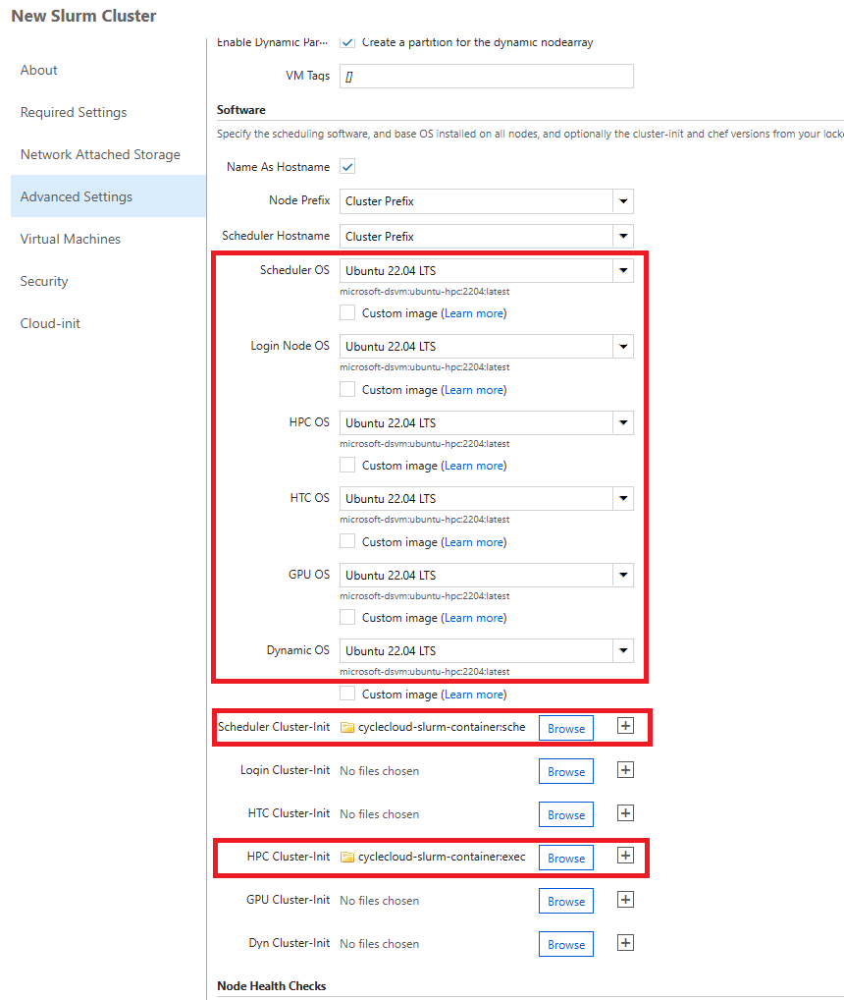
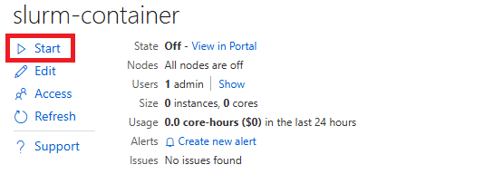

= Enroot 설정
:sectnums:
:toc:

클라우드에서 고성능 컴퓨팅(HPC) 및 AI 워크로드를 실행하려면 유연하고 확장 가능한 오케스트레이션 플랫폼이 필요합니다. Microsoft Azure CycleCloud를 Slurm과 함께 사용하면 HPC 클러스터 전반에서 컨테이너화된 애플리케이션을 효율적으로 관리할 수 있는 솔루션을 제공합니다.

Enroot는 NVIDA에서 개발한 경량 컨테이너 런타임으로, HPC와 AI/딥러닝 워크로드 환경에서 효율적인 컨테이너 실행을 지원하기 위해 설계되었습니다. 전통적인 Docker와 같은 범용 컨테이너 런타임은 복잡한 데몬과 루트 권한을 요구하지만, Enroot는 단일 실행 파일로 동작하며, 루트 권한 없이도 컨테이너를 실행할 수 있는 것이 큰 특징입니다. 이러한 설계 덕분에 연구자가 HPC 클러스터나 공유 환경에서도 안전하게 컨테이너 기반 워크로드를 수행할 수 있습니다.

Enroot CycleCloud 기술 개요에 대해서는 아래 문서들을 참조하십시오.

* link:../02_tech_desc/02_hpc/03_enroot.adoc[Enroot 기술 개요]

Nvidia에서 지원하는 컨테이너 이미지의 목록과 특성에 대해서는 아래 Nvidia 문서를 참조하십시오.

* https://docs.nvidia.com/deeplearning/frameworks/support-matrix/index.html#framework-matrix-2025__section_zz3_hdz_m1c[Nvidia Frameworks Support Matrix - Container images]

== 사전 작업

Korea South 지역에서 컴퓨팅 노드로 ND96***_v* 가상 머신을 사용하기 위해서는 사전 작업이 필요합니다. 

아래 절차에 따릅니다.

1. **Azure CycleCloud 배포** 가이드의 **3.1. Azure Portal에서 SSH 연결** 단계 또는 **3.2. 로컬 클라이언트를 통한 SSH 접속** 단계의 방법으로 CycleCloud에 SSH를 통해 접속합니다.
2. 아래 명령을 관리자 권한(sudo)으로 수행합니다.
+
아래 스크립트에서, ACCOUNT_NAME과 SUBSCRIPTION_ID는 아래와 같이 수정되어야 합니다.
+
[cols="1,3a"]
|===
|ACCOUNT_NAME|**Azure CycleCloud 배포 가이드**의 **6. CycleCloud Web UI**에 단계의 2번 절차에서 지정한 이름입니다. 아래 명령으로 확인할 수 있습니다. +
----
$  cyclecloud account list
cyclecloud-demo *
  Provider: azure
  Master Credentials: cyclecloud-demo
----
|SubscriptionId|Azure의 해당 Subscription ID 입니다.
|===
+
----
echo 'AccountName = "ACCOUNT_NAME"
SubscriptionId = "SUBSCRIPTION_ID"
Location = "koreasouth"
NotAvailableForSubscription = false
AcceleratedNetworkingEnabled = true
AdType = "Azure.MachineType"
CachedDiskBytes = 1099511627776
ComputeType = "GPU"
CoreCount = 96
CpuArchitectureType = "x64"
Description = "96 vCPUs, 1850.0 GB RAM, 1023.0 GB local disk"
EphemeralOSDiskSupported = true
Family = "standardNDISRH200V5Family"
GPUCount = 8
MaxDiskCount = 16
MaxNetworkInterfaces = 8
Memory = 1850.0
Name = "Standard_ND96isr_H200_v5"
OSDiskSize = 1023.0
PCPUCount = 96
PremiumIO = true
QuotaCoreCount = 96
RdmaEnabled = true
ResourceDiskSize = 1024.0
SKU = "ND96isr_H200_v5"
SpotVMCapable = true
Tier = "Standard"
UltraSSDAvailable = {"1"}
Zones = {"1"}' > /tmp/h200_sku.txt  && sudo mv /tmp/h200_sku.txt /opt/cycle_server/config/data/h200_sku.txt
----
+
3. 아래 명령을 실행하여 **/opt/cycle_server/data** 디렉토리에 생성된 **h200_sku.txt.imported** 파일을 확인합니다.
+
----
$ sudo ls /opt/cycle_server/config/data
h200_sku.txt.imported  marketplace_distribution.txt.imported  marketplace_site_id.txt.imported  settings.txt.imported  theme.txt.imported
----

== 템플릿 다운로드 및 프로젝트 업로드

여기에서는 템플릿을 다운로드하여 Slurm이 아닌 PBSPro를 사용하는 클러스터 템플릿을 생성합니다. 템플릿은 아래의 Github에서 확인할 수 있습니다.

https://github.com/vinil-v/cyclecloud-slurm-container[Running Container Workloads in CycleCloud-Slurm – Multi-Node, Multi-GPU Jobs (NCCL Benchmark)]

아래 절차에 따릅니다.

1. **Azure CycleCloud 배포** 가이드의 **3.1. Azure Portal에서 SSH 연결** 단계 또는 **3.2. 로컬 클라이언트를 통한 SSH 접속** 단계의 방법으로 CycleCloud에 SSH를 통해 접속합니다.
2. 아래 명령을 실행하여 **프로젝트를 사용한 사용자 정의 클러스터 템플릿 설정** 가이드의 **2.2. 템플릿 다운로드** 단계의 2번 단계에서 생성한 cyclecloud_projects 디렉토리로 이동합니다.
+
----
$ cd cyclecloud_projects
----
+
3. 아래와 같이 git clone 명령을 사용하여 cyclecloud-slurm-container 프로젝트의 리포지토리를 복제합니다.
+
----
$ git clone https://github.com/vinil-v/cyclecloud-slurm-container.git
----
+
4. 아래 명령을 실행하여 다운로드 된 프로젝트를 확인합니다.
+
----
$ ls
cyclecloud-pbspro  cyclecloud-slurm-container
----
+
5. 아래 명령을 실행하여 cyclecloud-slurm-container 프로젝트로 이동합니다.
+
----
$ cd cyclecloud-slurm-container
----
+
6. 아래 명령을 실행하여 프로젝트를 업로드합니다.
+
----
$ cyclecloud project upload cyclecloud-demo-storage
INFO: Any empty folders will not be processed, because source and/or destination doesn't have full folder support

Job c1479200-dbd7-984e-4c6f-2c3ffb53bdf3 has started
Log file is located at: /home/azureuser/.azcopy/c1479200-dbd7-984e-4c6f-2c3ffb53bdf3.log

100.0 %, 14 Done, 0 Failed, 0 Pending, 14 Total, 2-sec Throughput (Mb/s): 0.028

Job c1479200-dbd7-984e-4c6f-2c3ffb53bdf3 Summary
Files Scanned at Source: 14
Files Scanned at Destination: 0
Elapsed Time (Minutes): 0.0334
Number of Copy Transfers for Files: 14
Number of Copy Transfers for Folder Properties: 0
Total Number of Copy Transfers: 14
Number of Copy Transfers Completed: 14
Number of Copy Transfers Failed: 0
Number of Deletions at Destination: 0
Total Number of Bytes Transferred: 7016
Total Number of Bytes Enumerated: 7016
Final Job Status: Completed

Upload complete!
----

== CycleCloud Portal에서 cyclecloud-slurm-container 구성

여기에서는 CycleCloud Portal에서 업로드한 cyclecloud-slurm-container 프로젝트를 사용하여 클러스터를 구성합니다. 아래 절차에 따릅니다.

1. CycleCloud 웹 포털에 로그인합니다.
2. Slurm 클러스터를 클릭합니다.
+
image:./images/05/03/image01.png[width=800]
+
3. **About** 탭에서 Clouster Name에 **slurm-container**를 입력하고 **Next** 버튼을 클릭합니다.
4. **Required Setting**의 **Virtual Machines** 구역에서 **HPC VM Type** 오른쪽의 **Choose** 버튼을 클릭합니다.
+

+
5. **Select Machine Type**에서 **ND96isr_H200_v5** SKU를 선택하고 아래쪽의 **Apply** 버튼을 클릭합니다.
+

+
6. 선택돤 가상 머신 SKU를 확인합니다.
+

+
7. **Networking** 섹션에서 **Subnet ID**를 **rg-rpc:vnet-hpc-default[undefined]**를 선택합니다.
8. 아래쪽에서 **Next** 버튼을 클릭합니다.
9. **Network Attached Storage** 탭에서, 기본 값을 유지하고 **Next** 버튼을 클릭합니다.
10. **Advanced Settings** 탭의 **Software** 구역에서, **Scheduler Cluster-Init** 옆의 **Browse** 버튼을 클릭합니다.
+

+
11. **File Brower** 창에서, **cyclecloud-slurm-container** 프로젝트 디렉토리를 더블 클릭합니다.
+

+
12. **1.0.0** 디렉토리를 더블 클릭합니다.
13. **scheduler** 디렉토리 선택하고 Select 버튼을 클릭합니다.
+

+
14. **HPC Cluster-init** 옆의 **Browse** 버튼을 클릭합니다.
+

+
15. **File Brower** 창에서, **cyclecloud-slurm-container** 프로젝트 디렉토리를 더블 클릭합니다.
16. **1.0.0** 디렉토리를 더블 클릭합니다.
17. **execute** 디렉토리 선택하고 Select 버튼을 클릭합니다.
+
image:./images/05/03/image09.png[width=500]
+
18. 설정을 확인하고 Save 버튼을 클릭하여 설정을 저장합니다.
+

+
19. 클러스터를 시작합니다.
+

== 설정 테스트

여기에서는 설정대로 동작이 수행되는지 확인합니다. 아래 절차에 따릅니다.

1. CycleCloud에 SSH를 통해 접속합니다.
2. 아래와 같이 작업 스크립트를 만들고 _nccl_benchmark_job.sh_ 로 저장합니다.
+
[source, bash]
----
#!/bin/bash
#SBATCH --ntasks-per-node=8
#SBATCH --cpus-per-task=12
#SBATCH --gpus-per-node=8
#SBATCH --exclusive
#SBATCH -o nccl_allreduce_%j.log

export OMPI_MCA_coll_hcoll_enable=0 \
       NCCL_IB_PCI_RELAXED_ORDERING=1 \
       CUDA_DEVICE_ORDER=PCI_BUS_ID \
       NCCL_SOCKET_IFNAME=eth0 \
       NCCL_TOPO_FILE=/opt/microsoft/ndv4-topo.xml \
       NCCL_DEBUG=WARN \
       NCCL_MIN_NCHANNELS=32

CONT="mcr.microsoft.com#aznhc/aznhc-nv:latest"
PIN_MASK='ffffff000000,ffffff000000,ffffff,ffffff,ffffff000000000000000000,ffffff000000000000000000,ffffff000000000000,ffffff000000000000'
MOUNT="/opt/microsoft:/opt/microsoft"

srun --mpi=pmix \
     --cpu-bind=mask_cpu:$PIN_MASK \
     --container-image "${CONT}" \
     --container-mounts "${MOUNT}" \
     --ntasks-per-node=8 \
     --cpus-per-task=12 \
     --gpus-per-node=8 \
     --mem=0 \
     bash -c 'export LD_LIBRARY_PATH="/opt/openmpi/lib:$LD_LIBRARY_PATH"; /opt/nccl-tests/build/all_reduce_perf -b 1K -e 16G -f 2 -g 1 -c 0'
----
+
3. 아래 명령을 사용하여 NCCL 작업을 제출합니다. 아래 명령은 4개의 노드에서 벤치마크를 실행합니다. -N을 원하는 노드 수로 변경할 수 있습니다.
+
----
$ sbatch -N 4 --gres=gpu:8 -p hpc ./nccl_benchmark_job.sh
Submitted batch job 61
----
+
4. 아래 명령을 실행하여 slurm 스케줄러를 사용하여 제출한 작업의 대기열 목록과 상태를 확인합니다.
+
----
$ squeue
             JOBID PARTITION     NAME     USER ST       TIME  NODES NODELIST(REASON)
                61       hpc nccl_ben azureuse CF       0:04      4 gpu-hpc-[1-4]
----
+
5. 작업이 완료되면 nccl_allreduce_<jobid>.log 파일에서 검토를 위한 벤치마크 정보를 확인할 수 있습니다.
+
----
$ cat nccl_allreduce_61.log
pyxis: imported docker image: mcr.microsoft.com#aznhc/aznhc-nv:latest
pyxis: imported docker image: mcr.microsoft.com#aznhc/aznhc-nv:latest
pyxis: imported docker image: mcr.microsoft.com#aznhc/aznhc-nv:latest
pyxis: imported docker image: mcr.microsoft.com#aznhc/aznhc-nv:latest
# nThread 1 nGpus 1 minBytes 1024 maxBytes 17179869184 step: 2(factor) warmup iters: 5 iters: 20 agg iters: 1 validation: 0 graph: 0
#
# Using devices
#  Rank  0 Group  0 Pid  16036 on  gpu-hpc-1 device  0 [0x00] NVIDIA A100-SXM4-40GB
#  Rank  1 Group  0 Pid  16037 on  gpu-hpc-1 device  1 [0x00] NVIDIA A100-SXM4-40GB
#  Rank  2 Group  0 Pid  16038 on  gpu-hpc-1 device  2 [0x00] NVIDIA A100-SXM4-40GB
#  Rank  3 Group  0 Pid  16039 on  gpu-hpc-1 device  3 [0x00] NVIDIA A100-SXM4-40GB
#  Rank  4 Group  0 Pid  16040 on  gpu-hpc-1 device  4 [0x00] NVIDIA A100-SXM4-40GB
#  Rank  5 Group  0 Pid  16041 on  gpu-hpc-1 device  5 [0x00] NVIDIA A100-SXM4-40GB
#  Rank  6 Group  0 Pid  16042 on  gpu-hpc-1 device  6 [0x00] NVIDIA A100-SXM4-40GB
#  Rank  7 Group  0 Pid  16043 on  gpu-hpc-1 device  7 [0x00] NVIDIA A100-SXM4-40GB
#  Rank  8 Group  0 Pid  17098 on  gpu-hpc-2 device  0 [0x00] NVIDIA A100-SXM4-40GB
#  Rank  9 Group  0 Pid  17099 on  gpu-hpc-2 device  1 [0x00] NVIDIA A100-SXM4-40GB
#  Rank 10 Group  0 Pid  17100 on  gpu-hpc-2 device  2 [0x00] NVIDIA A100-SXM4-40GB
#  Rank 11 Group  0 Pid  17101 on  gpu-hpc-2 device  3 [0x00] NVIDIA A100-SXM4-40GB
#  Rank 12 Group  0 Pid  17102 on  gpu-hpc-2 device  4 [0x00] NVIDIA A100-SXM4-40GB
#  Rank 13 Group  0 Pid  17103 on  gpu-hpc-2 device  5 [0x00] NVIDIA A100-SXM4-40GB
#  Rank 14 Group  0 Pid  17104 on  gpu-hpc-2 device  6 [0x00] NVIDIA A100-SXM4-40GB
#  Rank 15 Group  0 Pid  17105 on  gpu-hpc-2 device  7 [0x00] NVIDIA A100-SXM4-40GB
#  Rank 16 Group  0 Pid  17127 on  gpu-hpc-3 device  0 [0x00] NVIDIA A100-SXM4-40GB
#  Rank 17 Group  0 Pid  17128 on  gpu-hpc-3 device  1 [0x00] NVIDIA A100-SXM4-40GB
#  Rank 18 Group  0 Pid  17129 on  gpu-hpc-3 device  2 [0x00] NVIDIA A100-SXM4-40GB
#  Rank 19 Group  0 Pid  17130 on  gpu-hpc-3 device  3 [0x00] NVIDIA A100-SXM4-40GB
#  Rank 20 Group  0 Pid  17131 on  gpu-hpc-3 device  4 [0x00] NVIDIA A100-SXM4-40GB
#  Rank 21 Group  0 Pid  17132 on  gpu-hpc-3 device  5 [0x00] NVIDIA A100-SXM4-40GB
#  Rank 22 Group  0 Pid  17133 on  gpu-hpc-3 device  6 [0x00] NVIDIA A100-SXM4-40GB
#  Rank 23 Group  0 Pid  17134 on  gpu-hpc-3 device  7 [0x00] NVIDIA A100-SXM4-40GB
#  Rank 24 Group  0 Pid  17127 on  gpu-hpc-4 device  0 [0x00] NVIDIA A100-SXM4-40GB
#  Rank 25 Group  0 Pid  17128 on  gpu-hpc-4 device  1 [0x00] NVIDIA A100-SXM4-40GB
#  Rank 26 Group  0 Pid  17129 on  gpu-hpc-4 device  2 [0x00] NVIDIA A100-SXM4-40GB
#  Rank 27 Group  0 Pid  17130 on  gpu-hpc-4 device  3 [0x00] NVIDIA A100-SXM4-40GB
#  Rank 28 Group  0 Pid  17131 on  gpu-hpc-4 device  4 [0x00] NVIDIA A100-SXM4-40GB
#  Rank 29 Group  0 Pid  17132 on  gpu-hpc-4 device  5 [0x00] NVIDIA A100-SXM4-40GB
#  Rank 30 Group  0 Pid  17133 on  gpu-hpc-4 device  6 [0x00] NVIDIA A100-SXM4-40GB
#  Rank 31 Group  0 Pid  17134 on  gpu-hpc-4 device  7 [0x00] NVIDIA A100-SXM4-40GB
NCCL version 2.19.3+cuda12.2
#
#                                                              out-of-place                       in-place
#       size         count      type   redop    root     time   algbw   busbw #wrong     time   algbw   busbw #wrong
#        (B)    (elements)                               (us)  (GB/s)  (GB/s)            (us)  (GB/s)  (GB/s)
        1024           256     float     sum      -1    53.54    0.02    0.04    N/A    55.41    0.02    0.04    N/A
        2048           512     float     sum      -1    60.53    0.03    0.07    N/A    60.49    0.03    0.07    N/A
        4096          1024     float     sum      -1    61.70    0.07    0.13    N/A    58.78    0.07    0.14    N/A
        8192          2048     float     sum      -1    64.86    0.13    0.24    N/A    59.49    0.14    0.27    N/A
       16384          4096     float     sum      -1    134.2    0.12    0.24    N/A    59.91    0.27    0.53    N/A
       32768          8192     float     sum      -1    66.55    0.49    0.95    N/A    61.85    0.53    1.03    N/A
       65536         16384     float     sum      -1    69.26    0.95    1.83    N/A    64.42    1.02    1.97    N/A
      131072         32768     float     sum      -1    73.87    1.77    3.44    N/A    221.6    0.59    1.15    N/A
      262144         65536     float     sum      -1    360.4    0.73    1.41    N/A    91.51    2.86    5.55    N/A
      524288        131072     float     sum      -1    103.5    5.06    9.81    N/A    101.1    5.18   10.04    N/A
     1048576        262144     float     sum      -1    115.6    9.07   17.57    N/A    118.0    8.89   17.22    N/A
     2097152        524288     float     sum      -1    142.8   14.68   28.45    N/A    141.5   14.82   28.72    N/A
     4194304       1048576     float     sum      -1    184.6   22.72   44.02    N/A    183.8   22.82   44.21    N/A
     8388608       2097152     float     sum      -1    277.2   30.26   58.63    N/A    271.9   30.86   59.78    N/A
    16777216       4194304     float     sum      -1    370.4   45.30   87.77    N/A    377.5   44.45   86.12    N/A
    33554432       8388608     float     sum      -1    632.7   53.03  102.75    N/A    638.8   52.52  101.76    N/A
    67108864      16777216     float     sum      -1   1016.1   66.04  127.96    N/A   1018.5   65.89  127.66    N/A
   134217728      33554432     float     sum      -1   1885.0   71.20  137.96    N/A   1853.3   72.42  140.32    N/A
   268435456      67108864     float     sum      -1   3353.1   80.06  155.11    N/A   3369.3   79.67  154.36    N/A
   536870912     134217728     float     sum      -1   5920.8   90.68  175.68    N/A   5901.4   90.97  176.26    N/A
  1073741824     268435456     float     sum      -1    11510   93.29  180.74    N/A    11733   91.52  177.31    N/A
  2147483648     536870912     float     sum      -1    22712   94.55  183.20    N/A    22742   94.43  182.95    N/A
  4294967296    1073741824     float     sum      -1    45040   95.36  184.76    N/A    44924   95.60  185.23    N/A
  8589934592    2147483648     float     sum      -1    89377   96.11  186.21    N/A    89365   96.12  186.24    N/A
 17179869184    4294967296     float     sum      -1   178432   96.28  186.55    N/A   178378   96.31  186.60    N/A
# Out of bounds values : 0 OK
# Avg bus bandwidth    : 75.0205
#
----

== 다른 방법으로 Enroot 테스트

여기에서는 스케줄러 노드에 접속하여 Enroot가 이미지를 가져와 컨테이너를 실행할 수 있는지 확인하고, Pyxis를 통해 Slurm 작업을 제출하여 계산 노드에서의 동작을 최종 점검합니다. 아래 절차에 따릅니다.

1. CycleCloud UI 또는 Azure Portal을 통해 Slurm 클러스터의 Scheduler 노드의 IP를 확인하고 SSH를 통해 액세스합니다.
+
----
ssh <user_name>@<scheduler-node-ip-address>
----
+
2. 아래 명령을 실행하여 Enroot와 Pyxis의 버전을 확인합니다.
+
----
enroot version
pyxis --version
----

=== 컨테이너 테스트

1. 아래 명령을 실행하여 NVIDIA의 공식 CUDA 이미지를 로걸 저장소로 가져오는지 테스트합니다. 이 명령어는 이미지를 다운로드하고 Enroot가 사용할 수 있는 압축된 SquashFS 파일 시스템 형식(`ubuntu22.04-cuda12.sqsh`)으로 만듭니다.
+
----
enroot import --output ubuntu22.04-cuda12.sqsh docker://nvidia/cuda:12.1.1-base-ubuntu22.04
----
+
2. 아래 명령을 실행하여 생성된 컨테이너 파일 시스템을 사용하여 컨테이터를 시작하고, 내부에서 GPU에 접근할 수 있는지 확인합니다.
+
----
enroot start --gpu ubuntu22.04-cuda12.sqsh bash -c "nvidia-smi"
----
3. GPU 정보를 표시하는 테이블로 표시되는 결과를 확인합니다. 아래와 유사할 것입니다.
+
----
+---------------------------------------------------------------------------------------+
| NVIDIA-SMI 535.104.05             Driver Version: 535.104.05   CUDA Version: 12.2     |
|-----------------------------------------+----------------------+----------------------+
| GPU  Name                 Persistence-M | Bus-Id        Disp.A | Volatile Uncorr. ECC |
| Fan  Temp   Perf          Pwr:Usage/Cap |         Memory-Usage | GPU-Util  Compute M. |
|                                         |                      |               MIG M. |
|=========================================+======================+======================|
|   0  NVIDIA A100-SXM4-40GB          On  | 00000000:07:00.0 Off |                    0 |
| N/A   30C    P0              51W / 400W |      0MiB / 40960MiB |      0%      Default |
|                                         |                      |             Disabled |
+-----------------------------------------+----------------------+----------------------+
|   1  NVIDIA A100-SXM4-40GB          On  | 00000000:0F:00.0 Off |                    0 |
| N/A   31C    P0              50W / 400W |      0MiB / 40960MiB |      0%      Default |
|                                         |                      |             Disabled |
+-----------------------------------------+----------------------+----------------------+

+---------------------------------------------------------------------------------------+
| Processes:                                                                            |
|  GPU   GI   CI        PID   Type   Process name                            GPU Memory |
|        ID   ID                                                             Usage      |
|=======================================================================================|
|    0   N/A  N/A    12345      C   /usr/bin/python                             3245MiB |
|    1   N/A  N/A    56789      C   /path/to/my_training_program              15789MiB |
+---------------------------------------------------------------------------------------+
----

=== Slurm 작업을 통핸 테스트

1. 스케줄러 노드에서 `test_enroot.sbatch` 라는 이름의 파일을 생성합니다. (nano와 같은 다른 에디터를 사용해도 무방합니다.)
+
----
vi test_enroot.sbatch
----
+
2. test_enroot 파일을 아래와 같이 작성합니다.
+
[source, bash]
----
#!/bin/bash
#SBATCH --job-name=EnrootTest
#SBATCH --output=enroot_test_%j.out
#SBATCH --error=enroot_test_%j.err
#SBATCH --nodes=1
#SBATCH --ntasks-per-node=1
#SBATCH --gpus=1

# Pyxis가 Enroot 컨테이너를 실행하도록 지시
# ubuntu22.04-cuda12.sqsh 파일이 현재 디렉토리에 있다고 가정
# 만약 /apps/enroot/images 같은 공용 경로에 있다면 절대 경로를 사용
# 예: --container-image=/apps/enroot/images/ubuntu22.04-cuda12.sqsh
#SBATCH --container-image=./ubuntu22.04-cuda12.sqsh

echo "--- Starting Enroot Container Test Job ---"
echo "Job is running on host: $(hostname)"

# 컨테이너 내부에서 nvidia-smi 실행
srun nvidia-smi

echo "--- Enroot Container Test Job Finished ---"
----
+
|===
|**중요** `--container-image` 경로에 방금 생성한 `.sqsh` 파일의 경로를 정확히 지정해야 합니다. Slurm 작업이 실행되는 계산 노드에서 접근 가능한 경로여야 합니다.
|===
+
3. 아래 명령을 실행하여 작업을 제출합니다.
+
----
sbatch test_enroot.sbatch
----
+
4. 아래 명령을 실행하여 작업 상태를 확인합니다.
+
----
squeue
----
+
5. 작업이 완료되면 출력 파일을 확인합니다. 작업은 일반적으로 1분 이내에 완료됩니다.
+
----
cat enroot_test_*.out
----
6. GPU 정보를 표시하는 테이블로 표시되는 결과를 확인합니다. 아래와 유사할 것입니다.
+
----
+---------------------------------------------------------------------------------------+
| NVIDIA-SMI 535.104.05             Driver Version: 535.104.05   CUDA Version: 12.2     |
|-----------------------------------------+----------------------+----------------------+
| GPU  Name                 Persistence-M | Bus-Id        Disp.A | Volatile Uncorr. ECC |
| Fan  Temp   Perf          Pwr:Usage/Cap |         Memory-Usage | GPU-Util  Compute M. |
|                                         |                      |               MIG M. |
|=========================================+======================+======================|
|   0  NVIDIA A100-SXM4-40GB          On  | 00000000:07:00.0 Off |                    0 |
| N/A   30C    P0              51W / 400W |      0MiB / 40960MiB |      0%      Default |
|                                         |                      |             Disabled |
+-----------------------------------------+----------------------+----------------------+
|   1  NVIDIA A100-SXM4-40GB          On  | 00000000:0F:00.0 Off |                    0 |
| N/A   31C    P0              50W / 400W |      0MiB / 40960MiB |      0%      Default |
|                                         |                      |             Disabled |
+-----------------------------------------+----------------------+----------------------+

+---------------------------------------------------------------------------------------+
| Processes:                                                                            |
|  GPU   GI   CI        PID   Type   Process name                            GPU Memory |
|        ID   ID                                                             Usage      |
|=======================================================================================|
|    0   N/A  N/A    12345      C   /usr/bin/python                             3245MiB |
|    1   N/A  N/A    56789      C   /path/to/my_training_program              15789MiB |
+---------------------------------------------------------------------------------------+
----

== 클러스터 종료

1. 클러스터를 종료합니다.
2. 클러스터 페이지에서 **Terminate** 를 클릭하여 클러스터를 중지합니다.
+
image:./images/05/03/image01.png[width=500]
+
3. 실습에 사용한 리소스를 삭제합니다.

---

link:./04_template.adoc[이전: CycleCloud 프로젝트를 사용한 사용자 정의 템플릿을 사용한 클러스터 배포] | link:./06_lustre.adoc[다음: Azure Managed Lustre 구성]