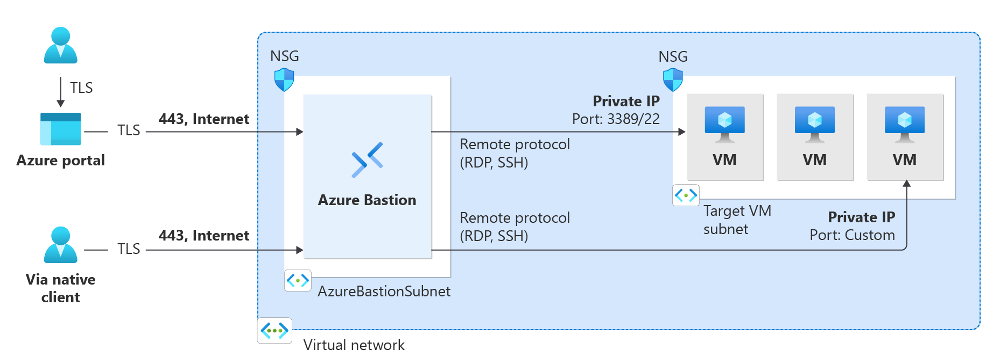
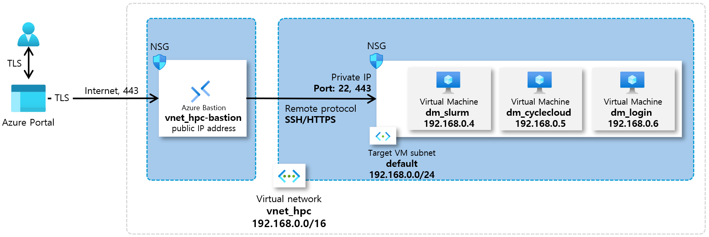
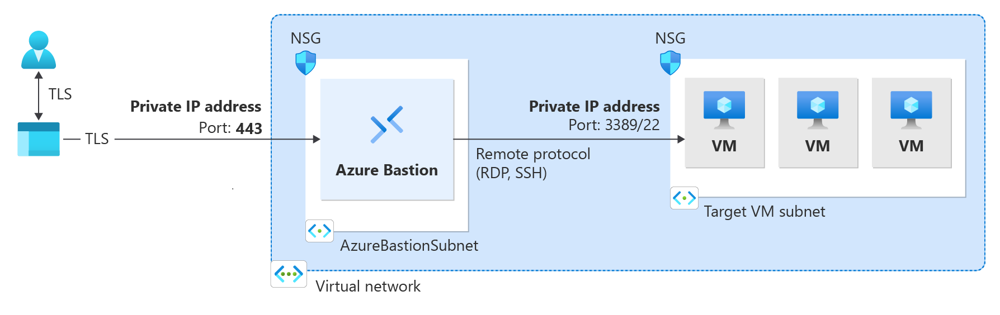

= Azure 배스천(Bastion)
:sectnums:
:toc:

Azure Bastion은 Azure 가상 네트워크(VNet) 내부에 안전하게 배치되어, 인터넷을 통해 가상 머신(VM)에 직접 접근하지 않고도 안전하게 RDP(Remote Desktop Protocol)와 SSH(Secure Shell) 접속을 제공하는 PaaS(Platform as a Service) 솔루션입니다. 즉, 퍼블릭 IP를 VM에 직접 노출하지 않고도 원격 관리가 가능하도록 설계된 보안 게이트웨이 역할을 수행합니다. Azure Bastion을 통해 연결하는 경우 가상 머신에 공용 IP 주소, 에이전트 또는 특수 클라이언트 소프트웨어가 필요하지 않습니다.

Bastion은 프로비전된 가상 네트워크의 모든 VM에 대한 보안 RDP 및 SSH 연결을 제공합니다. Azure Bastion을 사용하면 RDP/SSH를 사용한 보안 액세스 기능을 제공하면서 외부 환경에는 RDP/SSH 포트가 노출되지 않게 가상 머신을 보호할 수 있습니다.

== 주요 이점

보안 강화::
기존 방식에서는 VM에 퍼블릭 IP를 부여하고 인터넷을 통해 RDP 또는 SSH로 접근했는데, 이 경우 포트 스캔, 무차별 공격, 계정 탈취 등 보안 위험이 존재합니다.
* Azure Bastion은 VM과 동일한 VNet 내에 배포되며, 퍼블릭 IP 없이 VM 접근을 제공합니다.
* 모든 트래픽은 TLS(Transport Layer Security)로 암호화되어 안전하게 전달됩니다.
* 방화벽이나 NSG(Network Security Group)를 통해 인터넷에서 직접 VM으로의 접근을 차단할 수 있습니다.

접근 편의성::
* Azure 포털을 통해 웹 브라우저 기반 RDP/SSH 접속이 가능하며, 별도의 클라이언트 설치 없이도 VM 관리가 가능합니다.
* 운영자는 여러 VM에 대해 중앙화된 Bastion 게이트웨이를 통해 관리할 수 있어 관리 효율성을 높일 수 있습니다.

확장성과 통합 관리::
* 하나의 Bastion 인스턴스로 같은 VNet 내 여러 VM을 안전하게 관리할 수 있습니다.
* Azure 정책과 통합하여 Bastion 배포를 표준화하고, 보안 및 규제 준수를 강화할 수 있습니다.
* 기존 Azure 모니터링, Azure Active Directory 인증, RBAC과 연계하여 접근 제어 및 감사 로그 관리가 가능합니다.

[cols="1,3", options="header"]
|===
|혜택|설명
|Azure Portal을 통한 RDP 및 SSH|단 한 번의 클릭으로 원활한 환경을 사용하여 Azure Portal에서 RDP 및 SSH 세션을 가져올 수 있습니다.
|RDP/SSH를 위한 TLS 및 방화벽 통과를 통한 원격 세션|Azure Bastion은 자동으로 로컬 디바이스로 스트리밍되는 HTML5 기반 웹 클라이언트를 사용합니다. RDP/SSH 세션은 포트 443에서 TLS를 통해 진행됩니다. 이렇게 하면 트래픽이 방화벽을 더 안전하게 통과할 수 있습니다. Bastion은 TLS 1.2를 지원합니다. 이전 TLS 버전은 지원되지 않습니다.
|Azure VM에 공용 IP 주소가 필요하지 않음|Azure Bastion은 VM에서 개인 IP 주소를 사용하여 Azure VM에 대한 RDP/SSH 연결을 엽니다. 가상 머신에서 공용 IP 주소가 필요하지 않습니다.
|NSG(네트워크 보안 그룹) 관리의 번거로움이 없음|Azure Bastion 서브넷에 NSG를 적용할 필요가 없습니다. Azure Bastion은 개인 IP를 통해 가상 머신에 연결하므로 Azure Bastion의 RDP/SSH만 허용하도록 NSG를 구성할 수 있습니다. 이렇게 하면 가상 머신에 안전하게 연결하기 위해 매번 NSG를 관리하는 번거로움이 사라집니다.
|VM에서 별도의 베스천 호스트를 관리할 필요 없음|Azure Bastion은 안전한 RDP/SSH 연결을 제공하기 위해 내부적으로 강화된 Azure의 완전 관리형 플랫폼 PaaS 서비스입니다.
|포트 검색으로부터 보호|VM을 인터넷에 공개할 필요가 없기 때문에 사기 및 악성 해커의 포트 검색으로부터 VM을 보호할 수 있습니다.
|단일 지점에서 강화|Azure Bastion은 가상 네트워크의 경계에 위치하므로 가상 네트워크의 각 VM을 강화할 필요가 없습니다.
|제로 데이 공격으로부터 보호|Azure 플랫폼은 Azure Bastion을 강화하고 항상 최신 상태로 유지함으로써 제로 데이 공격으로부터 보호합니다.
|===

== SKU

SKU(Stock Keeping Unit)는 원래 제품 식별 단위를 의미하며, 클라우드 환경에서는 서비스나 리소스의 성능, 기능, 용량, 가격을 구분하는 단위로 사용됩니다. Azure Bastion은 Basic SKU와 Standard SKU로 나눌수 있으며, Basic과 같은 Developer SKU, Standard SKU에서 세션 녹화 기능과 바리이빗 전용 배포 기능이 포함된 Premium SKU로 나뉘어 있습니다. 

Basic SKU와 Standard SKU의 차이점을 정리하면 아래와 같습니다.

Basic SKU::
* 소규모 환경 또는 단일 VNet 내 VM 관리용으로 설계
* 기본 RDP/SSH 연결 지원
* 고정 용량 제한: 최대 연결 수가 제한적이며, 스케일링 자동화 기능이 없음
* 자동 패치 및 관리: Azure PaaS 서비스로 제공되므로 운영자가 직접 패치를 관리할 필요 없음
* 비용이 Standard보다 저렴하여 소규모 테스트 환경이나 단일 프로젝트에 적합

Standard SKU::
* 대규모 환경 및 고가용성 지원
* 스케일링 및 SLA: 자동 스케일링, 고가용성(HA) 지원, 더 많은 동시 접속 가능
* VNet 피어링 지원: 피어링된 다른 VNet의 VM에도 Bastion을 통해 접근 가능
* 고급 보안 기능: Private IP 기반 접근, Azure 정책 연계, RBAC 및 감사 로그 통합 가능
* 비용이 Basic보다 높지만, 운영 효율성과 확장성, 보안 강화가 필요한 생산 환경에 적합

[cols="3,1,1,1,1", options="header"]
|===
|기능|개발자 SKU|기본 SKU|표준 SKU|프리미엄 SKU
|동일한 가상 네트워크의 대상 VM에 연결|예|예|예|예
|피어링 가상 네트워크의 대상 VM에 대한 연결|예|예|예|예
|동시 연결 지원|예|예|예|예
|AKV(Azure Key Vault)에서 Linux VM 프라이빗 키에 액세스|예|예|예|예
|SSH를 사용하여 Linux VM에 연결|예|예|예|예
|RDP를 사용하여 Windows VM에 연결|예|예|예|예
|RDP를 사용하여 Linux VM에 연결|아니요|아니요|예|예
|SSH를 사용하여 Windows VM에 연결|아니요|아니요|예|예
|사용자 지정 인바운드 포트 지정|아니요|아니요|예|예
|Azure CLI를 사용하여 VM에 연결|아니요|아니요|예|예
|호스트 스케일링|아니요|아니요|예|예
|파일 업로드 또는 다운로드|아니요|아니요|예|예
|Kerberos 인증|예|예|예|예
|공유 가능한 링크|아니요|아니요|예|예
|IP 주소를 통해 VM에 연결|아니요|아니요|예|예
|VM 오디오 출력|예|예|예|예
|복사/붙여넣기 사용 안 함(웹 기반 클라이언트)|아니요|아니요|예|예
|세션 녹화|아니요|아니요|아니요|예
|프라이빗 전용 배포|아니요|아니요|아니요|예
|===

== 아키텍처

Azure Bastion은 선택한 SKU 및 옵션 구성에 따라 여러 배포 아키텍처를 제공합니다. 대부분의 SKU의 경우 Bastion은 가상 네트워크에 배포되고 가상 네트워크 피어링을 지원합니다. 특히 Azure Bastion은 로컬 또는 피어링된 가상 네트워크에서 만든 VM에 대한 RDP/SSH 연결을 관리합니다.

RDP 및 SSH는 Azure에서 실행 중인 워크로드에 연결하는 데 사용할 수 있는 기본 수단 중 일부입니다. 인터넷을 통해 RDP/SSH 포트를 노출하는 것은 바람직하지 않으며 중요한 위협 요소로 간주됩니다. 이는 프로토콜 취약성으로 인해 종종 발생합니다. 이 위협 요소를 포함하기 위해 경계 네트워크의 공용 측에 요새 호스트(점프 서버라고도 함)를 배포할 수 있습니다. Bastion 호스트 서버는 공격에 대응하도록 설계 및 구성됩니다. 또한 Bastion 서버는 요새 뒤와 네트워크 내부에 있는 워크로드 모두에 대한 RDP 및 SSH 연결을 제공합니다.

Bastion을 배포할 때 선택하는 SKU에 따라 아키텍처와 사용 가능한 기능이 결정됩니다. 더 많은 기능을 지원하기 위해 더 높은 SKU로 업그레이드할 수 있지만 배포 후에는 SKU를 다운그레이드할 수 없습니다. 프라이빗 전용 및 개발자 SKU와 같은 특정 아키텍처는 배포 시 구성해야 합니다. 각 아키텍처에 대한 자세한 내용은 Bastion 디자인 및 아키텍처를 참조하세요.

다음 다이어그램에서는 Azure Bastion에 사용 가능한 아키텍처를 보여 줍니다.

=== 배포 - 기본 SKU

기본 SKU 이상으로 작업할 때 Bastion은 다음 아키텍처와 워크플로를 사용합니다.

* Bastion 호스트는 최소/26 접두사가 있는 AzureBastionSubnet 서브넷이 포함된 가상 네트워크에 배포됩니다.
* 사용자는 HTML5 브라우저를 사용하여 Azure Portal에 연결하고 연결할 가상 머신을 선택합니다. Azure VM에는 공용 IP 주소가 필요하지 않습니다.
* 한 번 클릭으로 RDP/SSH 세션이 브라우저에서 열립니다.

일부 구성의 경우 사용자는 네이티브 운영 체제 클라이언트를 통해 가상 머신에 연결할 수 있습니다.

=== 배포: Bastion 개발자

Bastion Developer는 Azure Bastion 서비스를 무료로 제공하는 가벼운 솔루션입니다. 이 제품은 VM에 안전하게 연결하고 싶지만 추가 Bastion 기능이나 호스트 크기 조정은 필요하지 않은 개발/테스트 사용자에게 이상적입니다. Bastion Developer를 사용하면 가상 머신 연결 페이지를 통해 한 번에 하나의 Azure VM에 직접 연결할 수 있습니다.

Bastion Developer에 연결하는 경우 다른 SKU를 사용하여 배포하는 경우와 배포 요구 사항이 다릅니다. 일반적으로 베스천 호스트를 만들 때 호스트는 가상 네트워크의 AzureBastionSubnet에 배포됩니다. 베스천 호스트는 사용자 전용이지만 Bastion Developer는 그렇지 않습니다. Bastion Developer 리소스가 전담되지 않았기 때문에 Bastion Developer의 기능은 제한적입니다. 더 많은 기능을 지원해야 하는 경우 언제든지 Bastion Developer를 특정 SKU로 업그레이드할 수 있습니다. 

=== 배포: 프라이빗 전용

프라이빗 전용 Bastion 배포는 개인 IP 주소 액세스만 허용하는 인터넷으로 라우팅할 수 없는 Bastion 배포를 만들어 워크로드를 엔드투엔드로 잠급니다. 프라이빗 전용 Bastion 배포에서는 공용 IP 주소를 통한 베스천 호스트 연결을 허용하지 않습니다. 이와 대조적으로 일반 Azure Bastion 배포에서는 사용자가 공용 IP 주소를 사용하여 베스천 호스트에 연결할 수 있습니다.

다이어그램은 Bastion 프라이빗 전용 배포 아키텍처를 보여 줍니다. ExpressRoute 개인 피어링을 통해 Azure에 연결된 사용자는 베스천 호스트의 개인 IP 주소를 사용하여 Bastion에 안전하게 연결할 수 있습니다. 그런 다음 Bastion은 개인 IP 주소를 통해 베스천 호스트와 동일한 가상 네트워크 내에 있는 가상 머신에 연결할 수 있습니다. 프라이빗 전용 Bastion 배포에서 Bastion은 가상 네트워크 외부의 아웃바운드 액세스를 허용하지 않습니다.

고려 사항::
* 프라이빗 전용 Bastion은 배포 시 구성되며 프리미엄 SKU 계층이 필요합니다.
* 일반 Bastion 배포에서 프라이빗 전용 배포로 변경할 수 없습니다.
* 이미 Bastion 배포가 있는 가상 네트워크에 프라이빗 전용 Bastion을 배포하려면 먼저 가상 네트워크에서 Bastion을 제거한 다음 가상 네트워크에 프라이빗 전용으로 Bastion을 다시 배포합니다. AzureBastionSubnet을 삭제하고 다시 만들 필요가 없습니다.
* End-to-End 프라이빗 연결을 만들려면 Azure Portal을 통해 연결하는 대신 네이티브 클라이언트를 사용하여 연결합니다.
* 클라이언트 컴퓨터가 Azure가 아닌 온-프레미스인 경우 ExpressRoute 또는 VPN을 배포하고 Bastion 리소스에서 IP 기반 연결을 사용하도록 설정해야 합니다.

////
https://learn.microsoft.com/ko-kr/azure/bastion/bastion-overview
////

---

