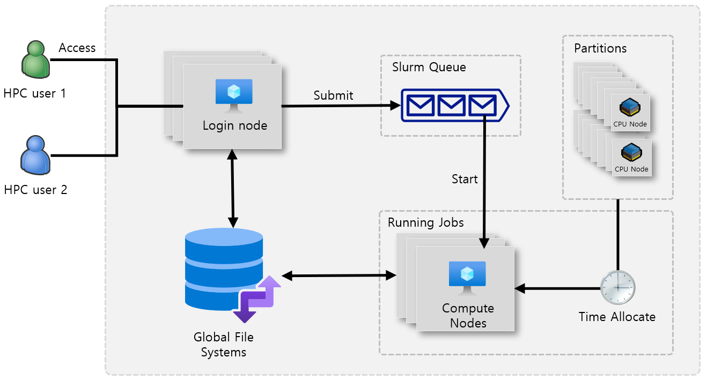
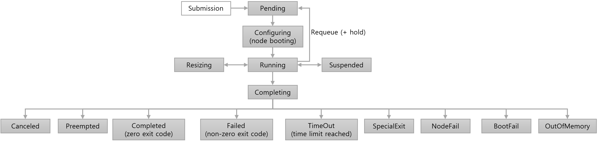

= Slurm 기술 개요
:sectnums:
:toc:

SLURM(Simplified Linux Utunity for Resource Management)은 리눅스 기반의 워크로드 관리자로, 여러 서버로 구성된 클러스터 환경에서 CPU, GPU 등 컴퓨팅 자원을 효율적으로 분배하고 관리하며, 사용자의 다양한 작업을 순서에 따라 실행하도록 돕습니다.10,000,000개 이상의 프로세서까지 확장 가능한 높은 확장성을 가졌으며, 글로벌 슈퍼컴퓨터 TOP 500의 절반 이상에서 사용될 정도로 성능이 검증된 시스템입니다.

Slurm 은 사용자를 일정 기간 동안 컴퓨팅 노드에 할당하여 게산을 실행하도록 리소스를 할당하는 역할을 수행합니다. 여러 사용자의 프로그램이 대기열에 들어가 동시에 실행될 수 있으며, SLURM은 각 사용자 프로그램을 별도의 리소스에서 스케줄링하고 실행합니다.

== Slurm의 동작

* 사용자는 일반적으로 로그인 노드를 통해 클러스터 내에서 slurm과 상호작용할 수 있습니다.
* 사용자는 코어, 주 메모리, 시간을 요청한 다음 프로그램을 slurm으로 보내 대기시킵니다.
* Slurm은 리소스(MPI를 사용한 기본 HPC의 경우 CPU, ML의 경우 GPU)를 예약하고 대기 큐에서 차례를 기다립니다.
* 대기 시간이 지나면 리소스가 할당되고 프로그램이 컴퓨팅 노드에서 실행됩니다.

사용자는 로그인 노드에 액세스한 다음 Slurm 작업을 생성하고 이를 Slurm 대기열로 보낸 다음 리소스가 할당될 때 까지 기다린 후 계산을 수행합니다.

[cols="1,3", options="header"]
|===
|노드 종류|역할
|Control/Head Nodes|클러스터의 두뇌 역할을 하는 핵심 노드로, 사용자가 접속하여 작업을 제출하는 지점이며, 클러스터의 모든 노드를 관리하고 계산 작업을 각 컴퓨팅 노드에 분배하는 스케줄링 소프트웨어가 실행됩니다. 
|Login Nodes|사용자가 클러스터에 안전하게 접속하여 작업을 제출하고 관리할 수 있도록 제공되는 진입점 역할을 수행합니다. 직접적인 계산은 수행하지 않으며, 헤드 노드의 부하를 줄여주는 역할을 합니다.
|Compute Nodes|실제 HPC 애플리케이션과 계산 작업을 실행합니다. 일반적으로 수십에서 수천 개의 컴퓨팅 노드가 노드 배열 형태로 구성되어 병렬 처리를 수행합니다. 작업 큐의 상태에 따라 필요한 만큼 생성되고, 작업이 완료되면 자동으로 종료되어 비용을 최적화합니다.
|Database Node|Slurm의 계정 정보, 작업 기록, 리소스 사용량 등 장기적인 데이터를 저장하는 데이터베이스(보통 slurmdbd 데몬과 함께 MariaDB/MySQL)를 운영합니다.
|===

== 주요 특징

오픈소스 워크로드 관리::
Slurm은 오픈소스 워크로드 관리 시스템의 대표적인 예로, HPC 환경에서 계산 작업을 효율적으로 스케줄링하고 클러스터를 관리하는 핵심적인 도구입니다. Slurm은 클러스터의 모든 노드와 자원 상태를 실시간으로 모니토링하며, 각 작업이 요구하는 CPU, 메모리, GPU등의 자원을 적절히 할당합니다. 이를 통해 클러스터 자원의 낭비를 최소화하고, 동시에 다수의 사용자가 공유하는 환경에서도 공정하게 자원을 배분할 수 있습니다.
+
Slurm은 오픈소스 기반이므로, 사용자는 소스 코드를 활용해 자신이 운영하는 HPC 환경에 맞게 기능을 확장하거나 커스터마이징 할 수 있습니다. 예를 들어, 스케줄링 정책, 우선순위 관리, 작업 의존성 처리, 모니터링 기능 등을 필요에 따라 조정할 수 있으며, 클러트서의 특성과 워크로드 요구사항에 맞춘 최적화가 가능합니다. 또한, Slurm은 배치 모드와 인터랙티브 모드 모두를 지원하여, 연구자와 개발자가 다양한 방식으로 작업을 제출하고 실행할 수 있도록 합니다.
+
Slurm의 구조는 컨트롤러와 계산 노드로 이루어져 있으며, 각 노드에 실행되는 Slurm 데몬(slurmd)이 컨트롤러와 통신하면서 자원 상태를 보고하고 작업을 수행합니다. 이 구조를 통해 Slurm은 안정적이고 확장성 있는 워크로드 관리가 가능합니다.

확장성과 유연성::
Slurm은 HPC 환경에서 높은 확장성과 유연성을 제공하는 워크로드 관리 시스템으로 설계되어 있습니다. 확장성 측면에서 Slurm은 소규모 연구영 클러스터에서 부터 수만개의 노드와 수십만개의 CPU 코어를 갖춘 대규모 슈퍼컴퓨터까지 안정적으로 운용할 수 있습니다. 컨트롤러와 계산 노드 구조를 기반으로, 클러스터 규모가 커지거나 노드가 추가되더라도 시스템 성능을 유지하면서 작업 스케줄링과 자원 관리 기능을 제공할 수 있습니다. 이러한 확장성 때문에 연구자와 엔지니어는 워크로드 요구사항에 따라 클러스터 규모를 유연하게 조정할 수 있으며, 자원 부족이나 과도한 부하로 인한 성능 저하를 최소화 할 수 있습니다.

유연성 측면에서 Slurm은 다양한 워크로드와 환경에 맞춰 설정을 조정할 수 있는 구조를 가지고 있습니다. 사용자는 스케줄링 정책, 우선 순위, 작업 의준성, 자원 할당 방식 등을 필요에 따라 맞춤형으로 구성할 수 있으며, 배치 모드와 인터랙티브 모드를 동시에 지원하여 다양한 활용 사례를 처리할 수 있습니다. 또한, 오픈소스 특성을 활용하여 플러그인 형태의 기능 확장도 가능합니다. 예를 들어, 특정 HPC 환경에 최적화된 모니터링, 인증, 로깅, 자원 관리 플로그인을 추가할 수 있어 시스템 운영의 유언성이 더욱 높아집니다.

자원 관리::
Slurm에서 자원 관리는 HPC 클러스터 운영의 핵심 기능중의 하나로, 클러스터 내 모든 노드와 컴퓨팅 자원을 효율적으로 관리하고 최적화하는 역할을 수행합니다. Slurm은 각 노드에 존재하는 CPU, 메모리, 네트워크 대역폭 등의 자원 상태를 실시간으로 모니터링하며, 작업이 요구하는 자원과 클러스터의 사용 가능 자원을 비교하여 적절하게 할당합니다. 이를 통해 자원의 과부하너 낭비를 방지하고, 작업 처리 속도를 극대화 할 수 있습니다.
+
자원 관리 기능은 단순히 할당에 그치지 않습니다. Slurm은 여러 사용자가 동시에 클러스터를 사용할 때도 자원을 공정하게 배분하도록 설계되어 있으며, 우선 순위 기반 스케줄링 작업, 작업 의존성 처리, 예약된 작업 관리등의 기능을 포함합니다. 또한, 사용자가 요청한 자원보다 적게 할당하거나, 필요에따라 자동으로 확장 및 축소(Auto-scaling)을 수행할 수 있어 HPC 환경에서 유연한 운영이 가능합니다.
+
Slurm의 자원 관리 구조는 컨트롤러와 계산 노드 간의 통신을 기반으로 합니다. 각 노드에서 실행되는 Slurm 데몬(slurmd)은 자원 사용 상태를 컨트롤러에 보고하며, 컨트롤러는 이를 바탕으로 작업 스케줄링과 자연 할당 결정을 내립니다. 이러한 구조 덕분에 Slurm은 대규모 클러스터에서도 안정적이고 확장 가능한 자원 관리를 제공하며, 연구, 시뮬레이션, 데이터 분석, 머신 러닝 등 다양한 HPC 워크로드를 효과적으로 지원합니다.

잡 스케줄링::
Slurm에서 잡 스케줄링은 HPC 클러스터에서 실행되는 작업들을 효율적이고 공정하게 관리하는 핵심 기능입니다. 잡 스케줄링은 단순히 작업을 실행하는 순서를 결정하는 것이 아니라, 클러스터의 자원 상태, 작업의 요구 사항, 우선순위, 작업 간 의존성 등을 종합적으로 고려하여 각 작업이 최적의 노드에서 실행될 수 있도록 조정하는 과정입니다. 이를 통해 다수 사용자가 동시에 클러스터를 활용하더라도 자원의 충돌을 최소화하고, 전체 시스템 성능을 극대화 할 수 있습니다.
+
Slurm은 다양한 스케줄링 전략을 제공합니다. 우선 순위 기반 스케줄링, 공정 공유(Fair Share), FIFO(First-In-First-Out), 예약 작업(Scheduled Jobs) 관리 등 여러 정책을 조합하여 사용자가 제출한 작업에 적절한 자원을 배분할 수 있습니다. 또한, 작업 간 의존성을 설정할 수 있어, 특정 작업이 완료되어야ㅐ 다음 작업이 실행되는 워크플로우를 구성할 수 있으며, 대규모 시뮬레이션이나 데이터 처리 파이프라인에서 복잡한 연산 순서를 효율적으로 관리할 수 있습니다.
+
Slurm에서 작업 제출은 `sbatch` 명령을 통해 배치 작업으로 이루어지거나, `srun` 명령을 통해 인터랙티브 모드로 실행될 수 있습니다. 사용자는 작업의 자원 요구 사항, 실행 시간 제한, 우선순위, 파티션(Partition)등을 설정할 수 있으며,  Slurm 컨트롤러는 이러한 정보를 바탕으로 최적의 노드와 실행 시점을 결정합니다. 작업 상태 확인은 `squeue` 명령으로 가능하며, 필요시 `scancel` 명령으로 작업을 취소할 수 있습니다.
+

명령어 기반 관리::
Slurm은 HPC 환경에서 클러스터를 효율적으로 관리하기 위해 명령어 기반의 관리(Command-Line Interface, CLI) 기능을 중심으로 설계되어 있습니다. 사용자는 다양한 Slurm 명령어를 통해 작업 제출, 상태 모니터링, 작업 취소, 자원 할당 확인 등 클러스터 운영에 필요한 모든 기능을 제어할 수 있습니다. 이러한 명령어 기반 관리는 GUI에 의존하지 않고도 클러스터를 세밀하게 제어할 수 있다는 장점이 있으며, 스크립트 자동화나 배치 처리에도 유연하게 사용할 수 있습니다.
+
* 작업 제출 
** sbatch : 배치 작업(Batch Job) 제출
** srun : 인터랙티브 작업(Interactive Job) 실행 및 병렬 작업 실행
* 작업 상태 확인
** squeue : 클러스터 내 제출된 작업 상태 확인
** sacct : 완료된 작업의 기록 및 사용 통계 확인
* 작업 제어
** scancel : 실행 중이거나 대기 중인 작업 취소
** scontrol : 작업, 노드, 파티션 등 클러스터 상태 및 속성 관리
* 자원 및 노드 관리
** sinfo : 파티션, 노드 상태, 자원 정보 확인
** scontrol show node <노드명> : 특정 노드의 상세 정보 확인
* 작업 모니터링 및 통계
** sstat : 실행 중인 작업의 실시간 성능 및 자원 사용 통계 확인
** sreport : 사용자/계정별 작업 및 자원 사용 통계 생성

스토리지 통합::
Slurm은 기본적으로 클러스터의 계산 자원(CPU, GPU, 메모리)을 중심으로 작업을 관리하는 워크로드 매니저지만, 실질적인 HPC 환경에서 작업의 성능을 좌우하는 또 하나의 핵심 요소는 스토리지 입니다. Slurm 관점에서 스토리지 통합은 단순한 데이터 저장이 아니라, 작업 실행과 스케줄링 과정에서 데이터 접근이 원활하게 이루어지도록 클러스터 내 자원 관리와 밀접하게 연결되는 과정으로 이해할 수 있다.
+
Slurm은 스토리지를 직접 관리하지는 않지만, Job 제출 및 실행 시 스토리지 경로와 자원 요구 사항을 명시할 수는 있습니다. 예를 들어, Lustre, BeeGFS와 같은 병렬 파일 시스탬, NFS 같은 공유 스토리지, 클라우드 기반 오브젝트 스토리지(Azure Blob, AWS S3)가 클러스터 노드에 마운트되어 있어야 Slurm이 스케줄링하는 작업들이 데이터에 접근할 수 있습니다. 이를 통해 사용자는 특정 파티션이나 노드에서 실행되는 작업이라도 동일한 경로로 스토리지에 접근할 수 있으며, 데이터 불일치나 I/O 병목을 최소화할 수 있습니다.
+
또한 Slurm에서는 잡 스크립트 내에서 데이터 입출력 경로나 캐싱 전략을 지정할 수 있으며, 필요시 `prolog` 와 `epilog` 스크립트를 통해 작업 실행 전후에 스토리지 마운트, 데이터 이동, 정리 작업등을 자동화할 수 있습니다. 이로서 스토리지 자원과 연산 자원이 일관되게 연동되고, 사용자는 스토리지 통합이 보장된 환경에서 작업을 수행할 수 있습니다.
+
스토리지 통합은 Slurm의 확장성과도 직결됩니다. 클러스터 규모가 커지고 사용자 수가 늘어나면, 단일 스토리지 시스템에 대한 접근은 성능 병목을 일으킬 수 있습니다. 이를 방지하기 위해 Slurm은 계층적 스토리지(HSM: Hierarchical Storage Management)나 데이터 로컬리티를 고려한 스케줄링 정책과 결합할 수 있습니다. 예컨대, 특정 데이터셋이 이미 로컬 SSD나 캐시 노드에 존재한다면, Slrum은 해당 노드에 작업을 할당하여 불필요한 데이터 이동을 줄이고 I/O 성능을 극대화 할 수 있습니다.
+
Slurm은 아래와 같은 파일 시스템을 지원합니다.
+
* 병렬 파일시스템 (Parallel File Systems)
** Lustre : HPC에서 가장 널리 쓰이는 병렬 파일시스템
** BeeGFS : 고성능, 확장성 중심 병렬 FS
** IBM Spectrum Scale (GPFS) : 대규모 데이터 및 HPC/AI 워크로드 지원
* 공유 네트워크 파일시스템
** NFS (Network File System)
** SMB / CIFS (Windows/Linux 간 파일 공유 시 사용)
* 클라우드 기반 파일시스템 및 스토리지
** Azure Blob / Data Lake Storage (HPC Cache와 함께 사용)
** Amazon S3 (S3FS, goofys 등 마운트 도구 활용)
** Google Cloud Storage (GCS)
* 분산 파일시스템
** CephFS : 오브젝트 기반 확장형 스토리지
** GlusterFS : 오픈소스 스케일아웃 파일시스템
* 로컬 스토리지 / 버스트 버퍼
** 노드 로컬 SSD/HDD
** NVMe 기반 버스트 버퍼 활용 → I/O 집약적 워크로드 가속

---