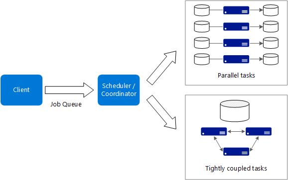
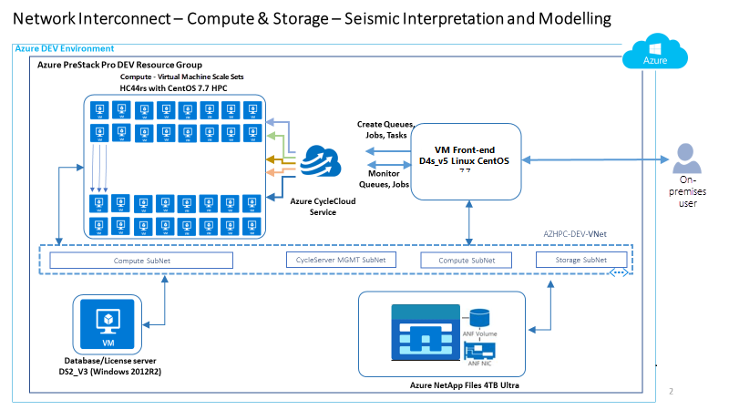
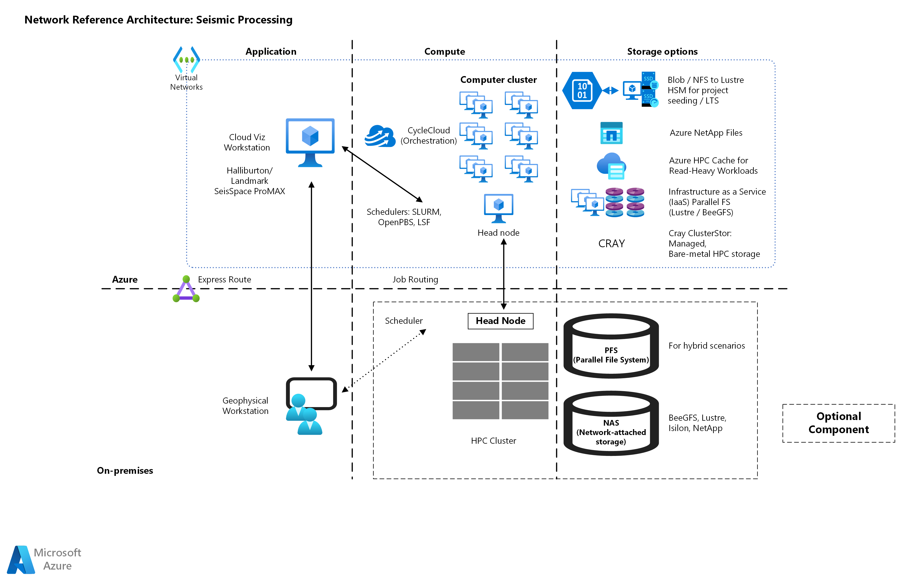
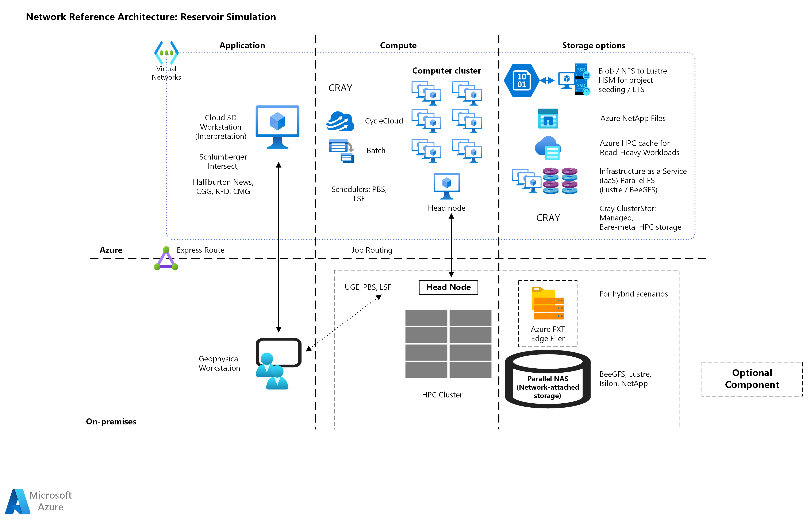
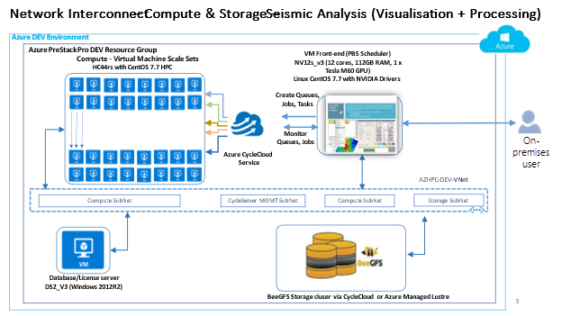
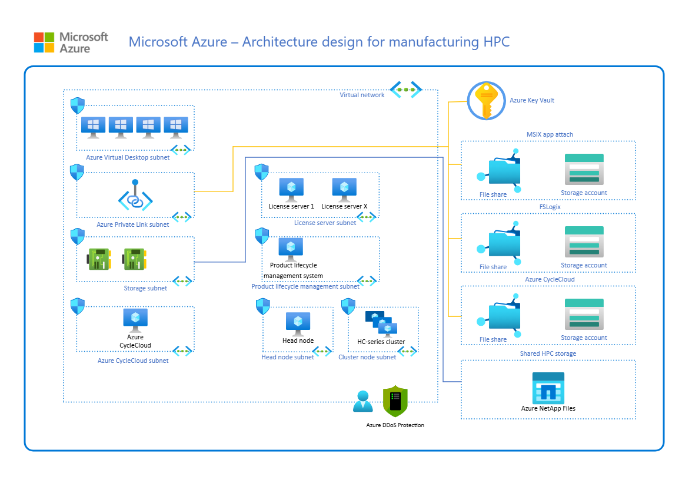

= Microsoft Azure HPC 아키텍처
:sectnums:
:toc:

////
https://learn.microsoft.com/ko-kr/azure/cloud-adoption-framework/scenarios/azure-hpc/compute
////

빅 컴퓨팅이라고도 불리는 HPC는 수백 또는 수천 개의 코어가 필요할 수 있는 대규모 워크로드를 수행합니다. HPC는 제품 개발 프로세스의 모든 단계에서 에너지, 금융, 제조와 같은 산업을 도울 수 있습니다.

빅 컴퓨팅 애플리케이션에는 일반적으로 다음과 같은 특성이 있습니다.

* 워크로드를 여러 코어에서 동시에 실행할 수 있는 개별 작업으로 나눌 수 있습니다.
* 각 태스크는 입력을 받아 처리하고 출력을 생성합니다. 전체 애플리케이션은 한정된 시간 동안 실행됩니다.
* 애플리케이션은 지속적으로 실행할 필요는 없지만 노드 오류 및 충돌을 처리할 수 있어야 합니다.
* 작업은 독립적이거나 긴밀하게 결합될 수 있으므로 InfiniBand 및 RDMA(원격 직접 메모리 액세스) 연결과 같은 고속 네트워킹 기술이 필요합니다.
* 고성능 컴퓨팅, GPU(그래픽 처리 장치) 가속 컴퓨팅, 필드 프로그래밍 가능한 게이트 배열 가속 컴퓨팅 또는 컴퓨팅 최적화 SKU를 사용할 수 있습니다. 선택은 워크로드에 따라 달라집니다.

Azure는 CPU 집약적 및 GPU 집약적 워크로드에 최적화된 다양한 VM(가상 머신) 인스턴스를 제공합니다. 이러한 VM은 Azure Virtual Machine Scale Sets에서 실행되어 복원력 및 부하 분산을 제공할 수 있습니다. 또한 Azure는 InfiniBand 지원 하드웨어를 제공하는 유일한 클라우드 플랫폼입니다. InfiniBand는 재무 위험 모델링, 엔지니어링 스트레스 분석, 저수지 시뮬레이션 및 지진 워크로드 실행과 같은 작업에 상당한 성능 이점을 제공합니다. 이 장점으로 인해 현재 온-프레미스 인프라 성능에 접근하거나 초과하는 성능이 발생합니다.

== 디자인 고려 사항

HPC 인프라를 디자인할 때 워크로드를 관리하고 예약하는 데 도움이 되는 여러 도구와 서비스를 사용할 수 있습니다.

Azure Batch::
대규모 HPC 애플리케이션을 실행하기 위한 관리되는 서비스입니다. Batch를 사용하여 VM 풀을 구성하고 애플리케이션 및 데이터 파일을 업로드합니다. 그런 다음 Batch 서비스는 VM을 구성하고, VM에 작업을 할당하고, 작업을 실행하고, 진행 상황을 모니터링합니다. Batch는 워크로드 변경에 대응하여 VM을 자동으로 확장 및 축소할 수 있습니다. Batch는 작업 예약 기능도 제공합니다.

Azure CycleCloud::
Azure 에서 HPC 및 대형 컴퓨팅 클러스터를 만들고, 관리하고, 운영하고, 최적화하는 데 사용할 수 있는 도구입니다. Azure CycleCloud를 사용하여 HPC 클러스터를 동적으로 구성하고 하이브리드 및 클라우드 워크플로에 대한 데이터 및 작업을 오케스트레이션합니다. 워크로드 관리자를 사용하여 HPC 워크로드를 관리하는 간단한 방법을 제공합니다. Azure CycleCloud는 그리드 엔진, Microsoft HPC 팩, LSF, PBS Pro 및 SLURM과 같은 워크로드 관리자를 지원합니다.

Azure Logic Apps::
관리되는 VM 풀에서 실행할 계산 집약적 작업을 예약하기 위한 특수 서비스입니다. 작업의 요구 사항에 맞게 컴퓨팅 리소스의 크기를 자동으로 조정할 수 있습니다.

== 참조 아키텍처

에너지, 금융 및 제조 산업에 대한 참조 아키텍처를 설명합니다.

=== 에너지 참조 아키첵처

==== 디자인 권장 사항

* 저수지 및 지진 워크플로는 일반적으로 컴퓨팅 및 작업 예약에 대해 유사한 요구 사항이 있음을 이해합니다.
* 네트워크 요구 사항을 고려합니다. Azure HPC는 메모리 집약적 지진 이미징 및 저수지 시뮬레이션을 위해 설계된 HBv2, HBv3, HBv4 및 HX 시리즈 VM 크기를 제공합니다.
* 메모리 대역폭 바인딩된 애플리케이션에 HX 시리즈 또는 HBv4 시리즈 VM을 사용하고, 컴퓨팅 바인딩된 저수지 시뮬레이션에 HBv3 시리즈 또는 HBv2 시리즈 VM을 사용합니다.
* 3D 저수지 모델링 및 지진 데이터 시각화에 NV 시리즈 VM을 사용합니다.
* GPU 가속 지진 FWI(전체 파형 반전) 분석에 NCv4 시리즈 VM을 사용합니다. +
데이터 집약적 RTM(수지 전송 몰딩) 처리의 경우 누적 용량이 7TB인 NVMe(비휘발성 메모리 익스프레스) 드라이브를 제공하기 때문에 NDv4 VM 크기가 가장 좋습니다. +
메시지 전달 인터페이스 워크로드를 사용하는 HBv2, HBv3, HBv4 및 HX 시리즈 VM에서 최상의 성능을 얻으려면 프로세서의 코어에 최적의 프로세스 고정을 수행합니다. +
또한 NCv4 시리즈 VM은 병렬 애플리케이션 프로세스의 올바른 고정을 보장하는 전용 도구를 제공합니다.
* NDv4 시리즈 VM의 복잡한 아키텍처 때문에 GPU 가속 애플리케이션을 최적으로 시작하도록 VM을 구성할 때 주의해야 합니다. 

==== 내진 처리를 위한 참조 아키텍처

지진 처리 및 이미징은 탐사 데이터를 기반으로 하위 표면의 모델을 만들기 때문에 석유 및 가스 산업의 기본 사항입니다. 지구과학자들은 일반적으로 하위 서체에 있을 수 있는 것을 적격하고 정량화하는 과정을 수행합니다. 지리 과학자는 일반적으로 데이터 센터 및 클라우드 바인딩 소프트웨어를 사용합니다. 경우에 따라 가상 데스크톱 기술을 사용하여 원격 또는 클라우드에서 소프트웨어에 액세스합니다.

지하 모델의 품질과 데이터의 품질 및 해상도는 임대 입찰이나 드릴링 위치를 결정할 때 올바른 비즈니스 결정을 내리는 데 매우 중요합니다. 지진 이미지 해석 이미지는 우물의 위치를 개선하고 마른 구멍을 드릴링의 위험을 줄일 수 있습니다. 석유 및 가스 회사의 경우 지하 구조를 더 잘 이해하면 탐사 위험을 줄이는 데 직접적으로 영향을 줍니다. 기본적으로 지질 지역에 대한 회사의 관점의 정확도가 높을수록 드릴 시 오일을 타격할 확률이 높아질 수 있습니다.

이 작업은 데이터 및 계산 집약적입니다. 회사는 TB의 데이터를 처리해야 합니다. 이 데이터 처리에는 빠른 네트워킹을 포함하는 대규모 및 빠른 계산 성능이 필요합니다. 지진 이미징의 데이터 및 컴퓨팅 집약적 특성으로 인해 회사는 병렬 컴퓨팅을 사용하여 데이터를 처리하고 컴파일 및 완료 시간을 줄입니다.

기업들은 복구 작업을 시작하기 전에 지하에서 발견한 저수지의 탄화수소 콘텐츠를 찾고 정확하게 정량화하고 자격을 갖추기 위해 대량의 지진 취득 데이터를 끊임없이 처리합니다. 취득 데이터는 구조화되어 있지 않으며 잠재 석유 및 가스 유전의 저장 용량이 쉽게 PB에 도달할 수 있습니다. 이러한 요인으로 인해 HPC 및 기타 적절한 데이터 관리 전략을 사용하여 적절한 기간 내에 내진 처리 작업을 완료할 수 있습니다.

==== 저수지 시뮬레이션 및 모델링을 위한 참조 아키텍처

물 포화, 다공성 및 투과성과 같은 물리적 하위 표면 특성은 저수지 모델링에서도 중요한 데이터입니다. 이 데이터는 배포할 복구 접근 방식 및 장비의 종류와 궁극적으로 우물 위치를 결정하는 데 중요합니다.

저수지 모델링 워크로드는 저수지 엔지니어링 영역이기도 합니다. 워크로드는 저수지 모델의 물리학, 수학 및 컴퓨터 프로그래밍을 결합하여 시간이 지남에 따라 저수지의 유체 동작을 분석하고 예측합니다. 이 분석에는 빠른 네트워킹을 포함하여 높은 계산 능력과 큰 컴퓨팅 워크로드 요구가 필요합니다.

=== 재무 참조 아키텍처

다음 아키텍처는 HPC의 VM을 재무 워크로드에 사용하는 방법의 예입니다. 이 워크로드는 HPC 팩 HB 시리즈 컴퓨팅 노드를 사용합니다. HB 시리즈 SKU는 사용 중지되었지만 이 아키텍처에 사용되는 컴퓨팅 인스턴스에 적합한 대안은 HBv4 시리즈 VM입니다.

image:./images/image09.png[width=1000]

HBv4 시리즈 VM은 재무 분석, 날씨 시뮬레이션 및 실리콘 레지스터 전송 수준 모델링과 같은 HPC 애플리케이션에 최적화되어 있습니다. HB VM은 다음과 같은 사양을 제공합니다.

* 최대 176 AMD EPYC™ 9V33X 시리즈 CPU 코어
* 768GB RAM
* 하이퍼스레딩 없음

HBv4 시리즈 VM은 다음과 같은 성능 메트릭도 제공합니다.

* 유효 메모리 대역폭의 초당 평균 1.2테라바이트
* L3 캐시 2,304메가바이트
* 블록 디바이스 SSD 성능을 위해 초당 최대 12GB(GB/s) 읽기 및 7GB/초 쓰기 속도
* 최대 3.7기가헤르츠(GHz)의 클록 주파수

HPC 헤드 노드의 경우 워크로드는 다른 크기의 VM을 사용합니다. 특히 범용 제품의 유형인 D16s_v4 VM을 사용합니다.

=== 제조 참조 아키텍처

다음 아키텍처는 제조에서 HPC에서 VM을 사용하는 방법의 예입니다. 이 아키텍처는 Azure Private Link 서브넷에 연결된 Azure Files 공유 및 Azure Storage 계정을 사용합니다.

아키텍처는 자체 서브넷에서 Azure CycleCloud를 사용합니다. HC 시리즈 VM은 클러스터 노드의 정렬에 사용됩니다.

HC 시리즈 VM은 집약적인 계산을 사용하는 HPC 애플리케이션에 최적화되어 있습니다. 예를 들어 암시적 및 유한 요소 분석, 저수지 시뮬레이션 및 계산 화학 애플리케이션이 있습니다. HC VM에는 44개의 Intel Xeon Platinum 8168 프로세서 코어, CPU 코어당 8GB RAM, 하이퍼스레딩 없음 및 최대 4개의 관리 디스크가 있습니다. Intel Xeon Platinum 플랫폼은 인텔의 풍부한 소프트웨어 도구 및 기능 에코시스템과 대부분의 워크로드에 대해 3.4GHz의 모든 코어 클록 속도를 지원합니다.

---

link:./04_azure_hpc_security.adoc[이전: HPC 관점에서 본 Azure 보안]