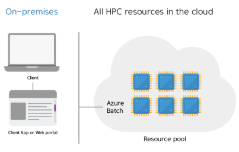
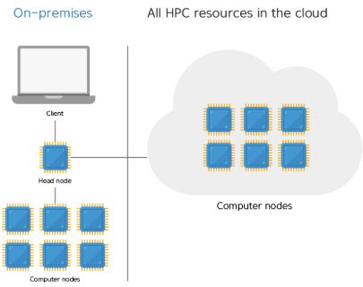
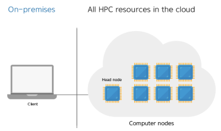

= Microsoft Azure의 HPC
:sectnums:
:toc:

Microsoft Azure는 HPC를 위한 포괄적인 클라우드 기반 인프라를 제공하여 복잡한 시뮬레이션, AI 모델링, 데이터 분석 등 다양한 연산 집약적인 작업을 지원합니다. Azure의 HPC 솔루션은 확장성, 보안, 비용 효율성을 갖춘 엔터프라이즈 급 인프라를 통해 기업과 연구기관의 요구를 충족합니다.

Microsoft Azure는 클라우드 기반 HPC 솔루션을 제공하여 대규모 연산, 데이터 분석, AI 모델 학습 등 계산 집약적인 작업을 효율적으로 수행할 수 있도록 지원합니다. Azure HPC는 전통적 온프레미스 HPC와 유사한 기술적 구성 요소를 가지면서, 클라우드 환경의 탄력성, 확장성, 서비스화 기능을 통합한 구성을 갖습니다. HPC 시스템을 빌드하는데는 많은 인프라 구성 요소가 필요합니다.  HPC 워크로드를 관리하는 방법으로 무엇을 선택하든 컴퓨팅, 스토리지 및 네트워킹은 기본 구성 요소를 제공합니다.

== 컴퓨팅 리소스

Azure는 CPU및 GPU 사용량이 많은 워크로드에 최적화된 크기 범위를 제공합니다.

=== 가상 머신

==== CPU 기반 가상 머신

Azure 고성능 컴퓨팅 VM은 계산 유체 역학, 유한 요소 분석, 프런트 엔드 및 백 엔드 EDA, 렌더링, 분자 역학, 계산 지질 과학, 날씨 시뮬레이션 및 재무 위험 분석과 같은 다양한 HPC 워크로드에 최적화되어 있습니다.

[cols="1,2a,2a", options="header"]
|===
|패밀리|워크로드|계열 목록
|HB 제품군|높은 메모리 대역폭 + 
유체 역학 + 
날씨 모델링	
|https://learn.microsoft.com/ko-kr/azure/virtual-machines/sizes/high-performance-compute/hbv2-series?tabs=sizebasic[HBv2 시리즈] + 
https://learn.microsoft.com/ko-kr/azure/virtual-machines/sizes/high-performance-compute/hbv3-series?tabs=sizebasic[HBv3 시리즈] + 
https://learn.microsoft.com/ko-kr/azure/virtual-machines/sizes/high-performance-compute/hbv4-series?tabs=sizebasic[HBv4 시리즈]
|HC 제품군|고밀도 컴퓨팅 +
 유한 요소 분석 +
 분자 역학 +
 계산 화학
|HC 시리즈
|HX 패밀리|대용량 메모리 용량 +
 EDA(전자 디자인 자동화)
|https://learn.microsoft.com/ko-kr/azure/virtual-machines/sizes/high-performance-compute/hx-series?tabs=sizebasic[HX 시리즈]
|===

==== GPU 사용 가상 머신

N 시리즈 VM은 AI(인공지능) 학습 및 시각화를 포함한 계산 집약적 또는 그래픽 집약적 애플리케이션을 위해 설계된 NVIDIA GPU를 특징으로 합니다.

[cols="1,2a,2a", options="header"]
|===
|패밀리|워크로드|계열 목록
|NC 패밀리|계산 집약적 +
그래픽 집약적 +
시각화|
https://learn.microsoft.com/ko-kr/azure/virtual-machines/sizes/gpu-accelerated/nc-family#ncads_h100_v5-series[NCads_H100_v5 시리즈] +
https://learn.microsoft.com/ko-kr/azure/virtual-machines/sizes/gpu-accelerated/nc-family#nccads_h100_v5-series[NCCads_H100_v5 시리즈] +
https://learn.microsoft.com/ko-kr/azure/virtual-machines/sizes/gpu-accelerated/nc-family#ncv3-series[NCv3 시리즈] +
https://learn.microsoft.com/ko-kr/azure/virtual-machines/sizes/gpu-accelerated/nc-family#ncast4_v3-series[NCasT4_v3 시리즈] +
https://learn.microsoft.com/ko-kr/azure/virtual-machines/sizes/gpu-accelerated/nc-family#nc_a100_v4-series[NC_A100_v4 시리즈]
|ND-family|대용량 메모리 계산 집약적 +
대용량 메모리 그래픽 집약적 +
대용량 메모리 시각화
|https://learn.microsoft.com/ko-kr/azure/virtual-machines/sizes/gpu-accelerated/nd-family#nd_mi300x_v5-series[ND_MI300X_v5 시리즈] +
https://learn.microsoft.com/ko-kr/azure/virtual-machines/sizes/gpu-accelerated/nd-family#nd_h100_v5-series[ND-H100-v5 시리즈] +
https://learn.microsoft.com/ko-kr/azure/virtual-machines/sizes/gpu-accelerated/nd-family#ndm_a100_v4-series[NDm_A100_v4 시리즈] +
https://learn.microsoft.com/ko-kr/azure/virtual-machines/sizes/gpu-accelerated/nd-family#nd_a100_v4-series[ND_A100_v4 시리즈]
|NG-family|VDI(Virtual Desktop) +
클라우드 게임
|https://learn.microsoft.com/ko-kr/azure/virtual-machines/sizes/gpu-accelerated/ng-family#ngads-v620-series[NGads V620 시리즈]
|NV 패밀리|VDI(가상 데스크톱) +
단정밀도 컴퓨팅 +
비디오 인코딩 및 렌더링
|https://learn.microsoft.com/ko-kr/azure/virtual-machines/sizes/gpu-accelerated/nv-family#nv-series-v1[NV 시리즈] +
https://learn.microsoft.com/ko-kr/azure/virtual-machines/sizes/gpu-accelerated/nv-family#nvv3-series[NVv3 시리즈] +
https://learn.microsoft.com/ko-kr/azure/virtual-machines/sizes/gpu-accelerated/nv-family#nvv4-series[NVv4 시리즈] +
https://learn.microsoft.com/ko-kr/azure/virtual-machines/sizes/gpu-accelerated/nv-family#nvads-a10-v5-series[NVadsA10_v5 시리즈] +
https://learn.microsoft.com/ko-kr/azure/virtual-machines/sizes/previous-gen-sizes-list#gpu-accelerated-previous-gen-sizes[이전 세대 NV 제품군]
|===

==== FPGA 가속

[cols="1,2a,2a", options="header"]
|===
|패밀리|워크로드|계열 목록
|NP 계열|기계 학습 유추 +
비디오 코드 변환 +
데이터베이스 검색 및 분석
|https://learn.microsoft.com/ko-kr/azure/virtual-machines/sizes/fpga-accelerated/np-family#np-series[NP 시리즈]
|===

== 스토리지

대규모 Batch 및 HPC 작업에는 기존 클라우드 파일 시스템의 용량을 초과하는 데이터 스토리지 및 액세스에 대한 요구사항이 있습니다. Azure 기반 HPC 애플리케이션의 속도 및 용량 요구사항을 관리하는 솔루션은 다양합니다. Microsoft Azure는 HPC를 위한 다음과 같은 저장소 솔루션을 제공합니다.

=== Azure NetApp Files

Azure NetApp Files는 Azure에서 기본 제공되는 자사의 엔터프라이즈급 고성능 파일 스토리지 서비스입니다. NetApp 계정 및 용량 풀 내에서 만들고 SMB 및 NFS를 사용하여 클라이언트에 공유할 수 있는 볼륨을 서비스로 제공합니다. 서비스 및 성능 수준을 선택하고 데이터 보호를 관리할 수도 있습니다. 온-프레미스에서 익숙하고 사용하는 것과 동일한 프로토콜과 도구를 사용하여 고성능, 고가용성 및 확장성 있는 파일 공유를 만들고 관리할 수 있습니다.

Azure NetApp Files의 주요 특성은 다음과 같습니다.

* 성능, 비용 최적화 및 스케일링
* 단순성 및 가용성
* 네트워크 관리 및 보안

Azure NetApp Files는 SMB, NFS 및 이중 프로토콜 볼륨을 지원하며 다음과 같은 사용 사례에 사용할 수 있습니다.

* 파일 공유
* 홈 디렉터리
* 데이터베이스
* 고성능 컴퓨팅

=== 스토리지 최적화 가상 머신

스토리지 최적화 VM(가상 머신) 크기는 높은 디스크 처리량 및 IO를 제공하며 빅 데이터, SQL, NoSQL 데이터베이스, 데이터 웨어하우징 및 대형 트랜잭션 데이터베이스에 적합합니다. 예를 들어 Cassandra, MongoDB, Cloudera, Redis가 있습니다.

[cols="1,2a,2a", options="header"]
|===
|패밀리|워크로드|계열 목록
|L-패밀리
|높은 디스크 처리량 및 IO +
빅 데이터 +
SQL 및 NoSQL 데이터베이스 +
데이터 웨어하우징 +
대규모 트랜잭션 데이터베이스
|https://learn.microsoft.com/ko-kr/azure/virtual-machines/sizes/storage-optimized/l-family#lsv3-series[Lsv3 시리즈] +
https://learn.microsoft.com/ko-kr/azure/virtual-machines/sizes/storage-optimized/l-family#lasv3-series[Lasv3 시리즈] +
https://learn.microsoft.com/ko-kr/azure/virtual-machines/sizes/previous-gen-sizes-list#storage-optimized-previous-gen-sizes[이전 세대 L-제품군]
|===

=== Blog, 테이블 및 큐 스토리지

Azure Storage 플랫폼은 최신 데이터 스토리지 시나리오를 위한 Microsoft의 클라우드 스토리지 솔루션입니다. Azure Storage는 클라우드의 다양한 데이터 개체에 대해 고가용성, 대규모 확장성, 내구성 및 보안 스토리지를 제공합니다. Azure Storage 데이터 개체는 REST API를 통해 HTTP 또는 HTTPS를 통해 전 세계 어디에서나 액세스할 수 있습니다. Azure Storage는 .NET, Java, Python, JavaScript, C++ 및 Go를 사용하여 애플리케이션 또는 서비스를 빌드하는 개발자를 위한 클라이언트 라이브러리도 제공합니다. 개발자와 IT 전문가는 Azure PowerShell 및 Azure CLI를 사용하여 데이터 관리 또는 구성 작업을 위한 스크립트를 작성할 수 있습니다. Azure Portal 및 Azure Storage Explorer는 Azure Storage와 상호 작용하기 위한 사용자 인터페이스 도구를 제공합니다.

==== Azure Storage의 이점

Azure Storage 서비스는 애플리케이션 개발자 및 IT 전문가에게 다음과 같은 이점을 제공합니다.

* 내구성 및 고가용성 +
중복성은 일시적인 하드웨어 오류 발생 시 데이터를 안전하게 보호합니다. 또한 로컬 재해 또는 자연 재해로 인한 장애를 방지할 수 있도록 데이터 센터 또는 지리적 영역에서 * 데이터를 복제하도록 선택할 수도 있습니다. 이러한 방식으로 복제된 데이터는 예기치 않은 중단이 발생할 경우 항상 사용 가능한 상태로 유지됩니다.
* 보안 +
Azure Storage 계정에 기록된 모든 데이터는 서비스에 의해 암호화됩니다. Azure Storage는 데이터에 액세스할 수 있는 사용자를 자세히 제어할 수 있습니다.
* 확장 가능 +
Azure Storage는 오늘날의 애플리케이션에 대한 데이터 저장소 및 성능 요구 사항을 충족하기 위해 대규모로 확장할 수 있도록 설계되었습니다.
* 관리됨 +
하드웨어 유지 관리, 업데이트 및 중요한 문제를 Azure에서 처리합니다.
* 액세스 가능성 +
Azure Storage의 데이터는 HTTP 또는 HTTPS를 통해 전 세계 어디에서든 액세스할 수 있습니다. Microsoft는 완성도 높은 REST API뿐만 아니라 .NET, Java, Node.js, Python, Go 등 기타 * 다양한 언어로 Azure Storage용 클라이언트 라이브러리를 제공합니다. Azure Storage는 Azure PowerShell 또는 Azure CLI에서 스크립트를 지원합니다. 또한 Azure Portal 및 Azure Storage Explorer는 데이터 작업을 위한 쉬운 시각적 솔루션을 제공합니다.

==== Azure Storage 데이터 서비스

Azure Storage 플랫폼에는 다음과 같은 데이터 서비스가 포함됩니다.

* Azure Blob: 텍스트 및 이진 데이터에 대한 확장성이 뛰어난 개체 저장소입니다. Data Lake Storage를 통한 빅 데이터 분석 지원도 포함됩니다.
* Azure Files: 클라우드 또는 온-프레미스 배포에 대한 관리되는 파일 공유입니다.
* Azure Elastic SAN: Azure에서 SAN 배포, 스케일링, 관리, 구성을 간소화하는 완전히 통합된 솔루션입니다.
* Azure 큐: 애플리케이션 구성 요소 간에 안정적인 메시징을 위한 메시징 저장소입니다.
* Azure Tables: 스키마가 없는 구조적 데이터 스토리지를 위한 NoSQL 저장소입니다.
* Azure 관리 디스크: Azure VM용 블록 수준 스토리지 볼륨입니다.
* Azure Container Storage: 컨테이너용으로 기본적으로 빌드된 볼륨 관리, 배포 및 오케스트레이션 서비스입니다.

=== Azure SMB 파일 스토리지

Azure Files는 산업 표준 SMB(서버 메시지 블록) 프로토콜, NFS(네트워크 파일 시스템) 프로토콜 및 Azure Files REST API를 통해 액세스할 수 있는 클라우드에서 완전 관리형 파일 공유를 제공합니다. Azure File 공유는 클라우드 또는 온-프레미스 배포를 통해 동시에 탑재될 수 있습니다. SMB Azure 파일 공유는 Windows, Linux, macOS 클라이언트에서 액세스할 수 있습니다. NFS Azure 파일 공유는 Linux 클라이언트에서 액세스할 수 있습니다. 또한 데이터가 사용되는 위치 근처에서 빠르게 액세스하기 위해 Azure 파일 동기화를 사용하여 SMB Azure 파일 공유를 Windows 서버에서 캐시할 수 있습니다.

Azure 파일 공유를 사용하여 다음을 수행할 수 있습니다.

* 온-프레미스 파일 서버 바꾸기 또는 보완 +
Azure Files를 사용하여 기존의 온-프레미스 파일 서버 또는 NAS(네트워크 연결 스토리지) 디바이스를 대체하거나 보완합니다. Windows, macOS 및 Linux와 같이 자주 사용되는 운영 체제는 전세계 어디서나 Azure File 공유를 직접 탑재할 수 있습니다. SMB Azure 파일 공유는 데이터의 성능 및 분산 캐싱을 위해 Azure 파일 동기화를 사용하여 온-프레미스 또는 클라우드의 Windows 서버에 복제될 수도 있습니다. ID 기반 인증을 사용하면 SMB Azure 파일 공유가 액세스 제어를 위해 온-프레미스 Active Directory AD DS(Domain Services)와 함께 작동할 수 있습니다.
* 애플리케이션 "리프트 앤 시프트" +
Azure Files를 사용하면 파일 애플리케이션 또는 사용자 데이터를 저장하기 위해 파일 공유를 사용하는 클라우드로 애플리케이션을 쉽게 "전환"할 수 있습니다. Azure Files를 사용하면 애플리케이션 및 데이터를 모두 Azure로 이동시키는 “클래식” 전환 시나리오 및 애플리케이션 데이터를 Azure Files로 이동시키는 “하이브리드” 전환 시나리오를 모두 사용하고 애플리케이션이 계속 온-프레미스에서 실행됩니다.
* 클라우드 개발 간소화 +
Azure Files를 사용하여 새로운 클라우드 개발 프로젝트를 간소화할 수 있습니다. 예시:
** 공유 애플리케이션 설정 +
분산 애플리케이션의 일반적인 패턴은 여러 애플리케이션 인스턴스에서 액세스할 수 있는 중앙 집중식 위치에 구성 파일을 저장하는 것입니다. 애플리케이션 인스턴스는 Azure File REST API를 통해 해당 구성을 로드하고 사용자는 공유를 로컬로 탑재하여 해당 인스턴스에 액세스할 수 있습니다.
** 진단 공유 +
Azure File 공유는 클라우드 애플리케이션에서 로그, 메트릭 및 크래시 덤프를 쓸 수 있는 편리한 장소입니다. 파일 REST API를 통해 애플리케이션 인스턴스에서 로그를 작성할 수 있고 개발자는 로컬 머신에 파일 공유를 탑재하여 해당 로그에 액세스할 수 있습니다. 이 기능은 뛰어난 유연성을 제공하여 개발자가 기존에 사용하던 도구를 중지하지 않고도 클라우드 개발을 지속할 수 있습니다.
** 개발/테스트/디버그 +
개발자 또는 관리자가 클라우드의 VM에서 작업할 때 종종 도구 또는 유틸리티 모음이 필요합니다. 각 VM에 이러한 유틸리티와 도구를 복사하는 작업은 시간이 오래 걸릴 수 있습니다. 개발자와 관리자는 VM에서 로컬로 Azure File 공유를 탑재하여 복사할 필요 없이 해당 도구 및 유틸리티에 빠르게 액세스할 수 있습니다.
* 컨테이너화 +
Azure 파일 공유를 상태 저장 컨테이너의 영구 볼륨으로 사용할 수도 있습니다. 모든 시작 시 원시 데이터에 액세스하는 컨테이너의 경우 이러한 컨테이너에서 실행되는 인스턴스에 관계 없이 파일 시스템에 액세스할 수 있도록 공유 파일 시스템이 필요합니다.

=== Azure Managed Lustre

Azure Managed Lustre는 HPC(고성능 컴퓨팅) 워크로드를 위한 확장 가능하고 강력하며 비용 효율적인 스토리지를 제공하는 관리되는 파일 시스템입니다.

다음은 Azure Managed Lustre의 몇 가지 주요 기능 및 이점입니다.

* HPC 워크로드가속화: 높은 처리량, 짧은 대기 시간 및 Lustre 프로토콜 호환성이 필요한 HPC 워크로드에 이상적인 고성능 분산 병렬 파일 시스템 솔루션을 제공합니다.
용도로 빌드된 관리 서비스: 기본 인프라를 관리하는 복잡성 없이 Lustre 병렬 파일 시스템의 이점을 제공합니다. Azure Managed Lustre는 작업을 간소화하고 설치 비용을 절감하며 복잡한 유지 관리를 제거하는 완전 관리형 서비스입니다.
* azure Blob Storage 통합 : 최적의 데이터 배치 및 비용 관리를 위해 Azure Blob Storage 컨테이너와 Azure Managed Lustre 파일 시스템을 연결할 수 있습니다. 
* AKS(Azure Kubernetes Service) 통합 : 사용 가능한 AKS 호환 CSI 드라이버를 사용하여 워크로드를 컨테이너화할 수 있습니다. 

Lustre는 고성능 처리량을 제공하면서 대규모 스토리지 크기로 확장할 수 있는 오픈 소스 병렬 파일 시스템입니다. Lustre는 세계에서 가장 빠른 슈퍼컴퓨터와 다양한 유형의 산업용 데이터 중심 워크플로에서 사용됩니다. 

== 네트워크

H16r, H16mr, A8 및 A9 VM은 높은 처리량 백 엔드 RDMA 네트워크에 연결할 수 있습니다. 이 네트워크는 MPI 또는 Intel MPI로 더 잘 알려진 Microsoft 메시지 전달 인터페이스에서 실행되는 긴밀하게 결합된 병렬 애플리케이션의 성능을 향상시킬 수 있습니다.

=== RDMA 지원 인스턴스

Azure RDMA(Remote Direct Memory Access)를 지원하는 인스턴스는 고성능 컴퓨팅(HPC) 애플리케이션, 특히 MPI(Message Passing Interface)를 사용하는 애플리케이션을 위해 설계되었습니다. 이러한 인스턴스는 대역폭과 지연 시간을 최적화하는 InfiniBand 또는 RoCE/iWARP와 같은 기술을 통해 매우 짧은 지연 시간과 높은 대역폭을 제공하며, HPC 워크로드에서 거의 베어 메탈 성능을 제공합니다. 주요 RDMA 지원 인스턴스 시리즈로는 HB, HC, NC, ND 시리즈가 있으며, 최신 시리즈인 ND-H100-v5 및 ND-MI300X-v5와 같은 GPU 가속 인스턴스도 RDMA를 지원합니다. 

* 고성능 네트워킹 +
InfiniBand 네트워크 아키텍처는 지름이 작은 팻 트리 토폴로지를 사용하여 높은 대역폭과 짧은 지연 시간을 제공합니다. 
* 빠른 통신 +
동일한 가상 머신 확장 집합(VMSS) 내에서 VM 간에 자동으로 구성되는 RDMA 연결을 통해 VM 간의 통신 속도가 향상됩니다. 
* GPUDirect RDMA 지원 +
일부 GPU 가속 인스턴스는 GPUDirect RDMA를 지원하여 GPU와 네트워크 간의 직접적인 통신을 통해 GPU 가속을 더욱 효율적으로 만듭니다. 
* 빅 컴퓨팅(Big Compute) 시나리오 +
RDMA 지원 인스턴스는 수많은 "수다스러운" MPI 애플리케이션의 성능을 향상시켜 긴밀하게 결합된 시뮬레이션 및 대규모 병렬 워크로드를 효율적으로 실행할 수 있도록 합니다. 

주요 RDMA 지원 인스턴스 시리즈는 다음과 같습니다.

* HB 시리즈
* HC 시리즈
* NC 시리즈
* ND 시리즈
* ND-H100-v5 및 ND-MI300X-v5 시리즈

=== 가상 네트워크

Azure Virtual Network는 Azure에서 프라이빗 네트워크에 대한 기본 구성 요소를 제공합니다. 이 서비스를 사용하면 VM(가상 머신)과 같은 Azure 리소스가 서로, 인터넷 및 온-프레미스 네트워크와 안전하게 통신할 수 있습니다. 가상 네트워크는 기존 데이터 센터에서 사용하는 친숙한 네트워킹 개념을 유지하면서 Azure 인프라의 규모, 가용성 및 격리 이점을 제공합니다.

=== ExpressRoute

ExpressRoute를 사용하면 연결 공급자의 도움을 받아 프라이빗 연결을 통해 온-프레미스 네트워크를 Microsoft 클라우드로 확장할 수 있습니다. ExpressRoute를 사용하면 Microsoft Azure 및 Microsoft 365와 같은 Microsoft 클라우드 서비스에 대한 연결을 설정할 수 있습니다.

연결은 공동 배치 시설의 연결 공급자를 통해 Any-to-Any(IP VPN) 네트워크, 지점 간 이더넷 네트워크 또는 가상 교차 연결에서 수행할 수 있습니다. ExpressRoute 연결은 공용 인터넷을 사용하지 않기 때문에 인터넷을 통한 일반 연결보다 안정적이고 속도가 빠르며 대기 시간이 짧고 보안성이 높습니다. 

== 워크로드 관리 및 오케스트레이션

=== 관리 모델

==== HPC as a Service 모델

HPCaaS란(HPCaaS : HPC as a Service), 클라우드의 자원을 활용하여 HPC 자원을 구성하고 네트워크 환경에서 데이터를 처리할 수 있도록 서비스하는 것을 의미합니다.

서비스 형태로 제공받으며 쓴 만큼의 비용만 지불하면 되기 때문에, 이제는 누구나 고가의 HPC 자원을 보유하고 있지 않아도, 매일 같이 수없이 쌓이는 데이터를 고성능 컴퓨팅(HPC) 자원을 활용하여 빠르게 대규모 데이터 처리를 할 수 있게 되었습니다.

==== Hybrid/Cloud Busting 모델

Azure HPC 하이브리드 버스트 모드는 기존 온프레미스 또는 다른 환경의 HPC(고성능 컴퓨팅) 클러스터에 Azure의 컴퓨팅 리소스를 추가하여 필요에 따라 확장하거나 유휴 자원을 활용하는 기능입니다. Microsoft HPC Pack을 사용하여 Windows 또는 Linux Azure 가상 머신을 클러스터에 통합하고, 수요가 많을 때 유연하게 컴퓨팅 용량을 늘리거나(버스트) 가동률을 최적화할 수 있습니다. 

==== Cloud Native 모델

Azure에서 HPC(고성능 컴퓨팅) 워크로드를 클라우드 네이티브 모드로 실행하는 것은 기존 애플리케이션을 클라우드에 맞게 현대화하고 Azure의 확장성 및 관리 효율성을 활용하는 것을 의미하며, 이를 위해 Azure Batch, Azure CycleCloud와 같은 클라우드 네이티브 도구와 서비스를 사용하고, 클라우드 네이티브 아키텍처를 지원하는 Azure의 인프라를 활용합니다. 

=== Azure HPC 관리 서비스

Microsoft Azure는 HPC를 수동으로 새로 빌드할 때의 불편함을 제거하고 클라우드의 장점을 제공하기 위한 HPC 서비스를 제공합니다.

==== Azure Batch

Azure Batch는 클라우드에서 대규모 병렬 및 HPC 애플리케이션을 효율적으로 실행하기 위핸 플랫폼 서비스입니다. Azure Batch는 가상 머신의 관리되는 풀에서 실행되는 컴퓨팅 집약적 작업을 예약하고, 작업 요구에 맞게 컴퓨링 리소스를 자동으로 크기 조정할 수 있습니다.

SaaS 공급자 및 개발자는 Batch SDK 및 도구를 사용하여 HPC 애플리케이션 또는 컨테이너 작업을 Azure에 통합하고, 데이터를 Azure로 스테이징하고, 작업 실행 파이프라인을 빌드할 수 있습니다.

Azure Batch에서 모든 서비스가 클라우드에서 실행되고 있는 경우 아래 이미지는 Azure Batch를 사용하여 아키텍처가 어떻게 보이는지 보여주며, 클라우드에서 실행중인 확장성 및 작업 일정 구성과 결과 및 보고서를 온-프레미스 환경으로 보낼 수 있습니다.

==== Azure CycleCloud

Azure CycleCloud는 Azure에서 지정한 스케줄러(Slurm, Grid Engine, HPC Pack, HTCondor, LSF, PBGS Pro, Symphony)를 사용하여 HPC 워크로드를 관리하는 가장 간단한 방법을 제공합니다. CycleCloud는 아래와 같은 작업들을 지원합니다:

* 전체 클러스터 및 기타 리소스(스케줄러, 컴퓨팅 VM, 스토리지, 네트워킹 및 캐시 포함) 배포
* 작업, 데이터 및 클라우드 워크플로 관리
* 관리자에게 작업을 실행할 수 있는 사용자, 위치 및 비용을 제어할 수 있는 모든 권한 부여
* 비용 제어, Active Directory 통합, 모니터링 및 보고를 비롯한 고급 정책 및 거버넌스 기능을 통해 클러스터를 * 사용자 지정 및 최적화
* 현재 작업 스케줄러 및 애플리케이션을 수정하지 않고 사용
* 다양한 HPC 워크로드 및 산업에 기본 제공 자동 크기 조정 및 입증된 참조 아키텍처 활용

==== Azure Batch와 CycleCloud 비교

[cols="1,2a,2a", options="header"]
|===
|기능|Azure Batch|Azure CycleCloud
|스케줄러|Azure Portal의 Batch API 및 도구 및 명령줄 스크립트(클라우드 네이티브)|Slurm, PBS Pro, LSF, Grid Engine 및 HTCondor와 같은 표준 HPC 스케줄러를 사용하거나 CycleCloud 자동 크기 조정 플러그 인을 확장하여 사용자 고유의 스케줄러를 사용합니다.
|컴퓨팅 리소스|서비스형 소프트웨어 노드 – 서비스형 플랫폼|서비스형 플랫폼 소프트웨어 – 서비스형 플랫폼
|모니터 도구|Azure Monitor (Azure 모니터)|Azure Monitor, Grafana
|사용자 지정|사용자 지정 이미지 풀, 타사 이미지, Batch API 액세스|포괄적인 RESTful API를 사용하여 기능을 사용자 지정 및 확장하고, 고유한 스케줄러를 배포하고, 기존 워크로드 관리자에 지원을 제공합니다.
|통합|Synapse Pipelines, Azure Data Factory, Azure CLI|Windows 및 Linux용 기본 제공 CLI
|사용자 유형|개발자|클래식 HPC 관리자 및 사용자
|작업 유형|배치, 워크플로우|긴밀하게 결합됨(메시지 전달 인터페이스/MPI)
|Windows 지원|예|스케줄러 선택에 따라 달라집니다
|===

== 보안

HPC는 대규모 연산 자원과 방대한 데이터를 활용하기 때문에, 보안은 HPC 환경의 성능만큼 중요한 요소입니다. 특히 클라우드 HPC는 다중 테넌트 환경에서 운영되므로, 전통적 온프레미스 HPC보다 데이터 보호, 접근 제어, 규제 준수에 대한 보안 요구가 더 엄격합니다. Microsoft Azure는 이러한 요구를 충족하기 위해 HPC 환경에 특화된 다계층 보안 모델을 제공합니다.

Microsoft Azure는 HPC 환경 보안을 위한 다양한 기술과 서비스를 제공합니다.

[cols="1,2", options="Header"]
|===
|보안 영역|사용 기술/서비스
|네트워크|VNet 격리, RDMA 암호화
|데이터 보안|암호화(At-Rest, In-Transit, In-Use)
|접근 제어|Azure AD, RBAC, MFA
|운영 보안|모니터링, 로깅, 패치 관리
|규제 준수|ISO, HIPPA, GDPR 등
|===

== 모니터링

Azure HPC 환경에서 모니터링은 클러스터 성능, 리소스 사용량, 보안 이벤트, 시스템 상태를 실시간으로 추적하고 분석하여 HPC 운영의 안정성과 효율성을 확보하는 핵심 활동입니다. 주요 기능으로는 Azure Monitor, Log Analytics, Azure Security Center, Azure Sentinel등을 활용하여 데이터 수집, 경고, 자동 대응 체계를 구성할 수 있습니다.

여기에 Grafana를 연계하여 수집된 지표와 로그 데이터를 시각화 하여 대시보드 형태로 한눈에 활용할 수 있

== 요약

Microsoft Azure HPC는 다음과 같은 통합 구성 요소를 통해, 기존 온프레미스 HPC 대비 유연성, 확장성, 비용 효율성을 제공합니다.

[cols="1,2", options="header"]
|===
|구성 요소|기능 및 역할
|컴퓨팅|CPU/GPU/FPGA 기반 VM 제공, 고속 병렬 연산 지원
|워크로드 관리|Azure Batch, CycleCloud를 통한 작업 오케스트레이션
|스토리지|HPC Cache, 병렬 파일 시스템으로 대규모 데이터 I/O 지원
|네트워킹|InfiniBand, RDMA 기반 고속 통신
|보안|다계층 보안, 기밀 컴퓨팅, 규제 준수
|모니터링|성능 및 상태 실시간 모니터링, 자동화 관리
|===

---

link:./02_hpc_on_cloud.adoc[이전: 클라우드 환경에서의 HPC] | 
link:./04_azure_hpc_security.adoc[다음: HPC 관점에서 본 Azure 보안]