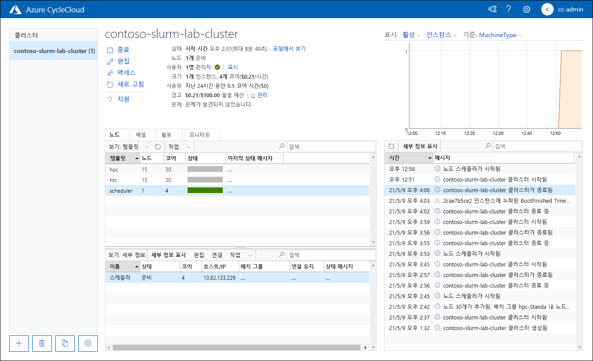
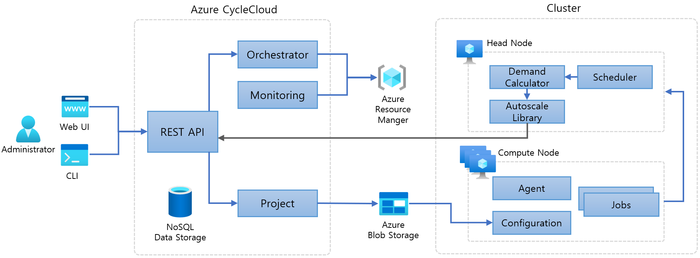

= Azure CycleCloud

////
https://learn.microsoft.com/ko-kr/training/modules/azure-cyclecloud-high-performance-computing/2-describe-basics

https://learn.microsoft.com/ko-kr/azure/cyclecloud/overview?view=cyclecloud-8
////

하이퍼스케일 기능을 활용하기 위해 온-프레미스 HPC 워크로드를 퍼블릭 클라우드로 전환하려고 합니다. 이러한 전환에서 관련된 학습 곡선을 최소화하고자 하며 특정 HPC 스케줄러와 같은 기존 배포와 관련된 전문 지식을 사용하려고 합니다. 또한, 온-프레미스 환경과 병렬로 처리되는 방식으로 클라우드 기반 클러스터 리소스의 성능 및 비용에 대한 인사이트를 얻으려고 합니다.

이런 요구사항을 해결하기 위해서는 많은 지식과 노력이 필요합니다. 클라우드 기반 HPC 클러스터의 구성 요소 역할을 하는 컴퓨팅, 네트워킹, 스토리지 리소스에 대한 깊은 지식이 필요합니다. 또한 해당 관리 인터페이스 없이 표준 Azure 관리 도구를 사용하여 그러한 솔루션을 운영하면 상당한 관리 오버헤드가 발생합니다.

Azure CycleCloud는 이와 같은 문제를 하결하여 Azure에서 HPC 스케줄러를 구현하는 간단하고 안전하며 스케일링 가능한 방법을 제공합니다. 

== Azure CycleCloud 개요

Azure CycleCloud는 Azure에서 HPC 클러스터를 배포하고 워크로드를 관리하기 위한 도구입니다. 다음을 포함하여 다양한 HPC 기능을 제공합니다.

HPC 클러스터의 템플릿 기반 배포::
Azure CycleCloud는 Slurm, OpenPBS, LSF, Grid Engine, HTCondor등 가징 일반적인 클러스터 스케줄러 배포를 위한 사용자 지정 간으한 기본 제공 템플릿을 제공합니다. Azure CycleCloud 인스턴스로 가져올 수 있는 미리 정의된 다른 많은 템플릿은 CycleCloud 리포지토리에서 사용할 수 있습니다.

클러스터 노드의 수동 및 자동화된 크기 조정::
 Azure CycleCloud를 사용하면 작업 큐 및 거버넌스 정책의 길이에 따라 관리형 클러스터의 수동 및 자동 수평 스케일링이 가능합니다. Azure CycleCloud는 사용자 지정 스케줄러용 자동 스케일링 어댑터를 개발하기 위한 REST API도 제공합니다.

cloud-init 스크립트를 통한 노드 구성::
Azure CycleCloud는 다른 CycleCloud 관련 구성 작업 전에 관리형 클러스터 노드 내에서 실행되는 사용자 지정 스크립트를 기반으로 구성 관리를 지원합니다.

내부 및 외부 클러스터 스토리지 관리::
Azure CycleCloud에서는 Azure 관리 디스크 및 네트워크 연결 스토리지(예: NFS 서버 또는 BeeGFS 클러스터)를 프로비저닝, 탑재, 포맷하여 클러스터 스토리지를 구성할 수 있습니다.

모니터링, 로깅 및 경고::
Azure CycleCloud는 기본 제공 클러스터 모니터링을 제공하며 Azure Monitor와 통합됩니다. CycleCloud 클러스터의 로그 데이터를 Log Analytics에 저장하고 사용자 지정 메트릭 대시보드를 만들 수도 있습니다. 또한 원격 분석 데이터에 의해 트리거되는 사용자 지정 경고 및 이메일 알림을 만들 수 있습니다. 모든 Azure CycleCloud 활동이 기록됩니다.

인증 및 권한 부여::
Azure CycleCloud는 기본 제공 로컬 인증을 지원합니다. 아니면 Active Directory Domain Services 또는 기타 LDAP(Lightweight Directory Access Protocol) 기반 ID 공급자와 통합할 수 있습니다. 기본적으로 로컬로 정의된 사용자는 관리형 클러스터 노드의 운영 체제에 액세스할 수 있지만, 클러스터 사용자를 별도로 관리할 수도 있습니다. Azure 구독의 리소스 관리를 위해 Microsoft Entra 서비스 주체 또는 관리 ID를 사용할 수 있습니다.

실시간에 가까운 비용 보고 및 제어::
Azure CycleCloud는 클러스터 사용량을 추적하고 해당 비용을 예측합니다. 이 기능을 사용하면 클러스터 비용이 지정한 금액을 초과할 때 트리거되는 예산 경고를 설정할 수 있습니다. Azure CycleCloud는 Microsoft Cost Management와도 통합됩니다.

== 구현 및 사용

CycleCloud는 Linux 기반 웹 애플리케이션으로 구현되며, Azure 환경에 액세스할 수 있는 모든 위치에 설치할 수 있습니다. 가장 간단한 설치 방법은 ARM(Azure Resource Manager) 템플릿을 사용하여 배포를 자동화하는 옵션과 함께 해당 Azure Marketplace 이미지를 사용하여 Azure VM을 배포하는 것입니다. 또는 yum 또는 apt 패키지를 사용하거나, Microsoft Container Registry에서 제공하는 컨테이너 이미지를 사용할 수 있습니다.

초기 구성 중에 SSH 키를 제공하여 CycleCloud 애플리케이션을 호스팅하는 운영 체제와 나중에 배포되는 클러스터 노드에 대한 액세스를 보호할 수 있습니다. CycleCloud 애플리케이션이 Azure Resource Manager와 상호 작용할 수 있도록 하려면 이 상호 작용에 대한 보안 컨텍스트를 제공하는 Microsoft Entra ID를 선택하고 Azure RBAC(역할 기반 액세스 제어)를 사용하여 대상 Azure 구독에서 충분한 권한을 할당해야 합니다. 이 ID는 서비스 주체 또는 Azure VM에서 Azure CycleCloud 애플리케이션을 호스팅하는 경우 관리 ID의 형식을 취할 수 있습니다.

또한 Azure CycleCloud 인스턴스에는 Azure 스토리지 계정 및 함께 제공되는 Blob 컨테이너가 필요합니다. 보관이라고 하는 이 컨테이너는 클러스터 노드에 프로젝트를 배포하기 위한 준비 영역을 제공합니다.

설치되면 Azure CycleCloud 애플리케이션은 사용자가 HPC 시스템을 관리하고 모니터링할 수 있는 그래픽 사용자 인터페이스와 CycleCloud를 기존 워크플로에 쉽게 통합하고 자동화할 수 있는 CLI(명령줄 인터페이스)를 제공합니다. CLI를 사용하여 템플릿을 가져오고, 클러스터 프로비저닝을 자동화하고, 고급 관리 작업을 수행할 수도 있습니다.

== Azure CycleCloud 아키텍처

Azure CycleCloud는 Azure Resource Manager에 비해 추가된 추상화 계층을 제공하여 사용자가 Azure 컴퓨팅 스토리지 리소스를 직접 처리할 필요성을 최소화합니다. 해당 역할은 그래픽 인터페이스 또는 CLI를 통해 액세스 할 수 있는 스케줄러 수준 구성을 사용자 정의 가상 네트워크와 서브넷에서 Azure VM및 Azure VM Scale Sets와 상호 작용하는 ARM(Azure Resource Manager) API 호출로 변환하는 것입니다. 이러한 호출은 InfiniBand 네트워크 토폴로지의 지역 vCPU 할당량, 클러스터 크기 제한, 제약 조건도 고려합니다. 또한 근접 배치 그룹과 같은 구문을 사용하거나 클러스터 노드를 동일한 InfiniBand에 연결하여 클러스터 성능을 쉽게 최적화합니다.

Azure CycleCloud는 일반적으로 하나 이상의 HPC 스케줄러 헤드 노드 및 컴퓨팅 노드로 구성되는 HPC 클러스터의 수명 주기를 오케스트레이션하지만, NFS 서버나 BeeGFS 클러스터, Azure NetApp Files, Azure HPC Cache, Microsoft Entra Domain Services 같은 네트워크 연결 스토리지를 포함할 수도 있습니다. Azure CycleCloud는 클러스터 및 노드 상태를 캐시하는 내부 NoSQL 데이터 저장소를 포함합니다. 노드 모니터링 시스템에서는 경고를 사용하도록 설정합니다. 해당 관리 기능은 REST API 통해 노출되며 웹 및 CLI를 통해 액세스할 수 있습니다.

